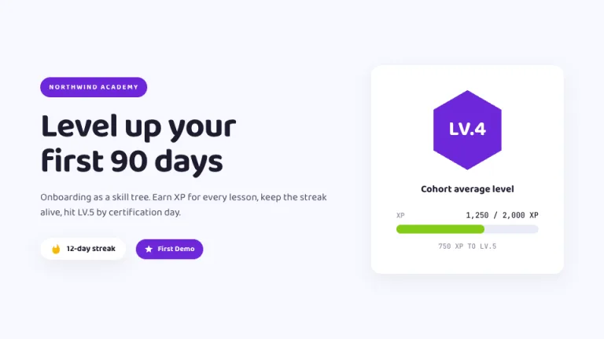
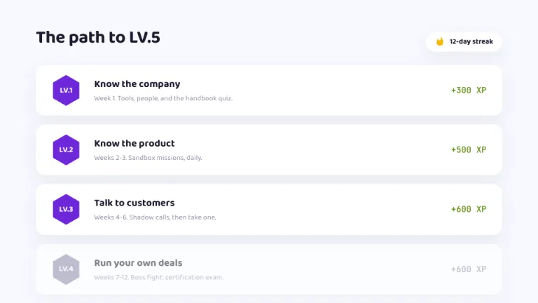
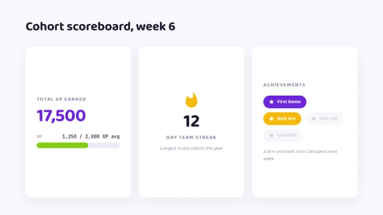
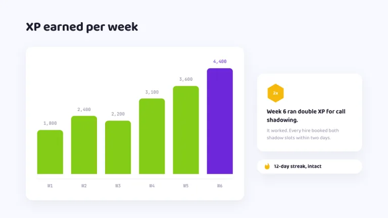
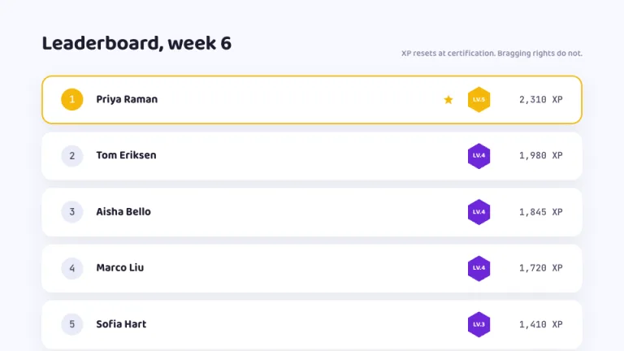
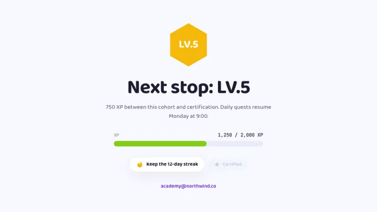

[← All prompts](../README.md) · [Live site](https://slidespeak.co/slide-design-prompts) · [SlideSpeak](https://slidespeak.co)

# Level Up

> Earn the XP

Gamified learning that looks like a modern app, not an arcade. Every slide shows XP earned and the streak still alive.

**Category:** Education & research &nbsp;·&nbsp; **Style:** Playful, Tech &nbsp;·&nbsp; **Mode:** Light &nbsp;·&nbsp; **Fonts:** Baloo 2 + JetBrains Mono

<table>
    <tr>
      <td align="center" width="33%"><br><sub>Title</sub></td>
      <td align="center" width="33%"><br><sub>Agenda</sub></td>
      <td align="center" width="33%"><br><sub>Key metrics</sub></td>
    </tr>
    <tr>
      <td align="center" width="33%"><br><sub>Chart & insight</sub></td>
      <td align="center" width="33%"><br><sub>Team</sub></td>
      <td align="center" width="33%"><br><sub>Closing</sub></td>
    </tr>
</table>

## The prompt

Copy the prompt below into **ChatGPT**, **Claude**, or any AI chat — or grab the raw [`PROMPT.md`](./PROMPT.md). It asks what your presentation is about first, then applies the design to every slide.

```text
Create a presentation styled as a modern gamified learning app, the 'Level Up' theme. Background: cool near-white (#F7F9FF). Typography: the bold friendly sans 'Baloo 2' for headings and body, with ink headings (#1E1B2E); 'JetBrains Mono' for all XP numbers (both Google Fonts). Cards: white, 16px rounded corners, very soft shadows (rgba(30,27,46,0.07), large blur, no hard edges). Signature motifs: XP progress bars with a rounded #E9ECF8 track, a lime fill (#84CC16) and a mono label like '1,250 / 2,000 XP'; pointy-top hexagonal level badges in violet (#6D28D9) with bold white text ('LV.4'); achievement chips as rounded pills with a small star icon, unlocked ones filled violet or gold (#F5B80B) with white text, locked ones gray at 40 percent opacity; a gold flame icon beside a streak counter ('12-day streak'). Render teams as leaderboard rows in white cards with circled rank numbers, hex badges and right-aligned mono XP, the leader outlined in gold. Strictly avoid: pixel art or retro 8-bit styling, dark backgrounds, gradients, harsh borders, photographs, accent colors beyond violet, lime and gold.

Use this theme for my slides. Ask me what the presentation is about first, then apply the theme to every slide.
```

**[Open ChatGPT ↗](https://chatgpt.com/)** &nbsp;·&nbsp; **[Open Claude ↗](https://claude.ai/new)** &nbsp;·&nbsp; **[Generate a finished deck with SlideSpeak ↗](https://app.slidespeak.co/presentation?utm_source=github&utm_medium=referral&utm_campaign=slide-design-prompts)**

## Palette

| Role | Hex |
| --- | --- |
| Background | `#F7F9FF` |
| Surface / panel | `#FFFFFF` |
| Border | `#E9ECF8` |
| Primary accent | `#6D28D9` |
| Primary (soft tint) | `#EFE9FB` |
| Text on primary | `#FFFFFF` |
| Heading text | `#1E1B2E` |
| Body text | `#4B4763` |
| Muted text | `#8E8AA6` |

**Chart series:** `#6D28D9` `#84CC16` `#F5B80B` `#D9D2F2`

## Fonts

- **Baloo 2** (heading, Google Fonts)
- **JetBrains Mono** (supporting, Google Fonts)

---

<sub>Part of [SlideSpeak Slide Design Prompts](../../README.md) · MIT licensed</sub>
