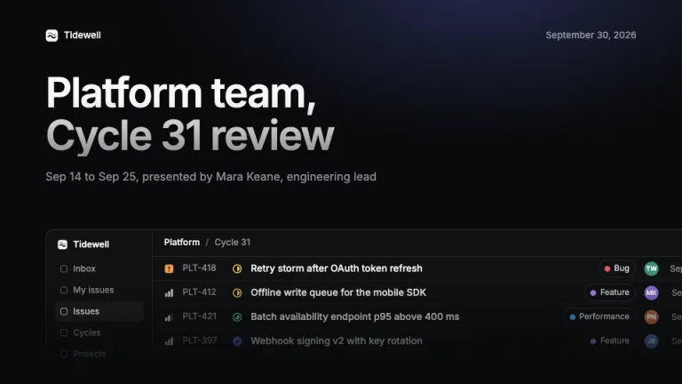
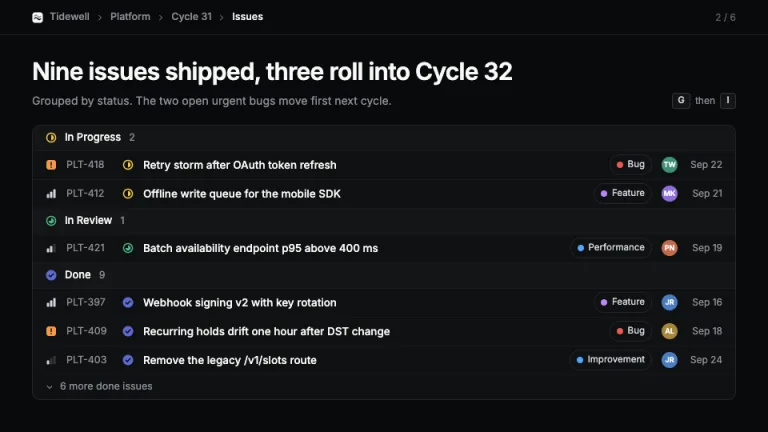
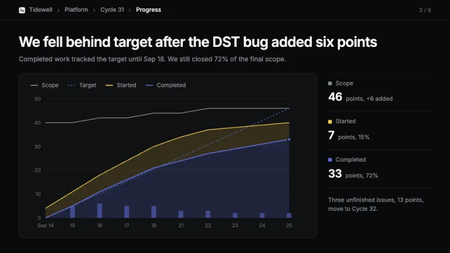
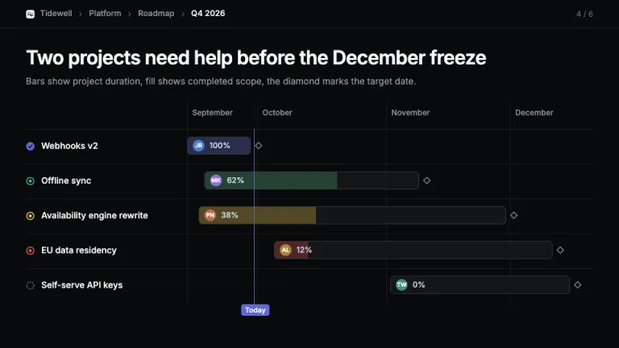
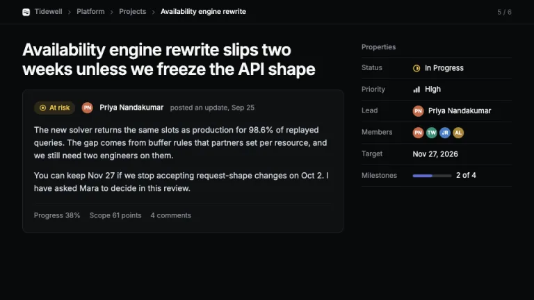
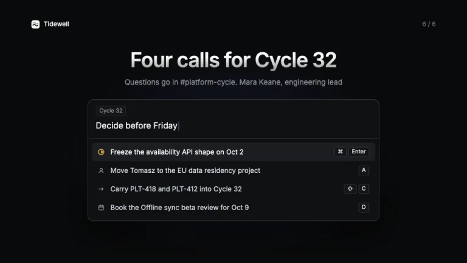

[← All prompts](../README.md) · [Live site](https://slidespeak.co/slide-design-prompts) · [SlideSpeak](https://slidespeak.co)

# Linear Style

> Your deck as a cycle view

Linear app design style slides for product teams: a near-black canvas, hairline borders, one lavender accent, issue rows, a cycle graph and a roadmap. An unofficial homage to the Linear interface. Not affiliated with, endorsed by, or connected to Linear Orbit, Inc.

**Category:** Tech & product &nbsp;·&nbsp; **Style:** Dark, Minimal &nbsp;·&nbsp; **Mode:** Dark &nbsp;·&nbsp; **Fonts:** Inter

<table>
    <tr>
      <td align="center" width="33%"><br><sub>Cover</sub></td>
      <td align="center" width="33%"><br><sub>Issue list</sub></td>
      <td align="center" width="33%"><br><sub>Cycle graph</sub></td>
    </tr>
    <tr>
      <td align="center" width="33%"><br><sub>Roadmap timeline</sub></td>
      <td align="center" width="33%"><br><sub>Project update</sub></td>
      <td align="center" width="33%"><br><sub>Command menu close</sub></td>
    </tr>
</table>

## The prompt

Copy the prompt below into **ChatGPT**, **Claude**, or any AI chat — or grab the raw [`PROMPT.md`](./PROMPT.md). It asks what your presentation is about first, then applies the design to every slide.

```text
Create a presentation in the 'Linear Style' theme, an unofficial homage to the Linear app design style: slides that look like views inside a dark issue tracker. Palette: canvas #08090a on every slide; panels #0f1011, group headers #141516, highlighted row #1c1d21; borders 1px #23252a, row dividers 1px #1a1b1e, stronger outlines #34343a. Text: headings #f7f8f8, body #d0d6e0, secondary #8a8f98, faint meta #62666d. One accent, lavender #5e6ad2, for Done, the completed series, the Today line and carets. Status colors are functional only: In Progress yellow #f2c94c, In Review and On track green #4cb782, Off track and Bug red #eb5757, Urgent orange #f2994a, label dots violet #bb87fc and blue #4ea7fc. Typography: 'Inter' (Google Fonts) throughout. Titles Inter 600 at 30px with -0.025em tracking, cover title 56 to 60px at -0.035em filled with a vertical gradient from #f7f8f8 to 55% white; body 14 to 16px weight 400; meta 12 to 13px. Sentence case, no uppercase labels. Header on content slides: a 44px app bar with a breadcrumb (company, team, view) separated by small chevrons, current view in #f7f8f8, page count '2 / 6' right, and a 1px #23252a rule below. Radii: 4px keys, 6px bars, 10 to 12px panels; no shadows except under the command menu. Signature, the issue row: 36px tall inside a #0f1011 panel, left to right a priority glyph (orange rounded square with '!' for Urgent, three ascending bars filled to level for High, Medium, Low), the identifier like PLT-418 in #8a8f98, a 14px status circle (dashed gray Backlog, outlined Todo, yellow half-filled In Progress, green three-quarter In Review, solid lavender with check for Done), the title in 13.5px 500 #f7f8f8, bordered label pills with a colored dot, a 20px initials avatar and a short date. Group rows by status under #141516 headers with a count. Slides: cover with a faint lavender radial glow at the top, the gradient title, a one-line subtitle, and an app window (sidebar plus issue list) rising from the bottom edge and fading into the canvas; issue list; cycle graph burn-up with gray scope line, dotted lavender target, yellow started band stacked on the lavender completed area, stats in a side column; roadmap timeline with project bars, health icons, progress fill, target diamonds and one lavender Today line; project update with a health pill, author and a properties panel; closing slide as a command menu with a search line, one highlighted row and keyboard keys. Strictly avoid: light backgrounds, pure #000000, colorful gradients or neon glows, more than one accent color, glassmorphism, emoji, stock photos, large rounded cards with soft shadows, uppercase letterspaced eyebrows, monospace labels, centered body text on content slides, the Linear logo or wordmark, and any claim of affiliation with Linear.

Use this theme for my slides. Ask me what the presentation is about first, then apply the theme to every slide.
```

**[Open ChatGPT ↗](https://chatgpt.com/)** &nbsp;·&nbsp; **[Open Claude ↗](https://claude.ai/new)** &nbsp;·&nbsp; **[Generate a finished deck with SlideSpeak ↗](https://app.slidespeak.co/presentation?utm_source=github&utm_medium=referral&utm_campaign=slide-design-prompts)**

## Palette

| Role | Hex |
| --- | --- |
| Background | `#08090a` |
| Surface / panel | `#0f1011` |
| Border | `#23252a` |
| Primary accent | `#5e6ad2` |
| Primary (soft tint) | `#1b1d33` |
| Text on primary | `#ffffff` |
| Heading text | `#f7f8f8` |
| Body text | `#d0d6e0` |
| Muted text | `#8a8f98` |

**Chart series:** `#5e6ad2` `#f2c94c` `#8a8f98` `#4cb782`

## Fonts

- **Inter** (heading, Google Fonts)

---

<sub>Part of [SlideSpeak Slide Design Prompts](../../README.md) · MIT licensed</sub>
