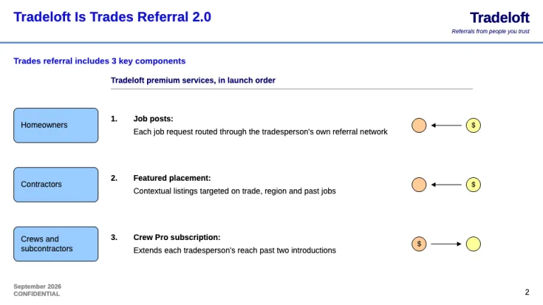
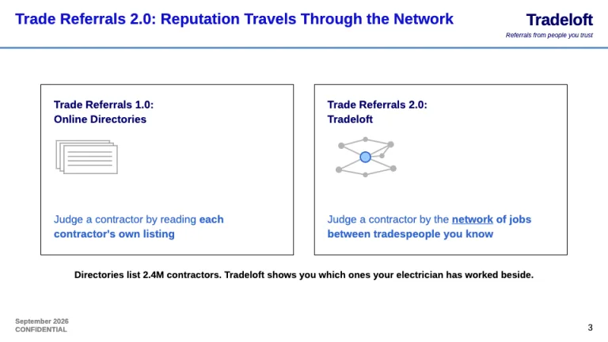
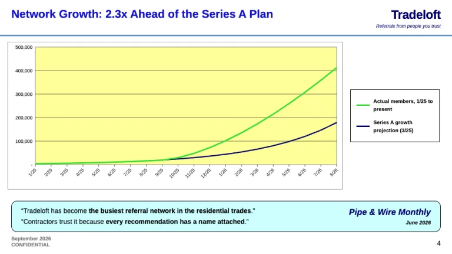
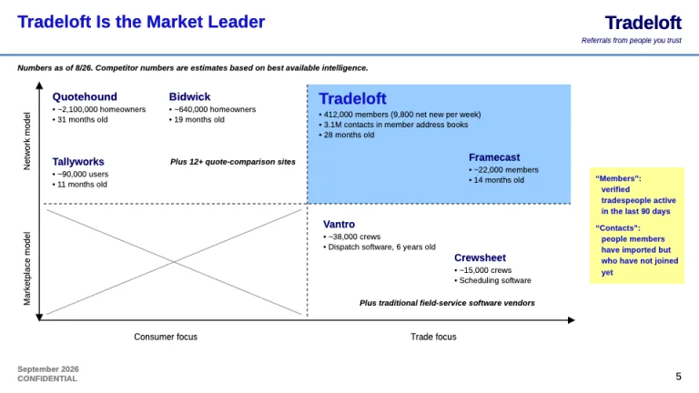
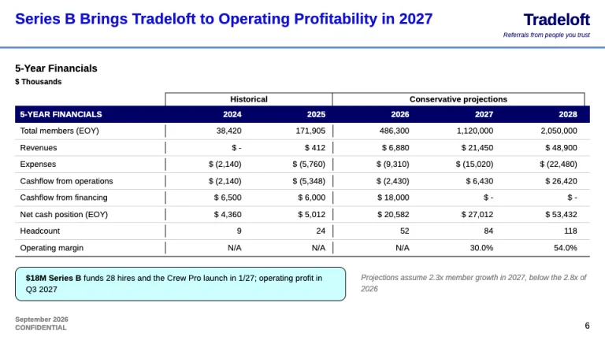

[← All prompts](../README.md) · [Live site](https://slidespeak.co/slide-design-prompts) · [SlideSpeak](https://slidespeak.co)

# LinkedIn Pitch Deck

> Reid Hoffman's 2004 Series B deck as a prompt

A LinkedIn pitch deck prompt that follows Reid Hoffman's 2004 Series B deck: thesis, analogies, growth against plan and five-year financials. An unofficial homage to LinkedIn's Series B pitch. Not affiliated with, endorsed by, or connected to LinkedIn Corporation.

**Category:** Pitch decks &nbsp;·&nbsp; **Style:** Minimal, Corporate &nbsp;·&nbsp; **Mode:** Light &nbsp;·&nbsp; **Fonts:** Arimo

<table>
    <tr>
      <td align="center" width="33%"><br><sub>Cover</sub></td>
      <td align="center" width="33%"><br><sub>Investment thesis</sub></td>
      <td align="center" width="33%"><br><sub>Pitch by analogy</sub></td>
    </tr>
    <tr>
      <td align="center" width="33%"><br><sub>Network growth</sub></td>
      <td align="center" width="33%"><br><sub>Market map</sub></td>
      <td align="center" width="33%"><br><sub>Five-year financials</sub></td>
    </tr>
</table>

## The prompt

Copy the prompt below into **ChatGPT**, **Claude**, or any AI chat — or grab the raw [`PROMPT.md`](./PROMPT.md). It asks what your presentation is about first, then applies the design to every slide.

```text
Create a presentation in the 'LinkedIn Pitch Deck' theme, an unofficial homage to the 2004 Series B deck Reid Hoffman later published with commentary: a network pitched before revenue, in 2004 PowerPoint form. Background white #ffffff. Typography: 'Arimo' (Google Fonts) throughout, 400 and 700 plus italics. Content slide header: a Title Case claim in Arimo 700 at 24px, royal blue #1111cc, top-left, two lines max; the company wordmark as plain bold navy #000066 text top-right with a 10px italic tagline; then a 3px steel-blue #5b8ec6 rule across the full width. Footer: month and year over 'CONFIDENTIAL', stacked bottom-left in Arimo 700 11px gray #808080; page number 14px black bottom-right. Body text black #000000 at 14 to 17px; secondary statements in #3366cc with the key word bold and underlined. Follow Hoffman's order: investment thesis, pitch by analogy, growth against the last round's plan, market leadership, revenue plan and pricing, five-year financials, team and investors, then the thesis again as the close. Cover: wordmark at 64 to 72px navy, italic tagline, 'Series B Financing' in bold #1111cc, a network of gray #b3b3b3 nodes around one light-blue #99ccff node, between two steel-blue rules. Thesis: market segments in rounded #99ccff boxes with 1px black borders at left, revenue streams numbered in launch order beside them, and money-flow glyphs: peach #ffcc99 and yellow #ffff99 circles, one marked '$', joined by a black arrow. Analogy: two 1px black-framed panels, 'X 1.0:' against 'X 2.0: Company', navy bold heads, verdicts in #3366cc with 'network' underlined. Signature slide, the growth chart drawn as 2004 Excel: yellow #ffff99 plot area, thin black gridlines, comma-formatted y-axis, dates rotated 45 degrees, a lime #33dd33 actual line pulling past a navy #000066 projection, a boxed legend at right, and a rounded cyan #ccffff press-quote callout below with the key phrase bold. Market map: a 2x2 with arrowed axes, the company quadrant filled #99ccff, competitors as bold navy names with '~' estimates, an italic sourcing line above and a yellow #ffff99 note defining the metrics. Revenue plan: #99ccff label boxes at left, 'Pricing plan' and 'Launch timing' columns of short bullets. Financials: spreadsheet table with 'Historical' and 'Conservative projections' brackets, a navy #000066 header row in white bold, right-aligned figures, losses in parentheses. Team: bold names, two bullet credentials each, investors below. Strictly avoid: the LinkedIn logo, its boxed wordmark or tagline, claiming affiliation with LinkedIn or Reid Hoffman, clipart, stock photos, gradients, drop shadows, dark backgrounds, fonts other than Arimo, topic-only titles, charts without a legend or source line.

Use this theme for my slides. Ask me what the presentation is about first, then apply the theme to every slide.
```

**[Open ChatGPT ↗](https://chatgpt.com/)** &nbsp;·&nbsp; **[Open Claude ↗](https://claude.ai/new)** &nbsp;·&nbsp; **[Generate a finished deck with SlideSpeak ↗](https://app.slidespeak.co/presentation?utm_source=github&utm_medium=referral&utm_campaign=slide-design-prompts)**

## Palette

| Role | Hex |
| --- | --- |
| Background | `#ffffff` |
| Surface / panel | `#ccffff` |
| Border | `#000000` |
| Primary accent | `#1111cc` |
| Primary (soft tint) | `#99ccff` |
| Text on primary | `#ffffff` |
| Heading text | `#1111cc` |
| Body text | `#000000` |
| Muted text | `#808080` |

**Chart series:** `#33dd33` `#000066` `#3aa8e8` `#ffcc99`

## Fonts

- **Arimo** (heading, Google Fonts)

---

<sub>Part of [SlideSpeak Slide Design Prompts](../../README.md) · MIT licensed</sub>
