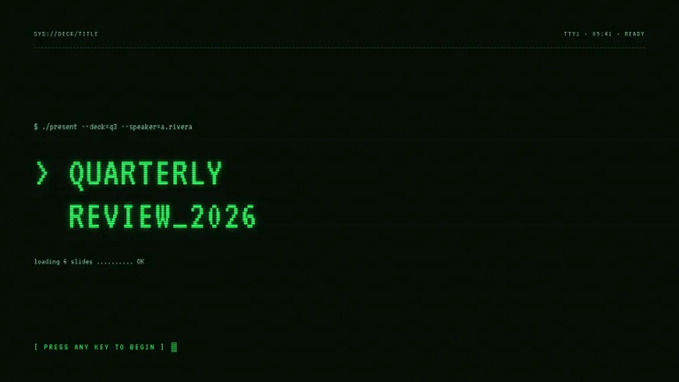
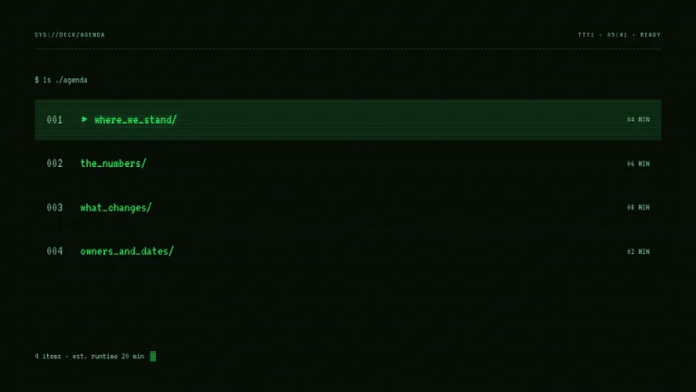
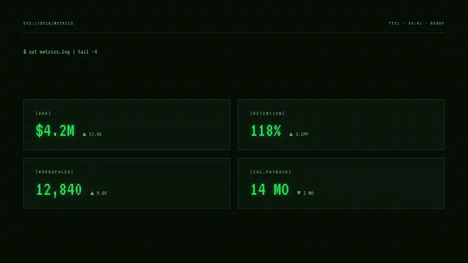
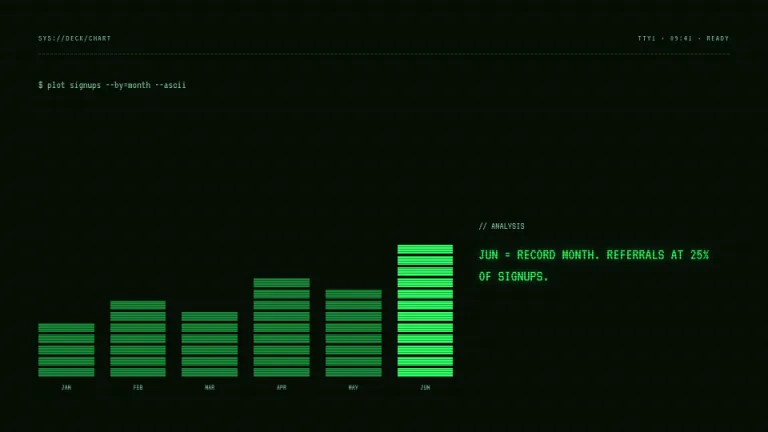
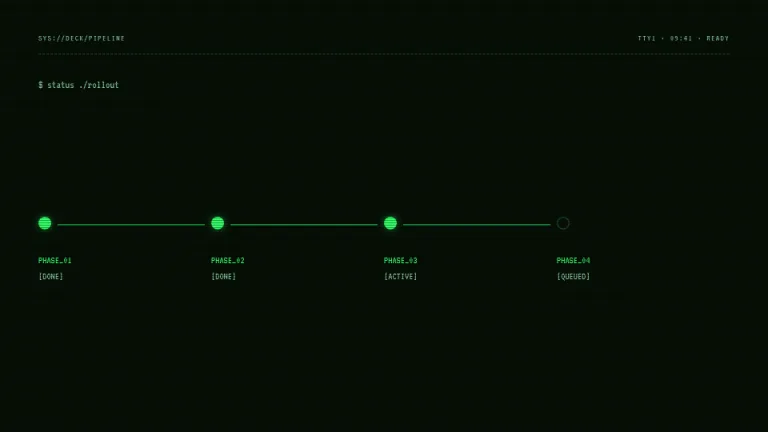
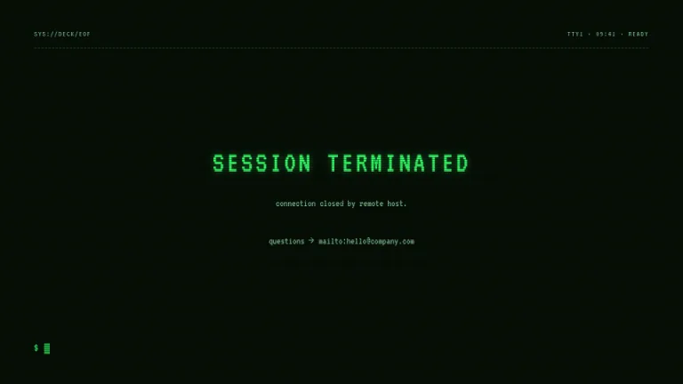

[← All prompts](../README.md) · [Live site](https://slidespeak.co/slide-design-prompts) · [SlideSpeak](https://slidespeak.co)

# Mainframe

> Straight from the machine room

Phosphor green on black, scanlines and a blinking cursor. Slides that look like a 1982 terminal session, down to the prompt.

**Category:** Tech & product &nbsp;·&nbsp; **Style:** Tech, Dark &nbsp;·&nbsp; **Mode:** Dark &nbsp;·&nbsp; **Fonts:** VT323

<table>
    <tr>
      <td align="center" width="33%"><br><sub>Title</sub></td>
      <td align="center" width="33%"><br><sub>Agenda</sub></td>
      <td align="center" width="33%"><br><sub>Key metrics</sub></td>
    </tr>
    <tr>
      <td align="center" width="33%"><br><sub>Chart & insight</sub></td>
      <td align="center" width="33%"><br><sub>Timeline</sub></td>
      <td align="center" width="33%"><br><sub>Closing</sub></td>
    </tr>
</table>

## The prompt

Copy the prompt below into **ChatGPT**, **Claude**, or any AI chat — or grab the raw [`PROMPT.md`](./PROMPT.md). It asks what your presentation is about first, then applies the design to every slide.

```text
Create a presentation styled as a 1980s computer terminal session, the 'Mainframe' theme. Background: near-black green (#061006) with a faint horizontal scanline texture across the whole slide. Every character on every slide is set in the monospace terminal font 'VT323' (a Google Font). Primary text: phosphor green (#33FF66) with a subtle glow; secondary text: dimmer green (#7FBF93). Every slide opens with a status bar: 'SYS://DECK/<SLIDE-NAME>' on the left, 'TTY1 · 09:41 · READY' on the right, separated from content by a dashed dark-green rule. Headlines are uppercase and prefixed with '> '. Slides end with a solid block cursor '█'. Metrics appear as bracket readouts like [ ARR: $4.2M ▲12.4% ] in bordered dark panels. Charts: bars built from stacked rectangular segments with small gaps, like LED level meters, brightest green for the key bar. Lists are styled as directory listings with three-digit line numbers and '▸' markers. Strictly avoid: any color besides greens, rounded corners, photos, proportional fonts.

Use this theme for my slides. Ask me what the presentation is about first, then apply the theme to every slide.
```

**[Open ChatGPT ↗](https://chatgpt.com/)** &nbsp;·&nbsp; **[Open Claude ↗](https://claude.ai/new)** &nbsp;·&nbsp; **[Generate a finished deck with SlideSpeak ↗](https://app.slidespeak.co/presentation?utm_source=github&utm_medium=referral&utm_campaign=slide-design-prompts)**

## Palette

| Role | Hex |
| --- | --- |
| Background | `#061006` |
| Surface / panel | `#0B1A0C` |
| Border | `#1E4426` |
| Primary accent | `#33FF66` |
| Primary (soft tint) | `#0F2E16` |
| Text on primary | `#061006` |
| Heading text | `#D8FFE3` |
| Body text | `#7FBF93` |
| Muted text | `#4E7F58` |

**Chart series:** `#33FF66` `#28C452` `#1A8A39` `#11331C`

## Fonts

- **VT323** (heading and body, Google Fonts)

---

<sub>Part of [SlideSpeak Slide Design Prompts](../../README.md) · MIT licensed</sub>
