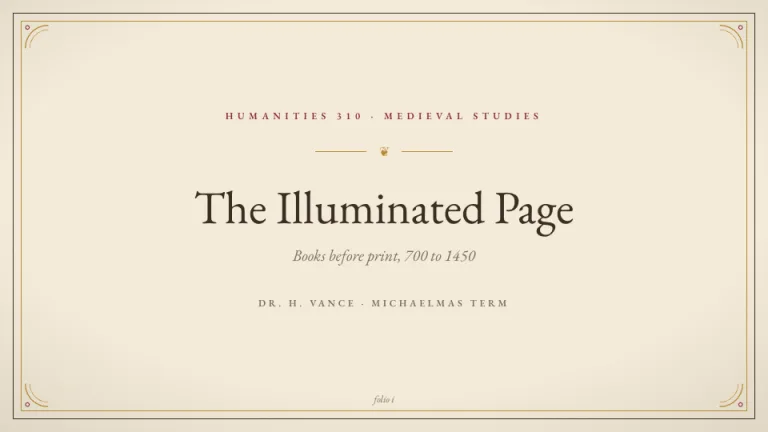
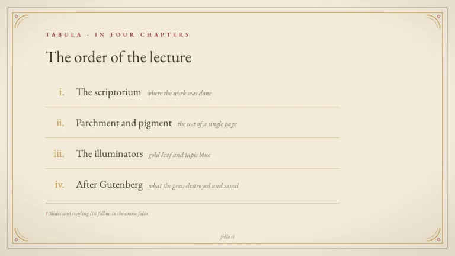
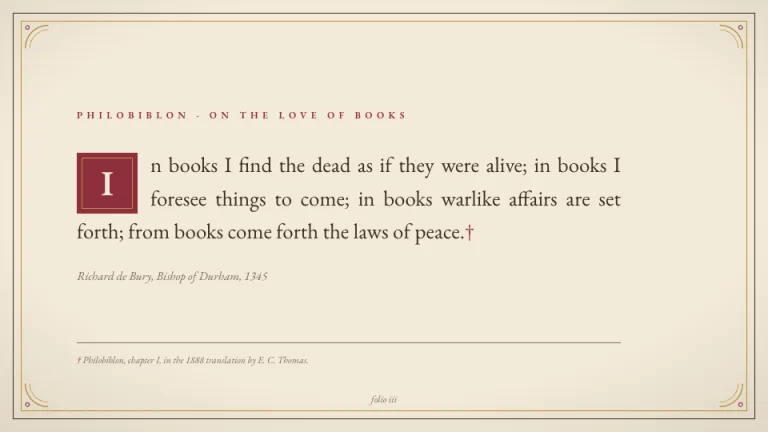
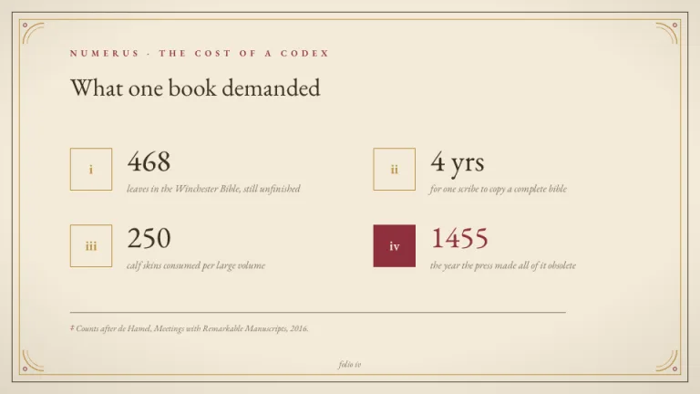
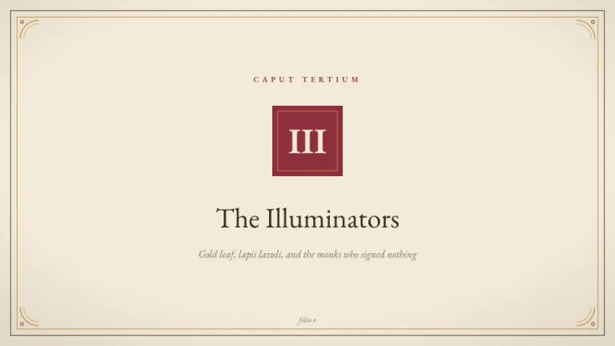
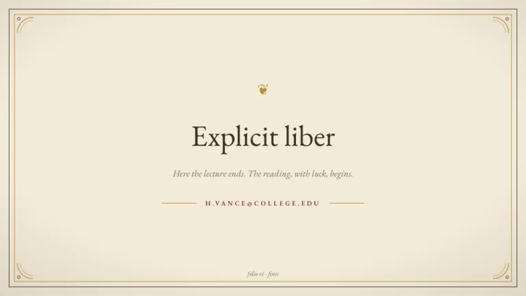

[← All prompts](../README.md) · [Live site](https://slidespeak.co/slide-design-prompts) · [SlideSpeak](https://slidespeak.co)

# Manuscript

> Slides before print

An illuminated book page turned into slides. Double-rule borders and garnet drop caps, with proper footnotes at the bottom of the page.

**Category:** Creative & portfolio &nbsp;·&nbsp; **Style:** Elegant, Warm &nbsp;·&nbsp; **Mode:** Light &nbsp;·&nbsp; **Fonts:** EB Garamond

<table>
    <tr>
      <td align="center" width="33%"><br><sub>Title</sub></td>
      <td align="center" width="33%"><br><sub>Agenda</sub></td>
      <td align="center" width="33%"><br><sub>Quote</sub></td>
    </tr>
    <tr>
      <td align="center" width="33%"><br><sub>Key metrics</sub></td>
      <td align="center" width="33%"><br><sub>Section divider</sub></td>
      <td align="center" width="33%"><br><sub>Closing</sub></td>
    </tr>
</table>

## The prompt

Copy the prompt below into **ChatGPT**, **Claude**, or any AI chat — or grab the raw [`PROMPT.md`](./PROMPT.md). It asks what your presentation is about first, then applies the design to every slide.

```text
Design slides as an illuminated manuscript page, the 'Manuscript' theme. Background: aged paper #F3EAD8 with a subtle vignette darkening toward the edges, a radial gradient reaching rgba(59,47,35,0.16) at the rim. Frame every slide with a double rule: a 1.5px ink #3B2F23 border inset 16px, a 1px old gold #B98D3B border inset 26px, and a small gold corner flourish curve in each corner. Typography: 'EB Garamond' (a Google Font) serif throughout; headings in ink #3B2F23; small caps kickers in garnet #8E2F3C with 0.45em letterspacing; justified body text; an italic folio number centered at the foot of every slide. Signature motifs: an ornate drop cap, a 76px garnet #8E2F3C square with a 1px gold inner border and a pale serif letter, opening body paragraphs and holding section numerals; footnote daggers † and ‡ in garnet above a thin footnote rule at the bottom of content slides; a small gold fleuron ❦ as ornament. Strictly avoid: photographs, sans-serif type, drop shadows, rounded corners, bright modern colors, left-ragged body text on quote slides.

Use this theme for my slides. Ask me what the presentation is about first, then apply the theme to every slide.
```

**[Open ChatGPT ↗](https://chatgpt.com/)** &nbsp;·&nbsp; **[Open Claude ↗](https://claude.ai/new)** &nbsp;·&nbsp; **[Generate a finished deck with SlideSpeak ↗](https://app.slidespeak.co/presentation?utm_source=github&utm_medium=referral&utm_campaign=slide-design-prompts)**

## Palette

| Role | Hex |
| --- | --- |
| Background | `#F3EAD8` |
| Surface / panel | `#FAF4E6` |
| Border | `#3B2F23` |
| Primary accent | `#8E2F3C` |
| Primary (soft tint) | `#EFD9D2` |
| Text on primary | `#F3EAD8` |
| Heading text | `#3B2F23` |
| Body text | `#5A4C3B` |
| Muted text | `#93846E` |

**Chart series:** `#8E2F3C` `#B98D3B` `#3B2F23` `#D9C9A8`

## Fonts

- **EB Garamond** (heading and body, Google Fonts)

---

<sub>Part of [SlideSpeak Slide Design Prompts](../../README.md) · MIT licensed</sub>
