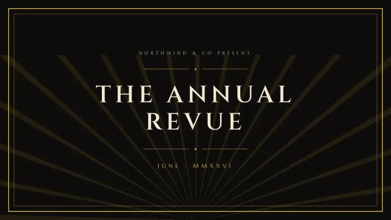
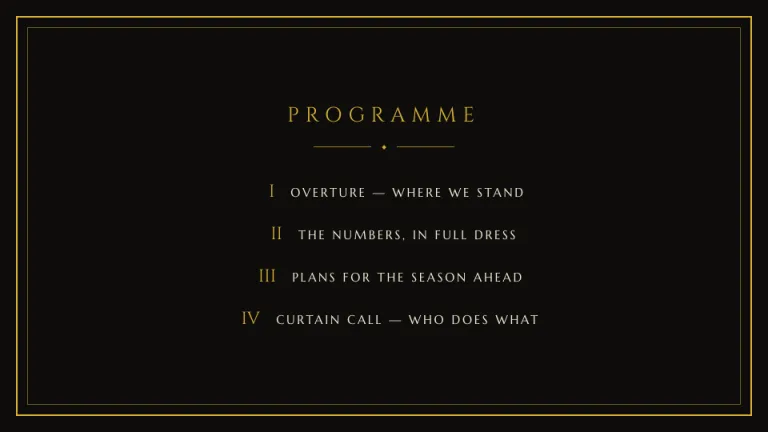
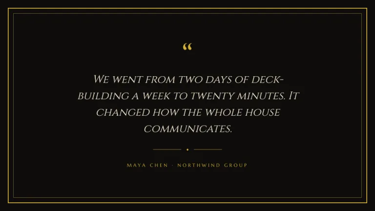
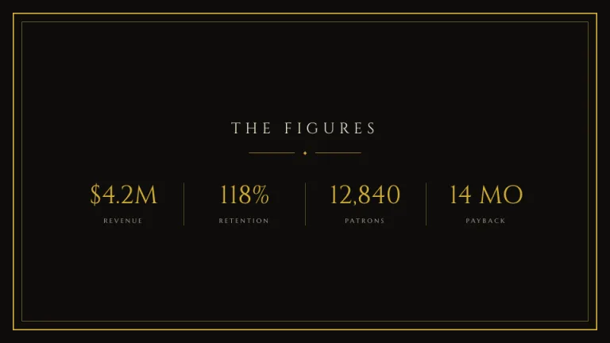
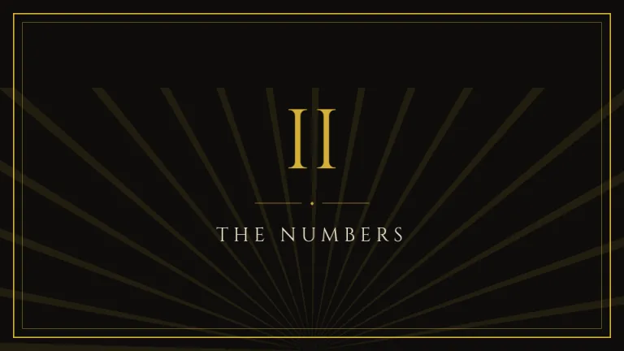
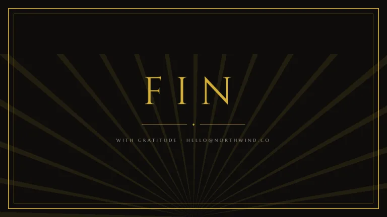

[← All prompts](../README.md) · [Live site](https://slidespeak.co/slide-design-prompts) · [SlideSpeak](https://slidespeak.co)

# Marquee

> Make it an occasion

Black and gold with double-line frames, sunburst rays and letterspaced serif caps. Art deco the way the poster artists did it.

**Category:** Creative & portfolio &nbsp;·&nbsp; **Style:** Elegant, Dark &nbsp;·&nbsp; **Mode:** Dark &nbsp;·&nbsp; **Fonts:** Cinzel + Marcellus

<table>
    <tr>
      <td align="center" width="33%"><br><sub>Title</sub></td>
      <td align="center" width="33%"><br><sub>Agenda</sub></td>
      <td align="center" width="33%"><br><sub>Quote</sub></td>
    </tr>
    <tr>
      <td align="center" width="33%"><br><sub>Key metrics</sub></td>
      <td align="center" width="33%"><br><sub>Section divider</sub></td>
      <td align="center" width="33%"><br><sub>Closing</sub></td>
    </tr>
</table>

## The prompt

Copy the prompt below into **ChatGPT**, **Claude**, or any AI chat — or grab the raw [`PROMPT.md`](./PROMPT.md). It asks what your presentation is about first, then applies the design to every slide.

```text
Create a presentation in 1920s art deco style, the 'Marquee' theme. Background: near-black (#0E0D0B). Accent: brass gold (#D4AF37). Text: cream (#F3EAD3). Every slide is perfectly symmetric and center-aligned, wrapped in a double frame: a 2px gold border inset about 20px from the edge, and a second 1px gold border about 14px inside it. Titles: 'Cinzel' serif, uppercase, letterspaced around 0.18em, with body and small letterspaced caps in 'Marcellus' (both Google Fonts), and a thin gold rule broken by a centered diamond '◆' above and below. Title, section and closing slides get a sunburst of thin gold rays radiating up from the bottom center at low opacity, behind the text. Numbering uses roman numerals in gold 'Cinzel' serif. Statistics sit in equal columns divided by thin gold vertical lines: large 'Cinzel' gold numbers over small letterspaced cream 'Marcellus' caps. Strictly avoid: asymmetry, sans-serif headlines, rounded corners, any color beyond gold and cream on black, photographs.

Use this theme for my slides. Ask me what the presentation is about first, then apply the theme to every slide.
```

**[Open ChatGPT ↗](https://chatgpt.com/)** &nbsp;·&nbsp; **[Open Claude ↗](https://claude.ai/new)** &nbsp;·&nbsp; **[Generate a finished deck with SlideSpeak ↗](https://app.slidespeak.co/presentation?utm_source=github&utm_medium=referral&utm_campaign=slide-design-prompts)**

## Palette

| Role | Hex |
| --- | --- |
| Background | `#0E0D0B` |
| Surface / panel | `#171511` |
| Border | `#4A3F25` |
| Primary accent | `#D4AF37` |
| Primary (soft tint) | `#2A2415` |
| Text on primary | `#0E0D0B` |
| Heading text | `#F3EAD3` |
| Body text | `#C9BC9C` |
| Muted text | `#857B61` |

**Chart series:** `#D4AF37` `#E2C868` `#F0DFA6` `#3A3220`

## Fonts

- **Cinzel** (heading, Google Fonts)
- **Marcellus** (supporting, Google Fonts)

---

<sub>Part of [SlideSpeak Slide Design Prompts](../../README.md) · MIT licensed</sub>
