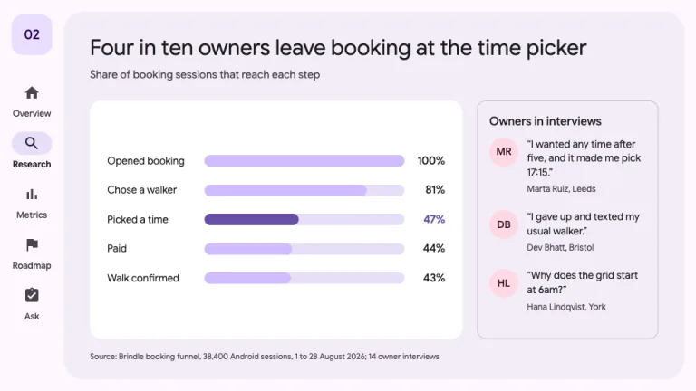
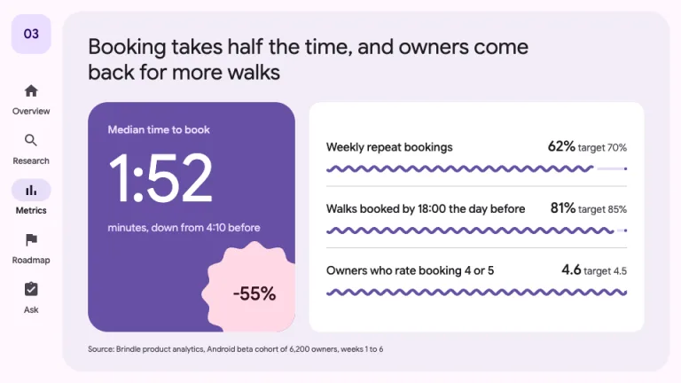
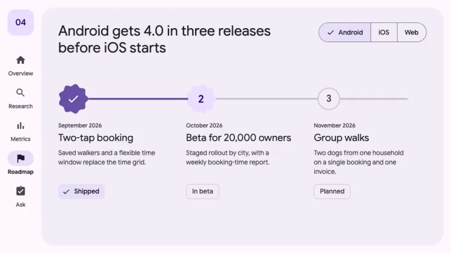
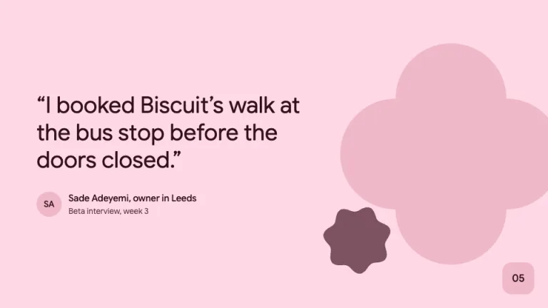
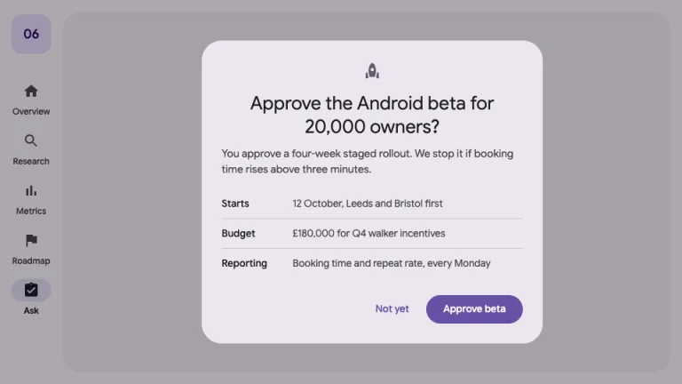

[← All prompts](../README.md) · [Live site](https://slidespeak.co/slide-design-prompts) · [SlideSpeak](https://slidespeak.co)

# Material Style

> Tonal surfaces and expressive shapes from one seed color

A Google Material Design presentation prompt using Material 3: seed color #6750A4, 28px tonal panes, a navigation rail and Expressive shapes. An unofficial homage to Google's Material Design. Not affiliated with, endorsed by, or connected to Google LLC.

**Category:** Tech & product &nbsp;·&nbsp; **Style:** Playful, Calm &nbsp;·&nbsp; **Mode:** Light &nbsp;·&nbsp; **Fonts:** Google Sans Flex

<table>
    <tr>
      <td align="center" width="33%"><br><sub>Cover</sub></td>
      <td align="center" width="33%"><br><sub>Research finding</sub></td>
      <td align="center" width="33%"><br><sub>Metrics</sub></td>
    </tr>
    <tr>
      <td align="center" width="33%"><br><sub>Roadmap</sub></td>
      <td align="center" width="33%"><br><sub>Customer quote</sub></td>
      <td align="center" width="33%"><br><sub>Decision dialog</sub></td>
    </tr>
</table>

## The prompt

Copy the prompt below into **ChatGPT**, **Claude**, or any AI chat — or grab the raw [`PROMPT.md`](./PROMPT.md). It asks what your presentation is about first, then applies the design to every slide.

```text
Create a presentation in the 'Material Style' theme, an unofficial homage to Material 3, the public design system from Google. Color: every hex comes from the Material 3 baseline scheme generated from the seed #6750A4. Surface #FEF7FF is the slide background; containers step up in tone: #F7F2FA, #F3EDF7, #ECE6F0, and white #FFFFFF for the innermost panel. Primary #6750A4 with #FFFFFF text, primary container #EADDFF with #21005D text, secondary container #E8DEF8 with #1D192B, tertiary #7D5260, tertiary container #FFD8E4 with #31111D, text #1D1B20, supporting text #49454F, outline #79747E, dividers #CAC4D0, inverse primary #D0BCFF. Typography: 'Google Sans Flex' (Google Fonts) only, on the Material type scale: display 56 to 64px weight 400, headlines 28 to 32px 400, titles 16 to 22px 500, body 14 to 16px 400, labels 11 to 14px 500. Sentence case everywhere. Shape follows hierarchy: 28px corners on panes and dialogs, 16px on inner panels and the FAB, 12px on outlined cards, 8px on chips, full radius on buttons, bars and indicators. Elevation is tonal, never a shadow. Signature layout: content slides carry a navigation rail, an 88px column on the left with a 56px FAB (#EADDFF, 16px radius) holding the two-digit slide number, then five section destinations, each a 24px filled icon over a 12px label; the current section sits in a 56x32 #E8DEF8 pill. Right of the rail, a #F3EDF7 pane with 28px corners holds a one-sentence headline and the content. Title slide: #FEF7FF, product name in 22px #6750A4 top-left, display title, presenter with an initials avatar in #FFD8E4, and Material 3 Expressive shapes filling the right half: a 9-sided scalloped cookie in #EADDFF, a soft burst in #FFD8E4, a #6750A4 circle and a #E8DEF8 pill. Data slides: pill-shaped bars on #E8DEF8 tracks, the bar that proves the headline in #6750A4 and the rest in #D0BCFF, values at the bar end; key results as wavy progress indicators (sine-wave segment in #6750A4, flat #E8DEF8 track, stop dot at the end); one hero number per slide in a filled #6750A4 container. Roadmaps: a segmented button for the filter, cookie-shaped milestone markers, status as 8px chips. Quote slides: full-bleed #FFD8E4 with a cropped four-leaf clover shape in #EFB8C8. The ask: a Material dialog, #ECE6F0 with 28px corners over a 32% black scrim, centered icon and headline, terms in a divided list, a text button and a filled #6750A4 button bottom-right. Footer: no rule and no deck name; data slides end with an 11px #49454F source line. Strictly avoid: Google logos, the G mark or the four-color Google palette, claiming affiliation with Google, drop shadows, gradients, all-caps labels, grids of identical cards, more than one hero number per slide, stock photos, emoji, and shapes behind body text.

Use this theme for my slides. Ask me what the presentation is about first, then apply the theme to every slide.
```

**[Open ChatGPT ↗](https://chatgpt.com/)** &nbsp;·&nbsp; **[Open Claude ↗](https://claude.ai/new)** &nbsp;·&nbsp; **[Generate a finished deck with SlideSpeak ↗](https://app.slidespeak.co/presentation?utm_source=github&utm_medium=referral&utm_campaign=slide-design-prompts)**

## Palette

| Role | Hex |
| --- | --- |
| Background | `#fef7ff` |
| Surface / panel | `#f3edf7` |
| Border | `#cac4d0` |
| Primary accent | `#6750a4` |
| Primary (soft tint) | `#eaddff` |
| Text on primary | `#ffffff` |
| Heading text | `#1d1b20` |
| Body text | `#49454f` |
| Muted text | `#79747e` |

**Chart series:** `#6750a4` `#d0bcff` `#7d5260` `#625b71`

## Fonts

- **Google Sans Flex** (heading, Google Fonts)

---

<sub>Part of [SlideSpeak Slide Design Prompts](../../README.md) · MIT licensed</sub>
