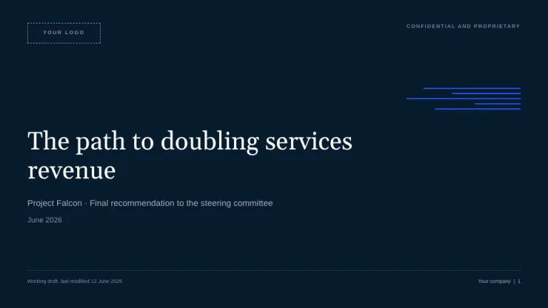
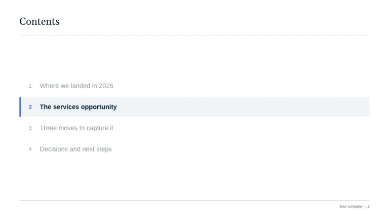
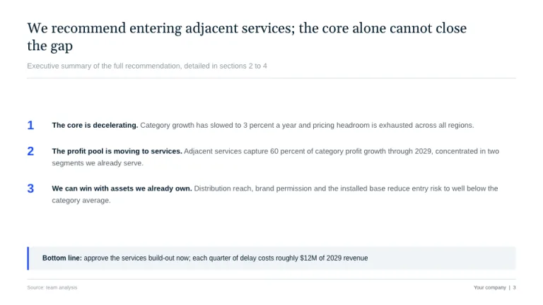
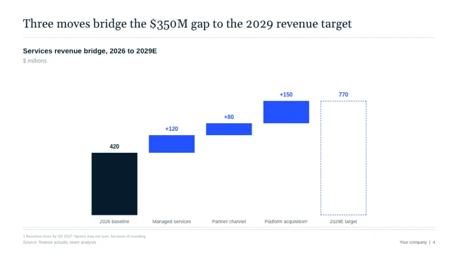
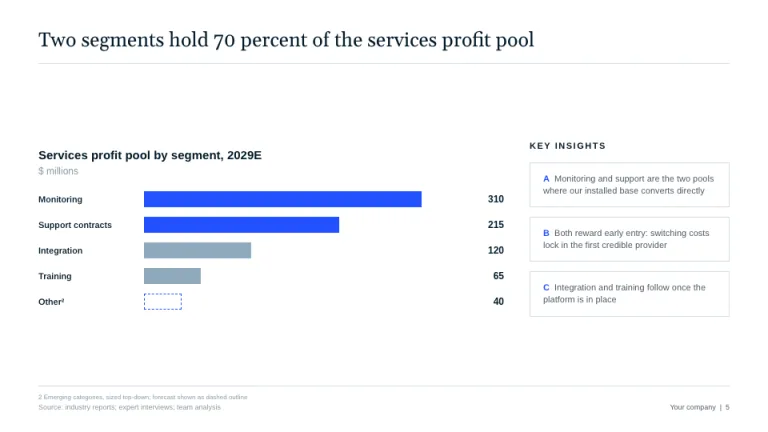
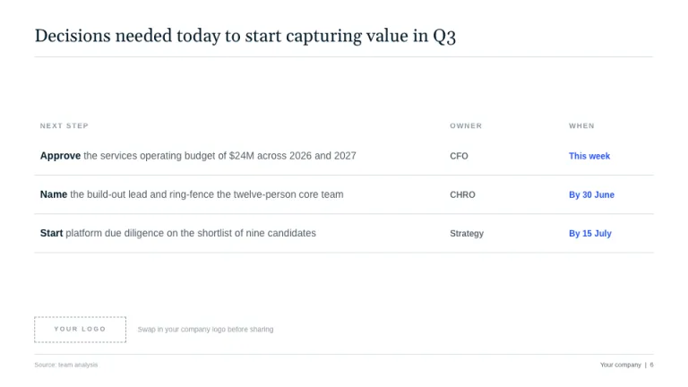

[← All prompts](../README.md) · [Live site](https://slidespeak.co/slide-design-prompts) · [SlideSpeak](https://slidespeak.co)

# McKinsey Style

> Answer first, always

An unofficial homage to the McKinsey deck: serif action titles, deep navy and electric blue, a tracker contents page, waterfall bridges and a logo placeholder ready for your own brand. Not affiliated with McKinsey & Company.

**Category:** Finance & consulting &nbsp;·&nbsp; **Style:** Corporate, Minimal &nbsp;·&nbsp; **Mode:** Light &nbsp;·&nbsp; **Fonts:** Gelasio + Arimo

<table>
    <tr>
      <td align="center" width="33%"><br><sub>Title</sub></td>
      <td align="center" width="33%"><br><sub>Contents</sub></td>
      <td align="center" width="33%"><br><sub>Executive summary</sub></td>
    </tr>
    <tr>
      <td align="center" width="33%"><br><sub>Waterfall bridge</sub></td>
      <td align="center" width="33%"><br><sub>Chart & insights</sub></td>
      <td align="center" width="33%"><br><sub>Next steps</sub></td>
    </tr>
</table>

## The prompt

Copy the prompt below into **ChatGPT**, **Claude**, or any AI chat — or grab the raw [`PROMPT.md`](./PROMPT.md). It asks what your presentation is about first, then applies the design to every slide.

```text
Create a presentation in the 'McKinsey Style' theme, an unofficial homage to the classic top-tier strategy consulting deck. Background: white (#FFFFFF). Typography: action titles in 'Gelasio', a bookish Georgia-style serif, regular weight, deep navy (#051C2C); body and labels in the neutral Arial-style sans-serif 'Arimo' (both Google Fonts), slate gray (#4E5B66); electric blue (#2251FF) is the only accent and appears once per slide to mark the takeaway. Every content slide opens with a full-sentence action title stating the slide's conclusion, under 15 words, never more than 2 lines, the largest text on the slide, with an optional short gray lead-in line beneath and a 1px #D6DEE6 rule under both. Title slide: full-bleed deep navy (#051C2C) background, a motif of thin electric blue horizontal lines of varying length, white serif title under 8 words, subtitle and date in muted blue-gray, plus 'Confidential and proprietary' in tiny letterspaced caps. A 'Contents' slide reappears before each section as a tracker: the current section bold navy on a light #F0F4F8 band with a 3px electric blue left border, all other sections muted gray. Title and closing slides carry a logo placeholder: a dashed 1px box labeled 'YOUR LOGO' in letterspaced caps. Charts follow firm conventions: a two-part chart header (bold navy descriptor, then a gray units line such as '$ millions'), value labels directly on bars, no gridlines and no y-axis, gray #8FA9BD bars with the key series electric blue, forecast values drawn as dashed outlines, numbered superscript footnotes, and a waterfall bridge as the signature chart. Footer on every slide: 8px footnotes and 'Source: ...' bottom-left, 'Company | page number' bottom-right, above nothing but a hairline rule. Key takeaways sit in #F0F4F8 boxes with a 3px electric blue left border, opening 'Bottom line:'. Next-step bullets start with imperative verbs. Strictly avoid: decorative imagery, gradients, drop shadows, rounded corners, more than one accent color, topic-label titles like 'Market overview', legends where direct bar labels work, claiming affiliation with McKinsey & Company.

Use this theme for my slides. Ask me what the presentation is about first, then apply the theme to every slide.
```

**[Open ChatGPT ↗](https://chatgpt.com/)** &nbsp;·&nbsp; **[Open Claude ↗](https://claude.ai/new)** &nbsp;·&nbsp; **[Generate a finished deck with SlideSpeak ↗](https://app.slidespeak.co/presentation?utm_source=github&utm_medium=referral&utm_campaign=slide-design-prompts)**

## Palette

| Role | Hex |
| --- | --- |
| Background | `#FFFFFF` |
| Surface / panel | `#F0F4F8` |
| Border | `#D6DEE6` |
| Primary accent | `#051C2C` |
| Primary (soft tint) | `#E8EEF4` |
| Text on primary | `#FFFFFF` |
| Heading text | `#051C2C` |
| Body text | `#4E5B66` |
| Muted text | `#8A97A3` |

**Chart series:** `#051C2C` `#2251FF` `#8FA9BD` `#DDE6EE`

## Fonts

- **Gelasio** (heading, Google Fonts)
- **Arimo** (supporting, Google Fonts)

---

<sub>Part of [SlideSpeak Slide Design Prompts](../../README.md) · MIT licensed</sub>
