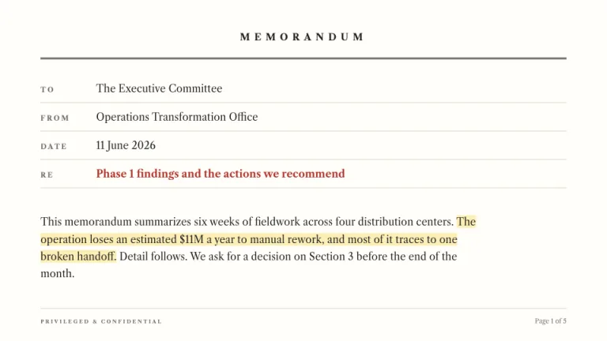
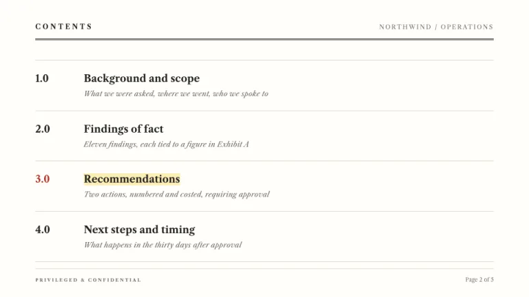
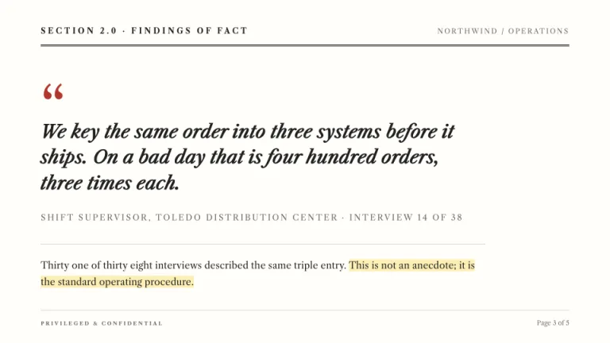
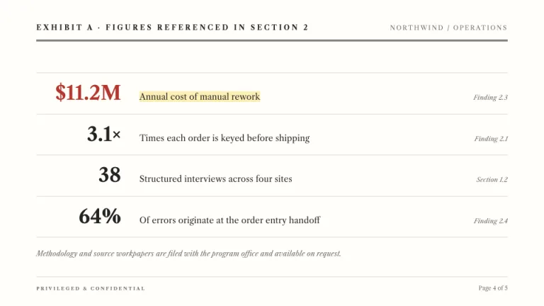
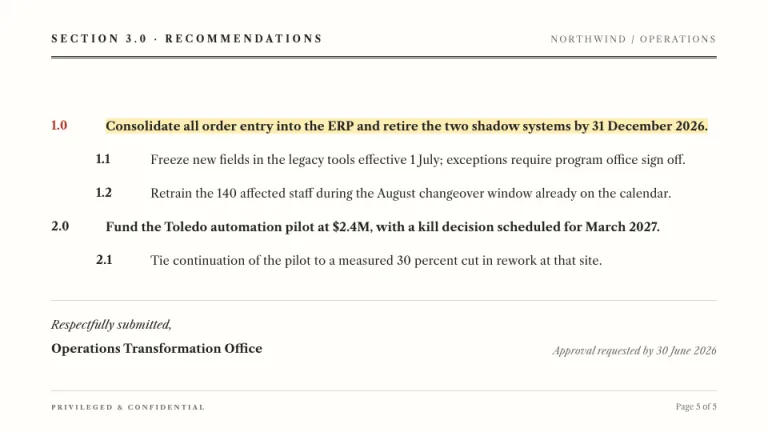

[← All prompts](../README.md) · [Live site](https://slidespeak.co/slide-design-prompts) · [SlideSpeak](https://slidespeak.co)

# Memo

> Per my last memo

The interoffice memorandum turned into slides. Serif body, legal outline numbering and one yellow highlight per slide on the sentence that matters.

**Category:** Business & strategy &nbsp;·&nbsp; **Style:** Minimal, Corporate &nbsp;·&nbsp; **Mode:** Light &nbsp;·&nbsp; **Fonts:** Libre Caslon Text

<table>
    <tr>
      <td align="center" width="33%"><br><sub>Title</sub></td>
      <td align="center" width="33%"><br><sub>Agenda</sub></td>
      <td align="center" width="33%"><br><sub>Quote</sub></td>
    </tr>
    <tr>
      <td align="center" width="33%"><br><sub>Key metrics</sub></td>
      <td align="center" width="33%"><br><sub>Closing</sub></td>
    </tr>
</table>

## The prompt

Copy the prompt below into **ChatGPT**, **Claude**, or any AI chat — or grab the raw [`PROMPT.md`](./PROMPT.md). It asks what your presentation is about first, then applies the design to every slide.

```text
Create a presentation in the 'Memo' theme, an interoffice memorandum styled as slides. Background: warm paper white (#FFFEF9). Typography: 'Libre Caslon Text' (a Google Font) serif throughout; body 15 to 16px in charcoal (#232323) with leading near 1.7; headers in letterspaced uppercase caps. Signature motifs: a memo header with MEMORANDUM in small caps tracked at 0.45em above ruled rows TO, FROM, DATE and RE with typed serif values, the RE line in red (#B3372F); a thin double rule, two 1px charcoal lines 1px apart, under every header; recommendations numbered in legal outline style (1.0, 1.1, 2.0) with sub items hanging indented 56px; exactly one sentence per slide swept with a translucent yellow highlight, #FCE588 at 60 percent opacity. Footer: PRIVILEGED & CONFIDENTIAL in 8px tracked caps with a page count. Red (#B3372F) appears once per slide at most. Strictly avoid: sans serif headlines, photographs, icons, filled charts, more than one highlight per slide, any accent color beyond the one red.

Use this theme for my slides. Ask me what the presentation is about first, then apply the theme to every slide.
```

**[Open ChatGPT ↗](https://chatgpt.com/)** &nbsp;·&nbsp; **[Open Claude ↗](https://claude.ai/new)** &nbsp;·&nbsp; **[Generate a finished deck with SlideSpeak ↗](https://app.slidespeak.co/presentation?utm_source=github&utm_medium=referral&utm_campaign=slide-design-prompts)**

## Palette

| Role | Hex |
| --- | --- |
| Background | `#FFFEF9` |
| Surface / panel | `#FFFFFF` |
| Border | `#D9D7CE` |
| Primary accent | `#B3372F` |
| Primary (soft tint) | `#F5E0DE` |
| Text on primary | `#FFFFFF` |
| Heading text | `#232323` |
| Body text | `#3A3A37` |
| Muted text | `#6B6B66` |

**Chart series:** `#232323` `#B3372F` `#6B6B66` `#FCE588`

## Fonts

- **Libre Caslon Text** (heading and body, Google Fonts)

---

<sub>Part of [SlideSpeak Slide Design Prompts](../../README.md) · MIT licensed</sub>
