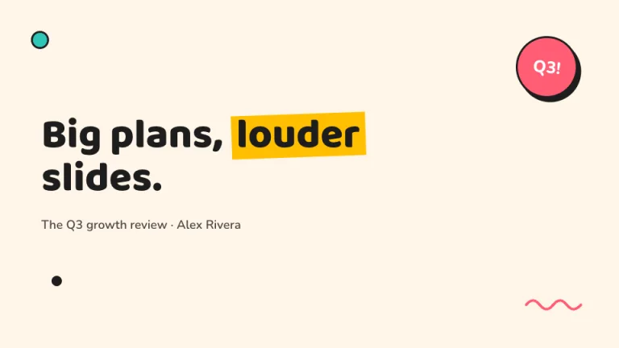
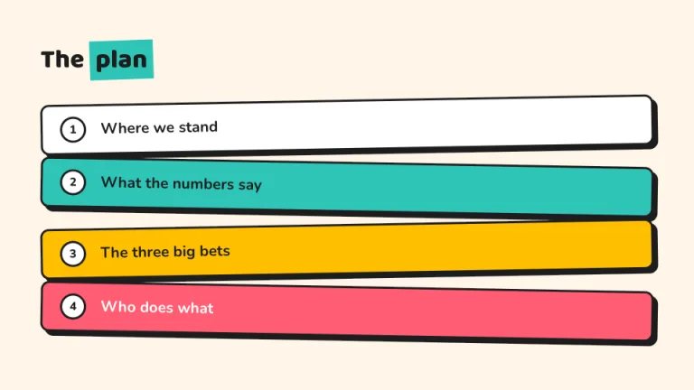
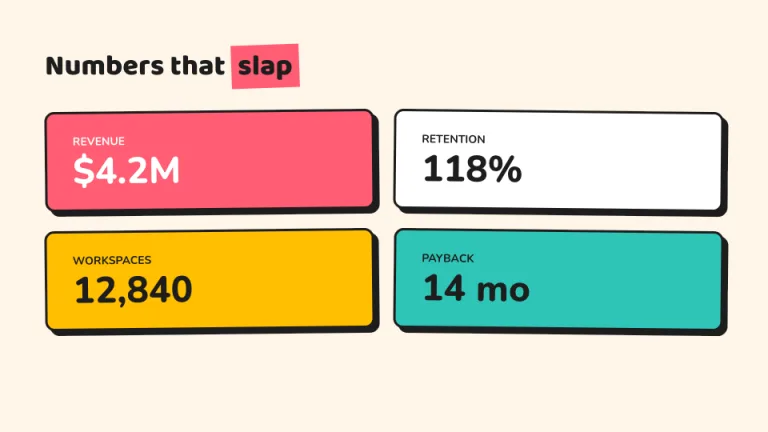
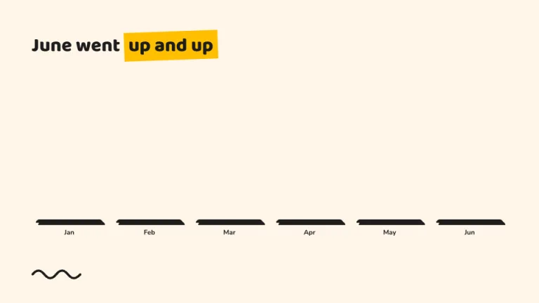
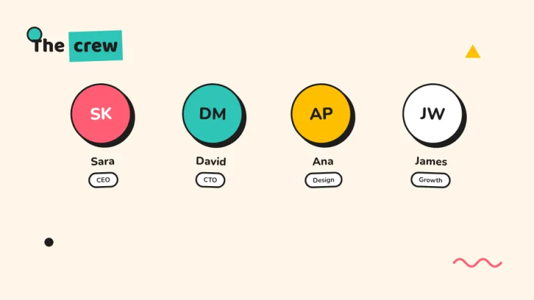
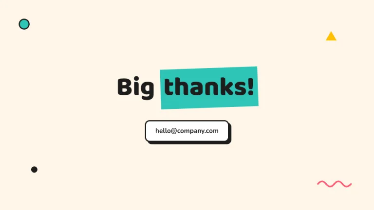

[← All prompts](../README.md) · [Live site](https://slidespeak.co/slide-design-prompts) · [SlideSpeak](https://slidespeak.co)

# Memphis

> Serious work, unserious style

Chunky blocks, thick black outlines and hard offset shadows in pink, teal and yellow. Loud on purpose, and weirdly good at holding attention.

**Category:** Marketing & brand &nbsp;·&nbsp; **Style:** Playful, Bold &nbsp;·&nbsp; **Mode:** Light &nbsp;·&nbsp; **Fonts:** Baloo 2 + Nunito

<table>
    <tr>
      <td align="center" width="33%"><br><sub>Title</sub></td>
      <td align="center" width="33%"><br><sub>Agenda</sub></td>
      <td align="center" width="33%"><br><sub>Key metrics</sub></td>
    </tr>
    <tr>
      <td align="center" width="33%"><br><sub>Chart & insight</sub></td>
      <td align="center" width="33%"><br><sub>Team</sub></td>
      <td align="center" width="33%"><br><sub>Closing</sub></td>
    </tr>
</table>

## The prompt

Copy the prompt below into **ChatGPT**, **Claude**, or any AI chat — or grab the raw [`PROMPT.md`](./PROMPT.md). It asks what your presentation is about first, then applies the design to every slide.

```text
Create a presentation in Memphis design style, the 'Memphis' theme. Background: cream (#FFF6E9). Palette: pink-red (#FF5D73), teal (#2EC4B6), yellow (#FFBF00) and ink black (#1D1D1D). Every card, button and bar is a chunky block with a 3px solid black border, 8 to 12px corner radius, and a hard offset shadow: 6px right, 6px down, solid black, zero blur. Typography: headlines in chunky 'Baloo 2', body in 'Nunito' (both Google Fonts). Headlines: heavy weight, with exactly one word highlighted by a solid color rectangle rotated about minus 2 degrees sitting behind it like a marker stroke. Cards in lists alternate fill colors and rotate alternately about plus and minus 1 degree. Scatter a few small geometric confetti shapes (an outlined circle, a solid triangle, a zigzag squiggle) near corners, never behind text. Charts: color-filled bars with black outlines and offset shadows. Add one rotated circular sticker badge with a black border somewhere on the title slide. Strictly avoid: gradients, soft shadows, thin hairlines, muted colors, perfectly straight alignment.

Use this theme for my slides. Ask me what the presentation is about first, then apply the theme to every slide.
```

**[Open ChatGPT ↗](https://chatgpt.com/)** &nbsp;·&nbsp; **[Open Claude ↗](https://claude.ai/new)** &nbsp;·&nbsp; **[Generate a finished deck with SlideSpeak ↗](https://app.slidespeak.co/presentation?utm_source=github&utm_medium=referral&utm_campaign=slide-design-prompts)**

## Palette

| Role | Hex |
| --- | --- |
| Background | `#FFF6E9` |
| Surface / panel | `#FFFFFF` |
| Border | `#1D1D1D` |
| Primary accent | `#FF5D73` |
| Primary (soft tint) | `#FFE3E7` |
| Text on primary | `#FFFFFF` |
| Heading text | `#1D1D1D` |
| Body text | `#4A4440` |
| Muted text | `#9A8F85` |

**Chart series:** `#FF5D73` `#2EC4B6` `#FFBF00` `#1D1D1D`

## Fonts

- **Baloo 2** (heading, Google Fonts)
- **Nunito** (supporting, Google Fonts)

---

<sub>Part of [SlideSpeak Slide Design Prompts](../../README.md) · MIT licensed</sub>
