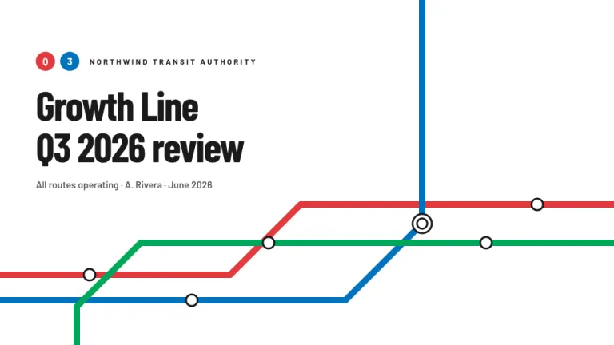
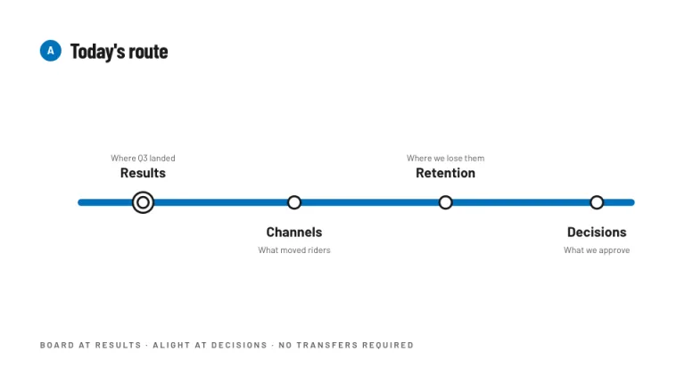
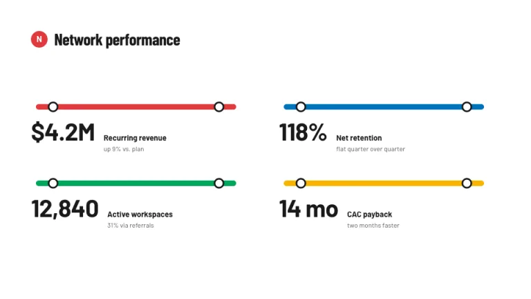
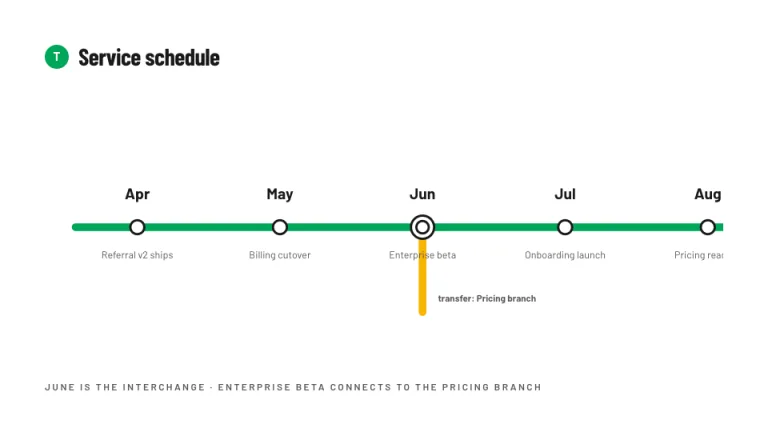
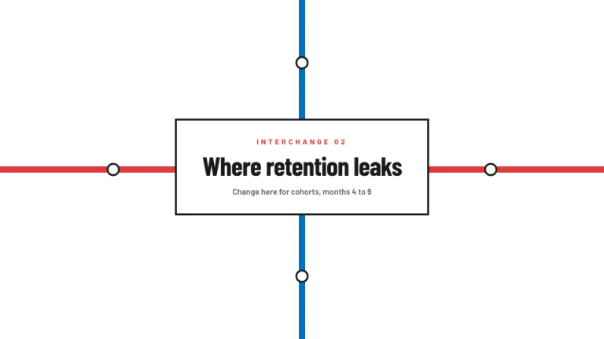
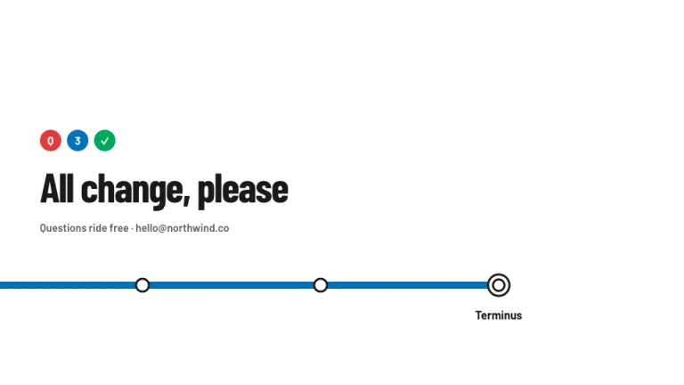

[← All prompts](../README.md) · [Live site](https://slidespeak.co/slide-design-prompts) · [SlideSpeak](https://slidespeak.co)

# Metro

> Mind the gap analysis

Your deck drawn as a transit map. Agendas and timelines run along thick colored routes with proper station dots.

**Category:** Business & strategy &nbsp;·&nbsp; **Style:** Playful, Minimal &nbsp;·&nbsp; **Mode:** Light &nbsp;·&nbsp; **Fonts:** Barlow Condensed + Barlow

<table>
    <tr>
      <td align="center" width="33%"><br><sub>Title</sub></td>
      <td align="center" width="33%"><br><sub>Agenda</sub></td>
      <td align="center" width="33%"><br><sub>Key metrics</sub></td>
    </tr>
    <tr>
      <td align="center" width="33%"><br><sub>Timeline</sub></td>
      <td align="center" width="33%"><br><sub>Section divider</sub></td>
      <td align="center" width="33%"><br><sub>Closing</sub></td>
    </tr>
</table>

## The prompt

Copy the prompt below into **ChatGPT**, **Claude**, or any AI chat — or grab the raw [`PROMPT.md`](./PROMPT.md). It asks what your presentation is about first, then applies the design to every slide.

```text
Create a presentation in the 'Metro' theme, built from transit-map design language. Background: pure white (#FFFFFF). Typography: headlines in bold 'Barlow Condensed' like station signage, body in 'Barlow' (both Google Fonts), ink #1A1A1A, secondary text #5A5A5A. Signature motifs: thick 10px route lines with rounded caps and clean 45 or 90 degree bends in four metro colors, red #E03A3E, blue #0072BC, green #00A65A, yellow #F8B500; station dots, 18px white circles with 3px #1A1A1A rings, sitting directly on the lines; interchanges drawn as a larger double ring, a 30px circle with a concentric 16px inner ring; circular line badges, 30px solid-color circles with one bold white character. Draw the agenda and the timeline AS metro lines: one horizontal route with evenly spaced stations, bold labels alternating above and below the line. Section slides: two routes crossing at an interchange, the section name in a white box with a 3px #1A1A1A border. Strictly avoid: gradients, shadows, photographs, thin or wavy lines, stations floating off their lines, more than four route colors.

Use this theme for my slides. Ask me what the presentation is about first, then apply the theme to every slide.
```

**[Open ChatGPT ↗](https://chatgpt.com/)** &nbsp;·&nbsp; **[Open Claude ↗](https://claude.ai/new)** &nbsp;·&nbsp; **[Generate a finished deck with SlideSpeak ↗](https://app.slidespeak.co/presentation?utm_source=github&utm_medium=referral&utm_campaign=slide-design-prompts)**

## Palette

| Role | Hex |
| --- | --- |
| Background | `#FFFFFF` |
| Surface / panel | `#F6F6F6` |
| Border | `#1A1A1A` |
| Primary accent | `#E03A3E` |
| Primary (soft tint) | `#FBE2E2` |
| Text on primary | `#FFFFFF` |
| Heading text | `#1A1A1A` |
| Body text | `#5A5A5A` |
| Muted text | `#8A8A8A` |

**Chart series:** `#E03A3E` `#0072BC` `#00A65A` `#F8B500`

## Fonts

- **Barlow Condensed** (heading, Google Fonts)
- **Barlow** (supporting, Google Fonts)

---

<sub>Part of [SlideSpeak Slide Design Prompts](../../README.md) · MIT licensed</sub>
