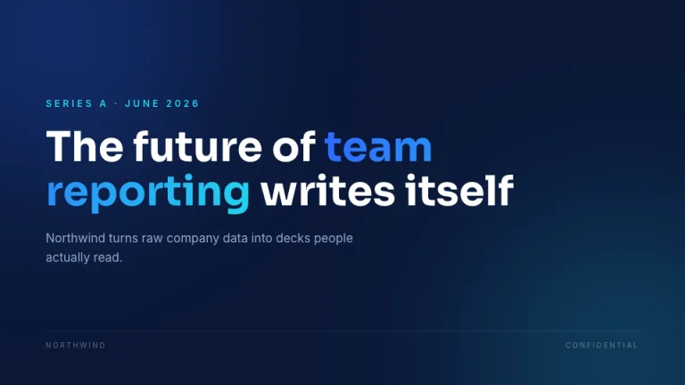
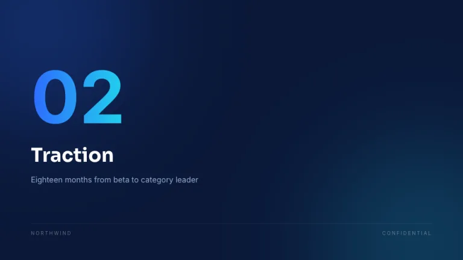
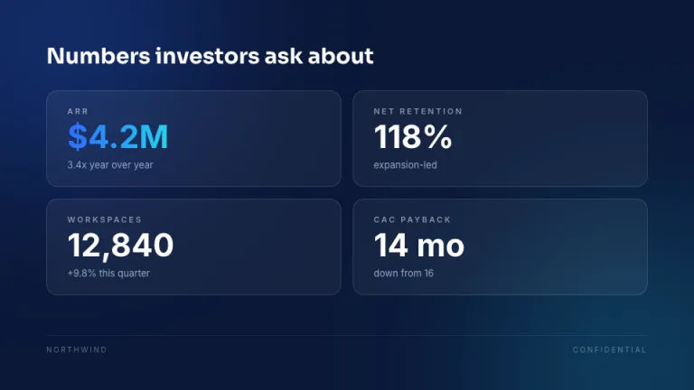
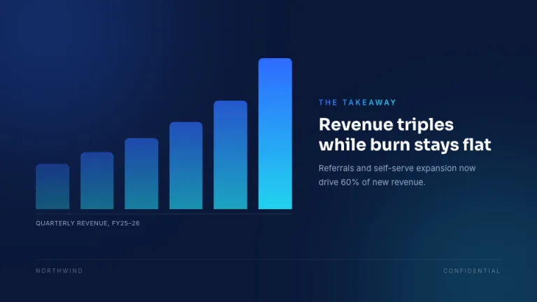
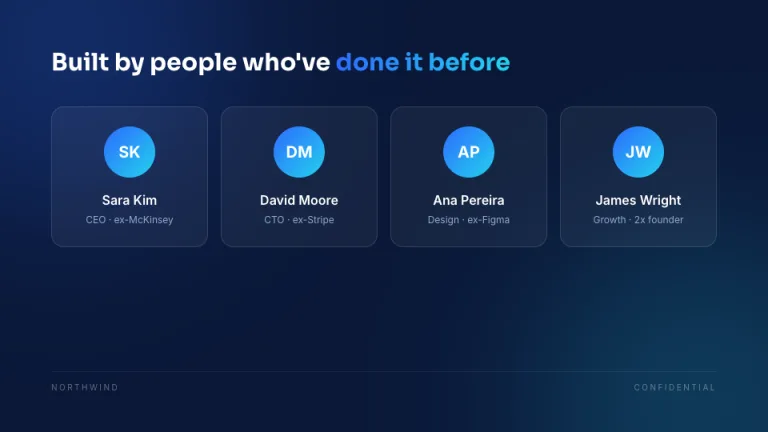
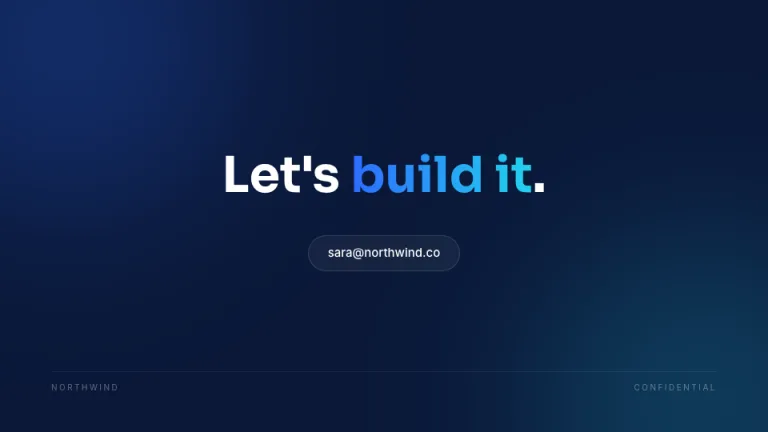

[← All prompts](../README.md) · [Live site](https://slidespeak.co/slide-design-prompts) · [SlideSpeak](https://slidespeak.co)

# Midnight Pitch

> Make investors lean in

Deep navy with glowing orbs and frosted glass panels. Huge numbers, one gradient highlight per slide, and enough drama to carry a fundraise.

**Category:** Pitch decks &nbsp;·&nbsp; **Style:** Dark, Bold &nbsp;·&nbsp; **Mode:** Dark &nbsp;·&nbsp; **Fonts:** Sora + Inter

<table>
    <tr>
      <td align="center" width="33%"><br><sub>Title</sub></td>
      <td align="center" width="33%"><br><sub>Section divider</sub></td>
      <td align="center" width="33%"><br><sub>Key metrics</sub></td>
    </tr>
    <tr>
      <td align="center" width="33%"><br><sub>Chart & insight</sub></td>
      <td align="center" width="33%"><br><sub>Team</sub></td>
      <td align="center" width="33%"><br><sub>Closing</sub></td>
    </tr>
</table>

## The prompt

Copy the prompt below into **ChatGPT**, **Claude**, or any AI chat — or grab the raw [`PROMPT.md`](./PROMPT.md). It asks what your presentation is about first, then applies the design to every slide.

```text
Create a presentation using the 'Midnight Pitch' theme. Background: deep navy (#0A1838) with two large, heavily blurred glowing orbs in opposite corners, one blue (#2E6BFF) and one cyan (#22D3EE), at roughly 20 percent opacity. Panels are frosted glass: white at 5 percent opacity with a 1px white border at 12 percent opacity and 16px radius. Typography: headlines in 'Sora', body in 'Inter' (both Google Fonts). Headlines: white, bold, oversized, tight leading; on every slide exactly one word or number gets a blue-to-cyan gradient text treatment. Body text: blue-gray (#94A8CC). Metrics are huge (around 15 percent of slide height) with small uppercase labels. Charts: bars filled with a vertical blue-to-cyan gradient on a transparent background. Footer on every slide: a thin white rule at 8 percent opacity with the company name left and 'CONFIDENTIAL' right, in small letterspaced caps. Strictly avoid: light backgrounds, hard opaque borders, more than the two accent hues, clip art.

Use this theme for my slides. Ask me what the presentation is about first, then apply the theme to every slide.
```

**[Open ChatGPT ↗](https://chatgpt.com/)** &nbsp;·&nbsp; **[Open Claude ↗](https://claude.ai/new)** &nbsp;·&nbsp; **[Generate a finished deck with SlideSpeak ↗](https://app.slidespeak.co/presentation?utm_source=github&utm_medium=referral&utm_campaign=slide-design-prompts)**

## Palette

| Role | Hex |
| --- | --- |
| Background | `#0A1838` |
| Surface / panel | `#13244D` |
| Border | `#23365F` |
| Primary accent | `#2E6BFF` |
| Primary (soft tint) | `#142B5C` |
| Text on primary | `#FFFFFF` |
| Heading text | `#FFFFFF` |
| Body text | `#94A8CC` |
| Muted text | `#5F73A0` |

**Chart series:** `#2E6BFF` `#22D3EE` `#7FA8FF` `#1E3566`

## Fonts

- **Sora** (heading, Google Fonts)
- **Inter** (supporting, Google Fonts)

---

<sub>Part of [SlideSpeak Slide Design Prompts](../../README.md) · MIT licensed</sub>
