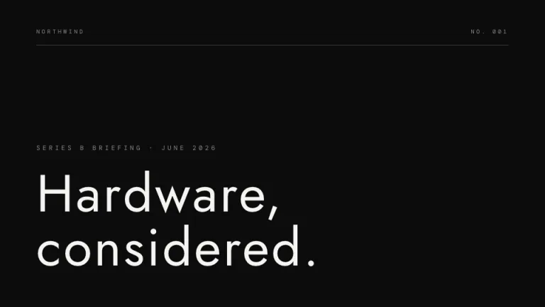
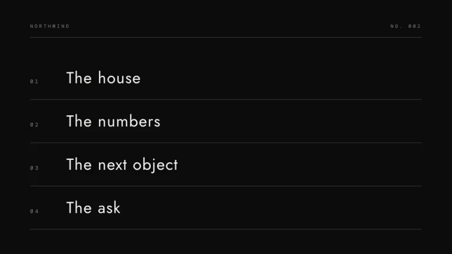
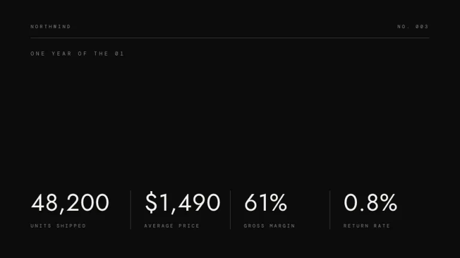
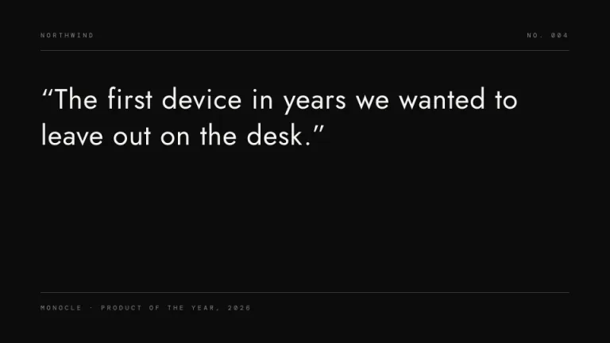
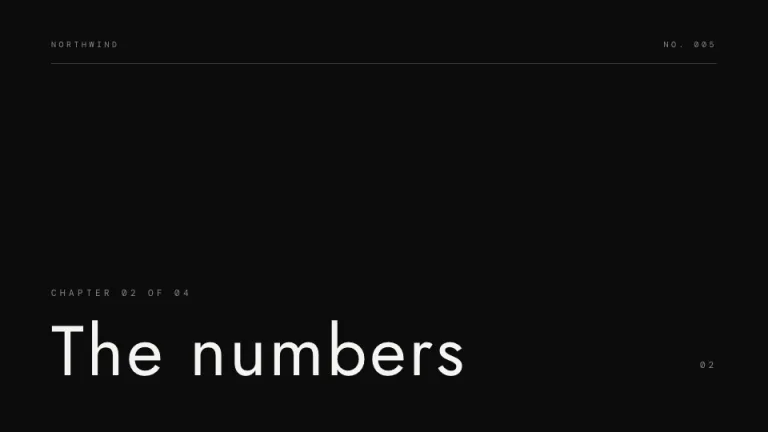
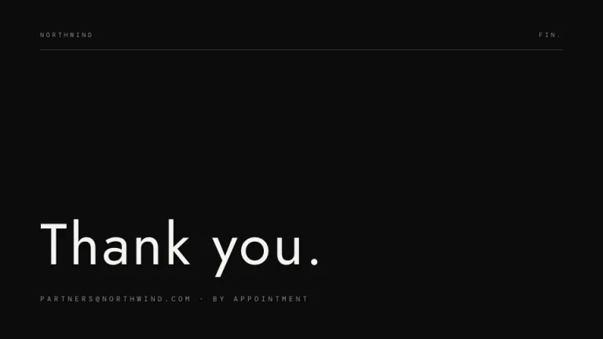

[← All prompts](../README.md) · [Live site](https://slidespeak.co/slide-design-prompts) · [SlideSpeak](https://slidespeak.co)

# Monolith

> Expensive silence

Luxury-brand minimalism on near-black. Huge thin type, monospace labels and a few faint rules carry the whole deck.

**Category:** Pitch decks &nbsp;·&nbsp; **Style:** Minimal, Dark &nbsp;·&nbsp; **Mode:** Dark &nbsp;·&nbsp; **Fonts:** Jost + DM Mono

<table>
    <tr>
      <td align="center" width="33%"><br><sub>Title</sub></td>
      <td align="center" width="33%"><br><sub>Agenda</sub></td>
      <td align="center" width="33%"><br><sub>Key metrics</sub></td>
    </tr>
    <tr>
      <td align="center" width="33%"><br><sub>Quote</sub></td>
      <td align="center" width="33%"><br><sub>Section divider</sub></td>
      <td align="center" width="33%"><br><sub>Closing</sub></td>
    </tr>
</table>

## The prompt

Copy the prompt below into **ChatGPT**, **Claude**, or any AI chat — or grab the raw [`PROMPT.md`](./PROMPT.md). It asks what your presentation is about first, then applies the design to every slide.

```text
Create a presentation in the 'Monolith' theme: luxury-brand dark minimalism. Background: flat near-black #0C0C0C on every slide. Typography: huge thin-weight display type in 'Jost', off-white #F5F5F3, 80 to 100px at font-weight 300, with generous letter-spacing near 0.04em; all labels in monospace 'DM Mono' (both Google Fonts), 10 to 11px, uppercase, letter-spaced 0.35em, warm gray #8A8A86. The only structure: single 1px horizontal rules in white at 20 percent opacity, one beneath a small header row (brand name left, slide number right), at most one more above a footer line. Place content low or high on the slide, never vertically centered, and leave at least half of each slide empty. Stats sit in one row, values around 50px thin, separated by the same 1px rules. Section slides put one huge thin headline at the bottom edge. Strictly avoid: any color beyond #0C0C0C, #F5F5F3 and #8A8A86; bold or heavy display weights; vertically centered layouts; icons, photos or illustrations; shadows and gradients; more than two rules per slide.

Use this theme for my slides. Ask me what the presentation is about first, then apply the theme to every slide.
```

**[Open ChatGPT ↗](https://chatgpt.com/)** &nbsp;·&nbsp; **[Open Claude ↗](https://claude.ai/new)** &nbsp;·&nbsp; **[Generate a finished deck with SlideSpeak ↗](https://app.slidespeak.co/presentation?utm_source=github&utm_medium=referral&utm_campaign=slide-design-prompts)**

## Palette

| Role | Hex |
| --- | --- |
| Background | `#0C0C0C` |
| Surface / panel | `#161616` |
| Border | `#2A2A2A` |
| Primary accent | `#F5F5F3` |
| Primary (soft tint) | `#2E2E2C` |
| Text on primary | `#0C0C0C` |
| Heading text | `#F5F5F3` |
| Body text | `#C9C9C5` |
| Muted text | `#8A8A86` |

**Chart series:** `#F5F5F3` `#B5B5B1` `#8A8A86` `#4A4A47`

## Fonts

- **Jost** (heading, Google Fonts)
- **DM Mono** (supporting, Google Fonts)

---

<sub>Part of [SlideSpeak Slide Design Prompts](../../README.md) · MIT licensed</sub>
