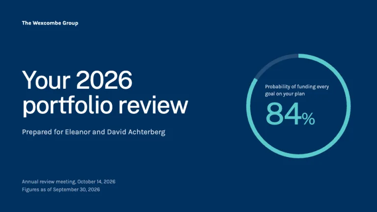
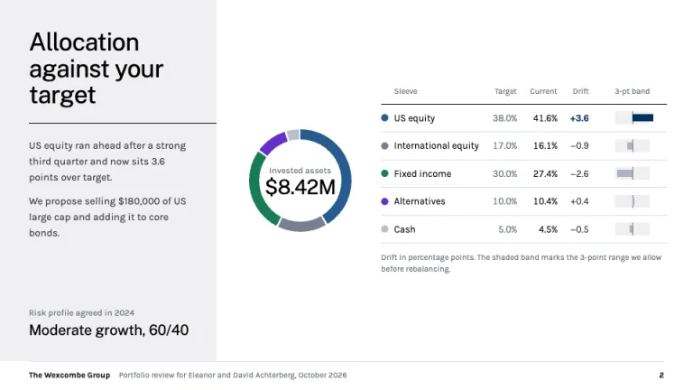
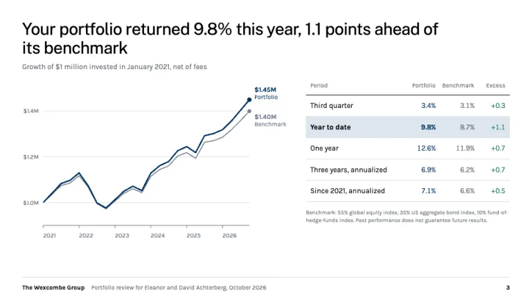
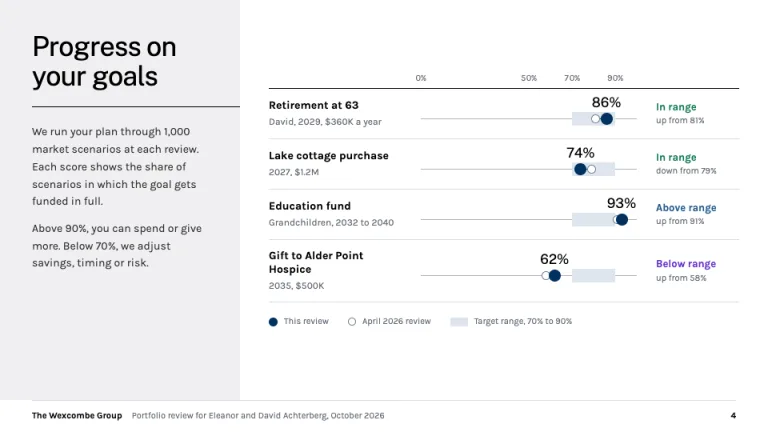
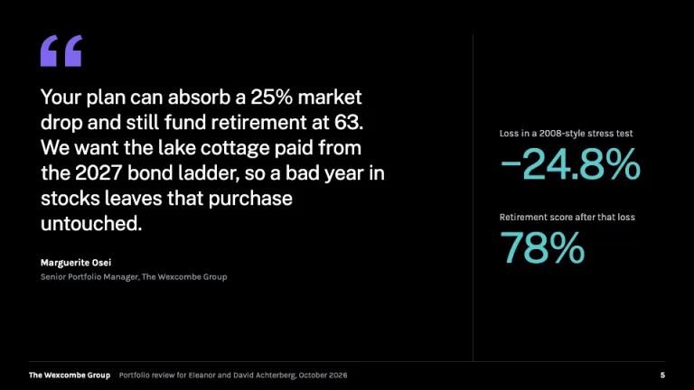
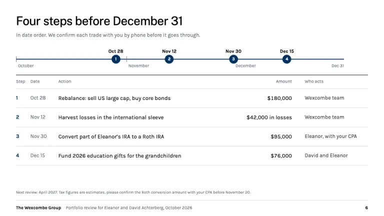

[← All prompts](../README.md) · [Live site](https://slidespeak.co/slide-design-prompts) · [SlideSpeak](https://slidespeak.co)

# Morgan Stanley Style

> The client review, in deep blue and black

A Morgan Stanley presentation template prompt for wealth client reviews: allocation drift, performance versus benchmark and goal tracking in deep blue. An unofficial homage to the Morgan Stanley presentation style. Not affiliated with, endorsed by, or connected to Morgan Stanley.

**Category:** Finance &nbsp;·&nbsp; **Style:** Elegant, Corporate &nbsp;·&nbsp; **Mode:** Light &nbsp;·&nbsp; **Fonts:** Public Sans + Karla

<table>
    <tr>
      <td align="center" width="33%"><br><sub>Cover</sub></td>
      <td align="center" width="33%"><br><sub>Asset allocation</sub></td>
      <td align="center" width="33%"><br><sub>Performance versus benchmark</sub></td>
    </tr>
    <tr>
      <td align="center" width="33%"><br><sub>Goal tracking</sub></td>
      <td align="center" width="33%"><br><sub>Advisor view</sub></td>
      <td align="center" width="33%"><br><sub>Next steps</sub></td>
    </tr>
</table>

## The prompt

Copy the prompt below into **ChatGPT**, **Claude**, or any AI chat — or grab the raw [`PROMPT.md`](./PROMPT.md). It asks what your presentation is about first, then applies the design to every slide.

```text
Create a presentation in the 'Morgan Stanley Style' theme, an unofficial homage to the wealth-management client review. Typography: 'Public Sans' (Google Fonts) at weight 400 for titles and large numerals with -0.02em tracking, titles 30 to 34px, cover 60px; 'Karla' (Google Fonts) for body at 13 to 15px and labels at 11px, bold only for names and the one figure that matters. Color: white (#ffffff) content slides, pure black (#000000) for titles and one full black slide, Morgan Stanley blue (#003060) for the cover and key marks, body #333333, notes #656b78, rules #d8dde1, pale gray (#f0f0f2) title panels, blue tint (#dde5ee) for target ranges and highlighted rows. Chart order: #265b8e, #778090, #187c56 jade, #6431ca violet; on dark slides use #5bcacc and #8064ed. The signature layout: a 300px #f0f0f2 panel down the left edge holding the slide title in 34px black, a 1px black rule running to the panel edge, and two short paragraphs of plain context; the exhibit sits on white to the right. Cover: full-bleed #003060, the advisory team name top-left in bold white, the review title in 60px white, 'Prepared for' and the client names in #c9d4e2, the date bottom-left, and a thin #5bcacc ring showing the plan-wide probability of success, its description above a large numeral. Allocation: a thin ring with total assets in the center beside a target, current and drift table; drift bars sit on a zero line inside a shaded 3-point band, and only a sleeve outside the band turns #003060 bold. Performance: a full-sentence result title, a growth-of-$1M line chart (portfolio 2.5px #003060, benchmark #778090, direct end labels, no legend) beside a returns table for quarter, year to date, one year, three years and since inception, with excess return in #187c56. Goal tracking: one horizontal rail per goal on a 0 to 100% scale, the 70% to 90% target range shaded #dde5ee, a filled #003060 dot for this review with its score above, a hollow #778090 dot for the previous review, and a status word: In range #187c56, Above range #265b8e, Below range #6431ca. Advisor view: full black, a #8064ed quote mark, the portfolio manager's view in 28px white, and stress-test figures as 58px #5bcacc numerals, description above. Next steps: a quarter timeline with dated markers over an action, amount and owner table. Footer on content slides: a 1px #d8dde1 rule, the advisory team in bold 11px black, client and date in #656b78, bold page number at right; performance slides carry a past-performance line. Strictly avoid: the Morgan Stanley logo or wordmark, claiming affiliation with Morgan Stanley, gold accents, serif display type, gradients, drop shadows, rounded cards, 3D or exploded pies, legends where direct labels fit, stock photos, icons, all-caps labels, and heavy bold titles.

Use this theme for my slides. Ask me what the presentation is about first, then apply the theme to every slide.
```

**[Open ChatGPT ↗](https://chatgpt.com/)** &nbsp;·&nbsp; **[Open Claude ↗](https://claude.ai/new)** &nbsp;·&nbsp; **[Generate a finished deck with SlideSpeak ↗](https://app.slidespeak.co/presentation?utm_source=github&utm_medium=referral&utm_campaign=slide-design-prompts)**

## Palette

| Role | Hex |
| --- | --- |
| Background | `#ffffff` |
| Surface / panel | `#f0f0f2` |
| Border | `#d8dde1` |
| Primary accent | `#003060` |
| Primary (soft tint) | `#dde5ee` |
| Text on primary | `#ffffff` |
| Heading text | `#000000` |
| Body text | `#333333` |
| Muted text | `#656b78` |

**Chart series:** `#265b8e` `#778090` `#187c56` `#6431ca`

## Fonts

- **Public Sans** (heading, Google Fonts)
- **Karla** (supporting, Google Fonts)

---

<sub>Part of [SlideSpeak Slide Design Prompts](../../README.md) · MIT licensed</sub>
