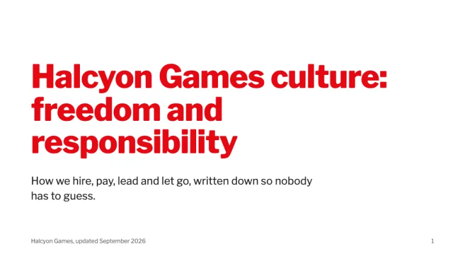
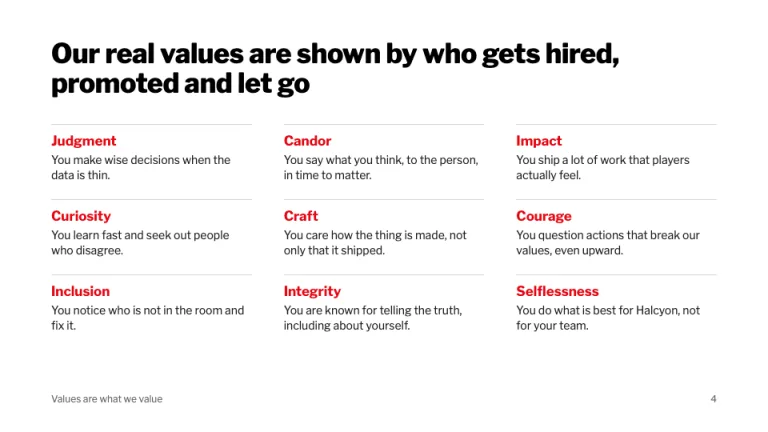
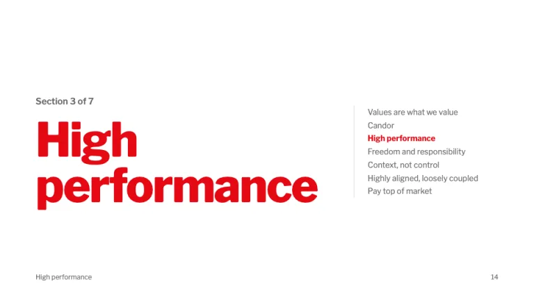
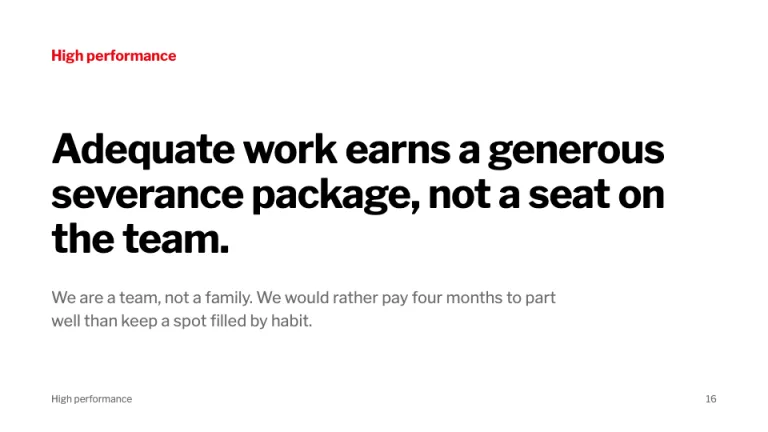
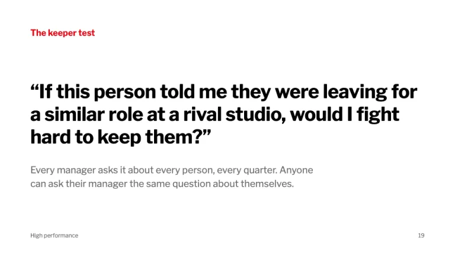
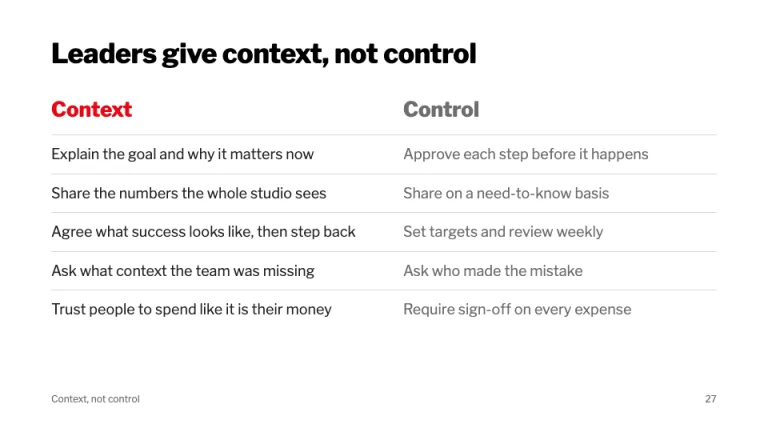

[← All prompts](../README.md) · [Live site](https://slidespeak.co/slide-design-prompts) · [SlideSpeak](https://slidespeak.co)

# Netflix Culture Deck

> Freedom, responsibility and nothing else on the slide

A Netflix culture deck format for writing down how your company works: text-only white slides, red section titles, big black statements, a values roster, a context-not-control table and the keeper test. An unofficial homage to the 2009 Netflix culture deck. Not affiliated with, endorsed by, or connected to Netflix, Inc.

**Category:** Business & strategy &nbsp;·&nbsp; **Style:** Minimal, Bold &nbsp;·&nbsp; **Mode:** Light &nbsp;·&nbsp; **Fonts:** Libre Franklin

<table>
    <tr>
      <td align="center" width="33%"><br><sub>Title</sub></td>
      <td align="center" width="33%"><br><sub>Values roster</sub></td>
      <td align="center" width="33%"><br><sub>Section opener</sub></td>
    </tr>
    <tr>
      <td align="center" width="33%"><br><sub>Statement</sub></td>
      <td align="center" width="33%"><br><sub>The keeper test</sub></td>
      <td align="center" width="33%"><br><sub>Context, not control</sub></td>
    </tr>
</table>

## The prompt

Copy the prompt below into **ChatGPT**, **Claude**, or any AI chat — or grab the raw [`PROMPT.md`](./PROMPT.md). It asks what your presentation is about first, then applies the design to every slide.

```text
Create a presentation in the 'Netflix Culture Deck' theme, an unofficial homage to the text-only culture deck that made 'freedom and responsibility' famous. Background: plain white (#ffffff) on every slide, never dark. Typography: 'Libre Franklin' (Google Fonts) throughout; titles in weight 800 with slightly tight tracking, statements in 700, body in 400. The words are the design: no photos, no icons, no illustrations, and charts only when a number is the whole point. Color has two jobs: red #e50914 marks section titles and the name of the idea on a slide; black #000000 carries headlines and #221f1f carries body text; gray #6d6d6d is for supporting lines and the footer. Title slide: the culture statement as a red title at 60 to 68px, left-aligned, two or three lines, a black one-line subtitle at 22px saying what the document covers, and nothing else. Section openers: 'Section 3 of 7' in gray 16px above a red section title at 80 to 88px, with the full running order of sections listed on the right in 14px gray and the current section in bold red. Statement slides: the section name in red 18px bold at top-left, then one sentence of 20 words or fewer in black 700 at 44 to 52px, then one gray line at 20px giving the reason. Values roster: a black headline, then nine behaviors in a three-column grid, each a red 17px bold term over a one-line black definition, separated by 1px #d9d9d9 top rules; values are not ranked, so never number them. Contrast table: a two-column table headed 'Context' in red and 'Control' in gray at 26px, five rows of paired phrases at 18px with 1px #d9d9d9 row rules, left column black, right column gray. The keeper test: the question in quotation marks at about 40px black, with the red name above it and a gray line on how managers use it. Write in plain, blunt, first-person-plural sentences; say what the company does and does not tolerate. Footer on every slide: the section name bottom-left and the slide number bottom-right, both 12px #6d6d6d. Left-align everything and leave at least 64px margins. Strictly avoid: the Netflix N logo or wordmark, black or dark streaming-style backgrounds, photos, emoji, icons beside bullets, bullet lists of more than five items, gradients, drop shadows, rounded cards, a second accent color, centered body text, corporate filler like 'synergy' or 'best-in-class', and claiming affiliation with Netflix, Inc.

Use this theme for my slides. Ask me what the presentation is about first, then apply the theme to every slide.
```

**[Open ChatGPT ↗](https://chatgpt.com/)** &nbsp;·&nbsp; **[Open Claude ↗](https://claude.ai/new)** &nbsp;·&nbsp; **[Generate a finished deck with SlideSpeak ↗](https://app.slidespeak.co/presentation?utm_source=github&utm_medium=referral&utm_campaign=slide-design-prompts)**

## Palette

| Role | Hex |
| --- | --- |
| Background | `#ffffff` |
| Surface / panel | `#f3f3f3` |
| Border | `#d9d9d9` |
| Primary accent | `#e50914` |
| Primary (soft tint) | `#fde6e7` |
| Text on primary | `#ffffff` |
| Heading text | `#000000` |
| Body text | `#221f1f` |
| Muted text | `#6d6d6d` |

**Chart series:** `#e50914` `#221f1f` `#8c8c8c` `#c4c4c4`

## Fonts

- **Libre Franklin** (heading, Google Fonts)

---

<sub>Part of [SlideSpeak Slide Design Prompts](../../README.md) · MIT licensed</sub>
