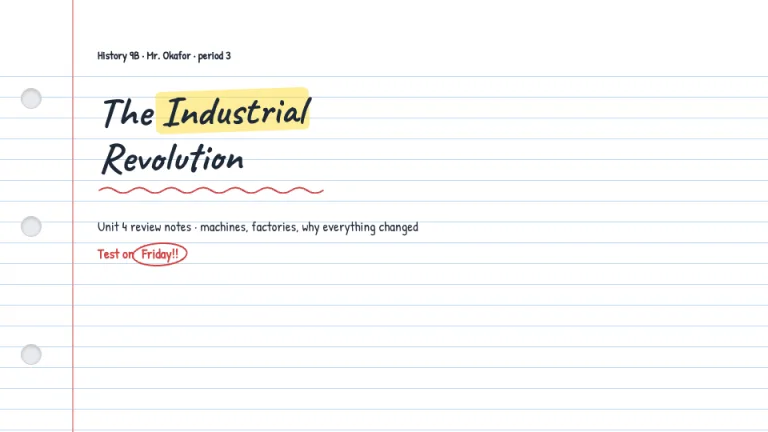
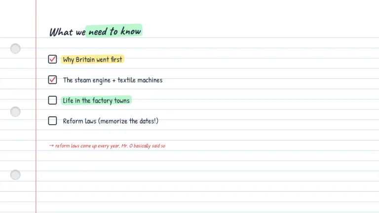
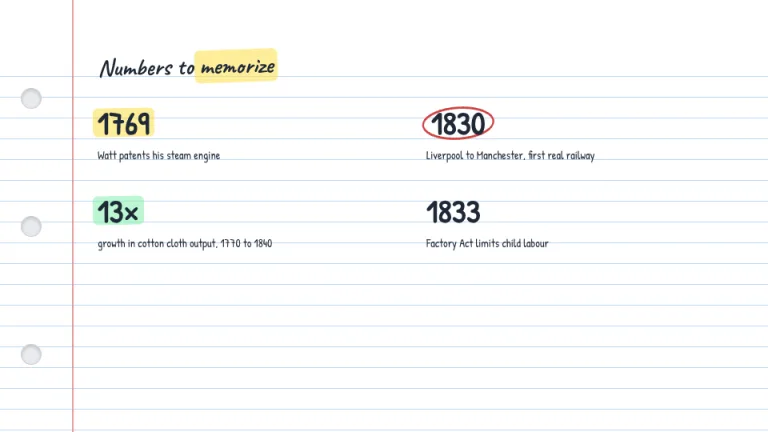
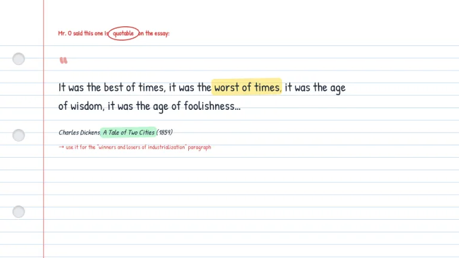
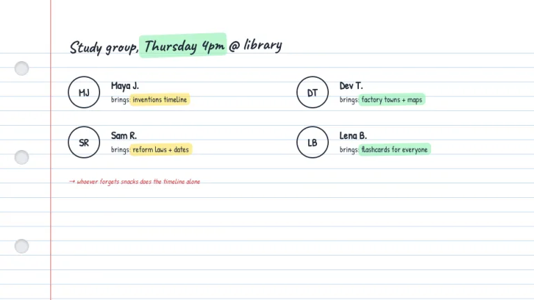
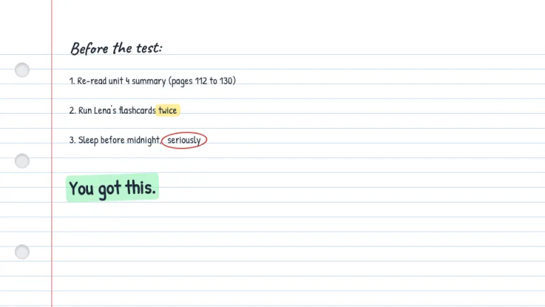

[← All prompts](../README.md) · [Live site](https://slidespeak.co/slide-design-prompts) · [SlideSpeak](https://slidespeak.co)

# Notebook

> Margins included

A lined notebook page with highlighter strokes and red pen circles. Notes that look like the smartest kid in class wrote them.

**Category:** Education & research &nbsp;·&nbsp; **Style:** Playful, Warm &nbsp;·&nbsp; **Mode:** Light &nbsp;·&nbsp; **Fonts:** Caveat + Patrick Hand

<table>
    <tr>
      <td align="center" width="33%"><br><sub>Title</sub></td>
      <td align="center" width="33%"><br><sub>Agenda</sub></td>
      <td align="center" width="33%"><br><sub>Key metrics</sub></td>
    </tr>
    <tr>
      <td align="center" width="33%"><br><sub>Quote</sub></td>
      <td align="center" width="33%"><br><sub>Team</sub></td>
      <td align="center" width="33%"><br><sub>Closing</sub></td>
    </tr>
</table>

## The prompt

Copy the prompt below into **ChatGPT**, **Claude**, or any AI chat — or grab the raw [`PROMPT.md`](./PROMPT.md). It asks what your presentation is about first, then applies the design to every slide.

```text
Create slides in the 'Notebook' theme, a student's lined notebook page. Background: white #FFFFFF with 1px horizontal ruled lines in pale blue #BFD7EE every 26px, starting about 70px from the top; a 2px vertical red margin line #E8A0A0 at 90px from the left; three gray punch holes about 26px wide spaced down the left edge. All content sits right of the margin line. Typography: headings in handwritten 'Caveat', body in 'Patrick Hand' (both Google Fonts), dark gray #1F2937, body text set on the 26px line grid, headings slightly rotated up to 1 degree. Signature motifs: translucent highlighter strokes behind key words, rounded rectangles in yellow #FDE047 or green #86EFAC at 55 percent opacity, slightly rotated; hand-drawn red #D14545 ellipses circling dates and numbers, plus squiggly red underlines; small margin doodles such as stars and curved arrows in red, left of the margin line. Strictly avoid: dark backgrounds, gradients, drop shadows, corporate card layouts, perfectly straight decorative strokes, photography.

Use this theme for my slides. Ask me what the presentation is about first, then apply the theme to every slide.
```

**[Open ChatGPT ↗](https://chatgpt.com/)** &nbsp;·&nbsp; **[Open Claude ↗](https://claude.ai/new)** &nbsp;·&nbsp; **[Generate a finished deck with SlideSpeak ↗](https://app.slidespeak.co/presentation?utm_source=github&utm_medium=referral&utm_campaign=slide-design-prompts)**

## Palette

| Role | Hex |
| --- | --- |
| Background | `#FFFFFF` |
| Surface / panel | `#F8FAFD` |
| Border | `#BFD7EE` |
| Primary accent | `#D14545` |
| Primary (soft tint) | `#FBE3E3` |
| Text on primary | `#FFFFFF` |
| Heading text | `#1F2937` |
| Body text | `#374151` |
| Muted text | `#9CA3AF` |

**Chart series:** `#FDE047` `#86EFAC` `#BFD7EE` `#E8A0A0`

## Fonts

- **Caveat** (heading, Google Fonts)
- **Patrick Hand** (supporting, Google Fonts)

---

<sub>Part of [SlideSpeak Slide Design Prompts](../../README.md) · MIT licensed</sub>
