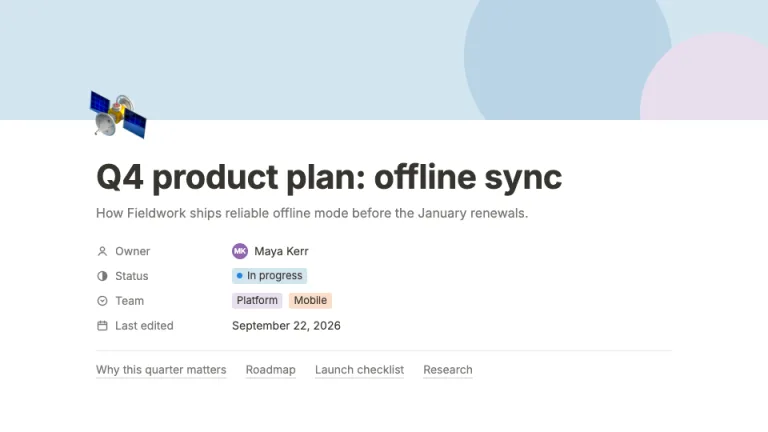
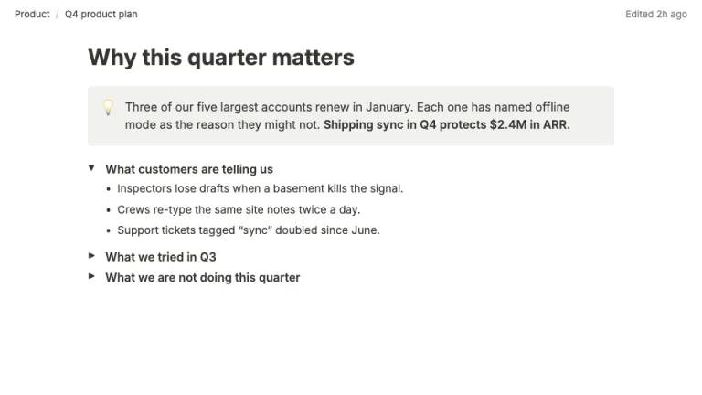
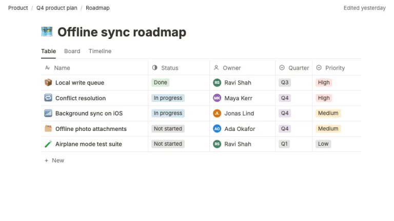
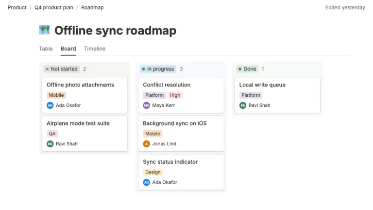
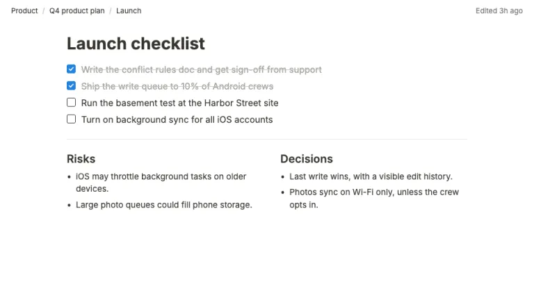
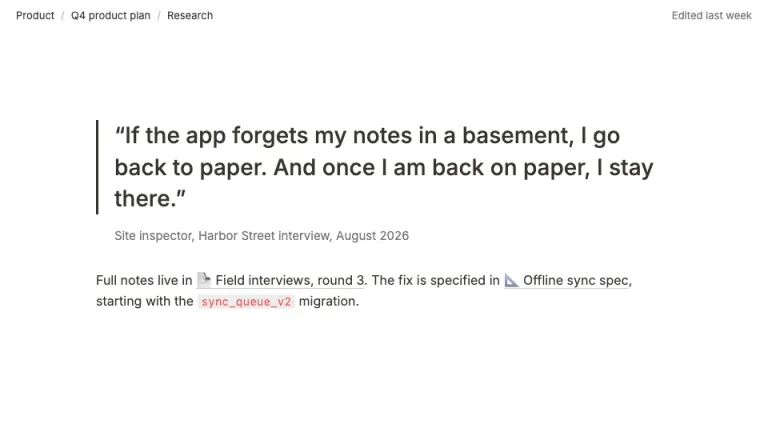

[← All prompts](../README.md) · [Live site](https://slidespeak.co/slide-design-prompts) · [SlideSpeak](https://slidespeak.co)

# Notion Style

> Your deck, written like a doc

A Notion presentation style where each slide is a Notion page, with emoji page icons, gray property rows, callouts, toggles, checkboxes, and table and board views in Notion's light tag colors. An unofficial homage to the Notion workspace look. Not affiliated with, endorsed by, or connected to Notion Labs, Inc.

**Category:** Tech & product &nbsp;·&nbsp; **Style:** Minimal, Calm &nbsp;·&nbsp; **Mode:** Light &nbsp;·&nbsp; **Fonts:** Inter

<table>
    <tr>
      <td align="center" width="33%"><br><sub>Title page</sub></td>
      <td align="center" width="33%"><br><sub>Callout and toggles</sub></td>
      <td align="center" width="33%"><br><sub>Database table</sub></td>
    </tr>
    <tr>
      <td align="center" width="33%"><br><sub>Board view</sub></td>
      <td align="center" width="33%"><br><sub>Checklist and columns</sub></td>
      <td align="center" width="33%"><br><sub>Quote and linked pages</sub></td>
    </tr>
</table>

## The prompt

Copy the prompt below into **ChatGPT**, **Claude**, or any AI chat — or grab the raw [`PROMPT.md`](./PROMPT.md). It asks what your presentation is about first, then applies the design to every slide.

```text
Create a presentation in the 'Notion Style' theme, an unofficial homage to slides that read like Notion pages. Background: white (#ffffff), never dark mode. Typography: 'Inter' (Google Fonts) throughout, text in warm ink #37352f, secondary text #787774. Page titles in Inter 700 at 40 to 42px, section headings Inter 700 at 28 to 30px, sub-headings Inter 600 at 20px, body Inter 400 at 15 to 16px with line-height 1.5, sentence case, left-aligned in a content column about 720px wide. The signature is the page head: the title slide opens with a flat cover band 150px tall (#d3e5ef with large flat circles in #b9d4e6 and #e8deee, no gradient), a 64 to 72px emoji page icon overlapping its bottom edge, the page title, a one-line gray description, then property rows: gray name with a small line glyph on the left, value on the right (initials avatar, status pill, tag pills, date). Content slides carry a 40px breadcrumb bar at the top: the page path in 13px ink, 'Edited 2h ago' right-aligned in #787774; no page numbers or footers. Tag pills use Notion's light tag palette with #37352f text, 3px radius, 13px: gray #e3e2e0, brown #eee0da, orange #fadec9, yellow #fdecc8, green #dbeddb, blue #d3e5ef, purple #e8deee, pink #f5e0e9, red #ffe2dd; status pills add a small colored dot; use at most three tag colors per slide. Callout blocks: #f1f1ef fill, 4px radius, an emoji on the left, one or two sentences with one bold phrase. Toggle lists: a small triangle, one toggle open with its nested bullets indented, the others collapsed. To-dos: 16px checkboxes with a 1.5px ink border; checked ones fill blue #2383e2 with a white tick and their text turns #a5a29c with a strikethrough. Dividers are 1px #e9e9e7 lines. Column blocks sit 48px apart. Database slides: a view tab row (Table, Board, Timeline) with the active tab underlined in ink, a table with a 1px #e9e9e7 grid, header cells in #787774 with property-type glyphs, rows with an emoji plus name, pills and avatars; board view uses pale column backgrounds with a status pill header and count, and white cards with Notion's hairline shadow (rgba(15,15,15,.1) 0 0 0 1px, rgba(15,15,15,.1) 0 2px 4px). Quote blocks: a 3px #37352f left bar and 28px text, attribution in #787774. Page mentions are underlined with a faint rule and a leading page emoji; inline code sits on rgba(135,131,120,.15) in #eb5757. Charts: flat bars in #2383e2, #448361, #d9730d, #9065b0 with direct labels. Strictly avoid: the Notion logo or 'N' cube, claiming affiliation with Notion Labs, Inc., dark mode, gradient covers, heavy or blurred drop shadows, rounded cards above 6px radius, centered body text, stock photos, decorative illustrations, saturated tag fills, more than three tag colors per slide, all-caps labels, and slide numbers.

Use this theme for my slides. Ask me what the presentation is about first, then apply the theme to every slide.
```

**[Open ChatGPT ↗](https://chatgpt.com/)** &nbsp;·&nbsp; **[Open Claude ↗](https://claude.ai/new)** &nbsp;·&nbsp; **[Generate a finished deck with SlideSpeak ↗](https://app.slidespeak.co/presentation?utm_source=github&utm_medium=referral&utm_campaign=slide-design-prompts)**

## Palette

| Role | Hex |
| --- | --- |
| Background | `#ffffff` |
| Surface / panel | `#f7f6f3` |
| Border | `#e9e9e7` |
| Primary accent | `#2383e2` |
| Primary (soft tint) | `#d3e5ef` |
| Text on primary | `#ffffff` |
| Heading text | `#37352f` |
| Body text | `#37352f` |
| Muted text | `#787774` |

**Chart series:** `#2383e2` `#448361` `#d9730d` `#9065b0`

## Fonts

- **Inter** (heading, Google Fonts)

---

<sub>Part of [SlideSpeak Slide Design Prompts](../../README.md) · MIT licensed</sub>
