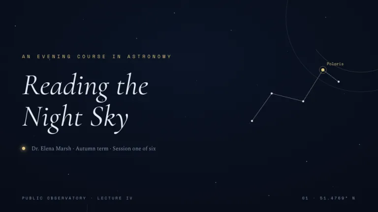
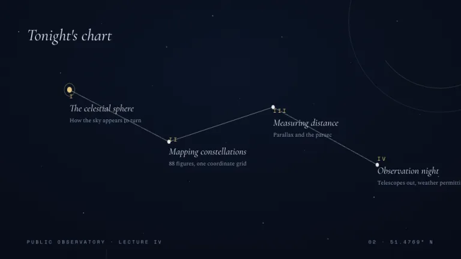
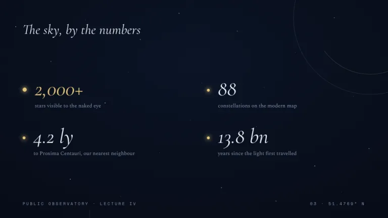
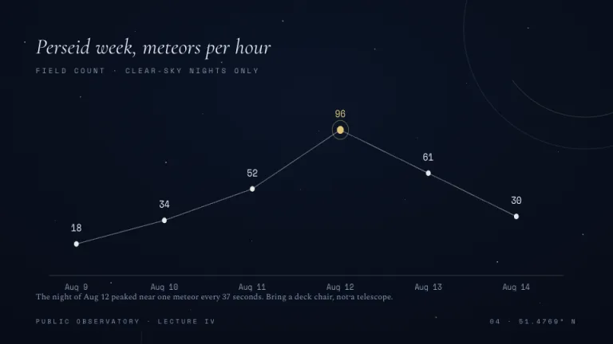
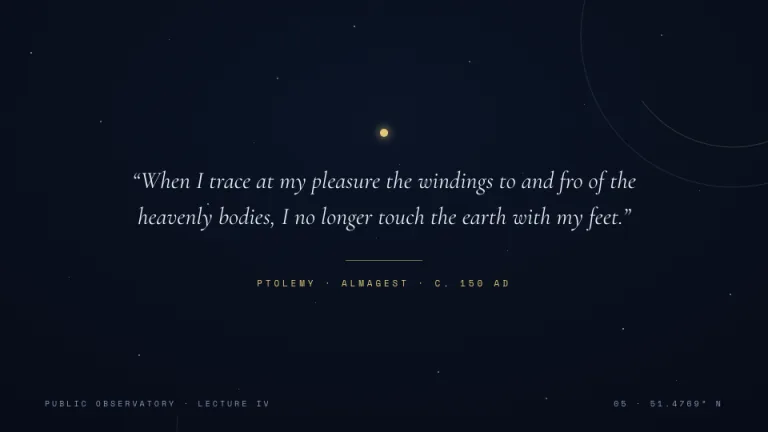
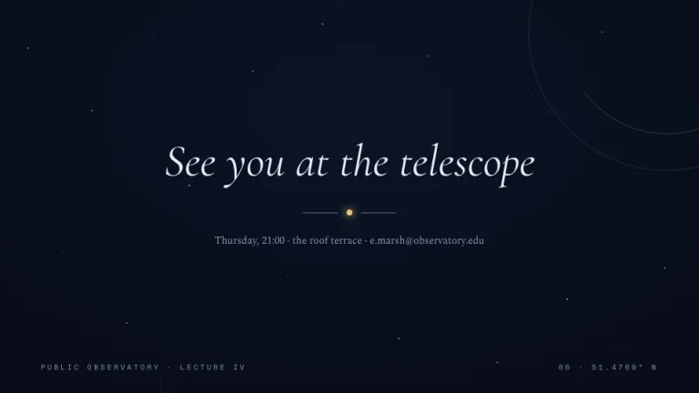

[← All prompts](../README.md) · [Live site](https://slidespeak.co/slide-design-prompts) · [SlideSpeak](https://slidespeak.co)

# Observatory

> Data as constellations

A star atlas for slides. Agendas and charts are drawn as constellations on a deep night sky, with the key point in glowing gold.

**Category:** Education & research &nbsp;·&nbsp; **Style:** Calm, Dark &nbsp;·&nbsp; **Mode:** Dark &nbsp;·&nbsp; **Fonts:** Cormorant Garamond + Spectral + Space Mono

<table>
    <tr>
      <td align="center" width="33%"><br><sub>Title</sub></td>
      <td align="center" width="33%"><br><sub>Agenda</sub></td>
      <td align="center" width="33%"><br><sub>Key metrics</sub></td>
    </tr>
    <tr>
      <td align="center" width="33%"><br><sub>Chart & insight</sub></td>
      <td align="center" width="33%"><br><sub>Quote</sub></td>
      <td align="center" width="33%"><br><sub>Closing</sub></td>
    </tr>
</table>

## The prompt

Copy the prompt below into **ChatGPT**, **Claude**, or any AI chat — or grab the raw [`PROMPT.md`](./PROMPT.md). It asks what your presentation is about first, then applies the design to every slide.

```text
Design slides as a night-sky star atlas, the 'Observatory' theme. Background: a radial gradient from deep blue-black #0B1426 at upper center to #050810 at the edges, scattered with about 24 tiny white star dots of 1 to 2px at opacities between 0.25 and 0.6. Typography: italic 'Cormorant Garamond' display headings in #E8EDF7; body text in 'Spectral'; small uppercase 'Space Mono' labels with wide letterspacing in muted blue #8A97B2 (all three are Google Fonts); accents in pale gold #E3C77B. Signature motifs: draw data and lists as constellations, points joined by 1px white lines at 40 percent opacity with a small label at each star; mark the key data point as a 5px gold #E3C77B star with a soft glow and a thin gold ring around it; add one or two large partial orbit arcs, thin dashed circles below 20 percent opacity, bleeding off the corners. Footer: tiny 'Space Mono' metadata including a latitude reading. Strictly avoid: photographs, filled panels or cards, bright saturated colors, solid chart bars, sans-serif headlines, fully opaque connecting lines.

Use this theme for my slides. Ask me what the presentation is about first, then apply the theme to every slide.
```

**[Open ChatGPT ↗](https://chatgpt.com/)** &nbsp;·&nbsp; **[Open Claude ↗](https://claude.ai/new)** &nbsp;·&nbsp; **[Generate a finished deck with SlideSpeak ↗](https://app.slidespeak.co/presentation?utm_source=github&utm_medium=referral&utm_campaign=slide-design-prompts)**

## Palette

| Role | Hex |
| --- | --- |
| Background | `#0B1426` |
| Surface / panel | `#101C33` |
| Border | `#25344F` |
| Primary accent | `#E3C77B` |
| Primary (soft tint) | `#342E1D` |
| Text on primary | `#0B1426` |
| Heading text | `#E8EDF7` |
| Body text | `#B8C2D6` |
| Muted text | `#8A97B2` |

**Chart series:** `#E3C77B` `#E8EDF7` `#8A97B2` `#25344F`

## Fonts

- **Cormorant Garamond** (heading, Google Fonts)
- **Spectral** (supporting, Google Fonts)
- **Space Mono** (supporting, Google Fonts)

---

<sub>Part of [SlideSpeak Slide Design Prompts](../../README.md) · MIT licensed</sub>
