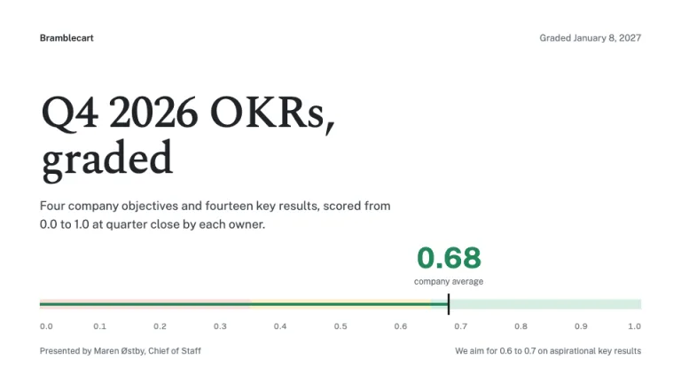
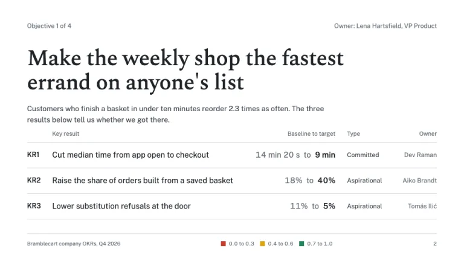
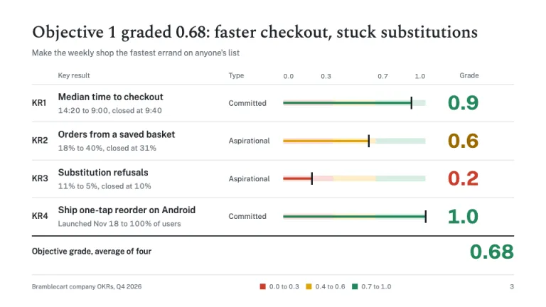
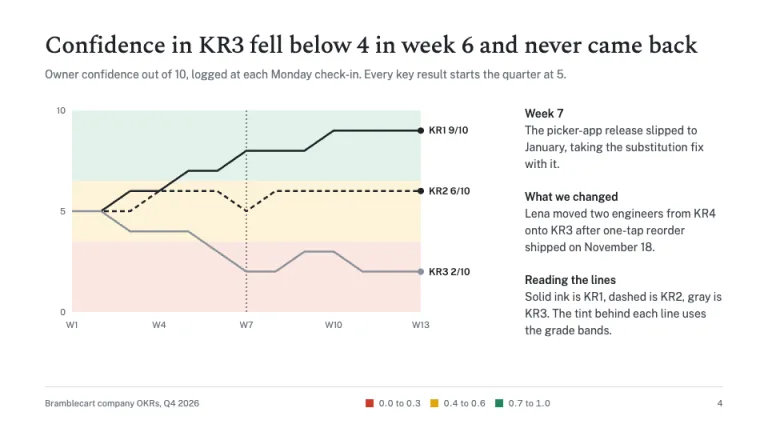
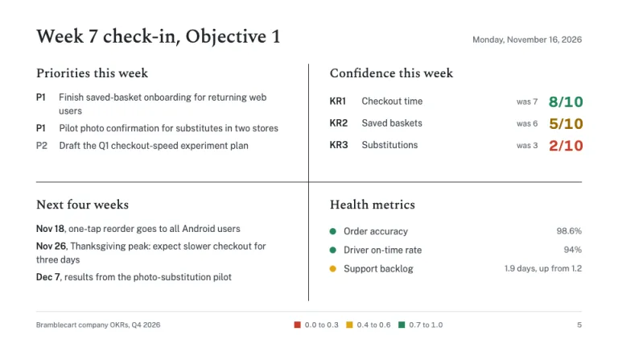
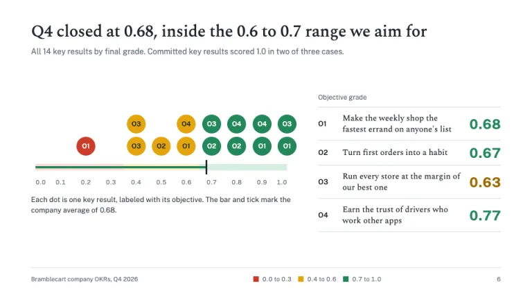

[← All prompts](../README.md) · [Live site](https://slidespeak.co/slide-design-prompts) · [SlideSpeak](https://slidespeak.co)

# OKR Deck

> Every key result, graded from 0.0 to 1.0

An OKR presentation template for quarterly reviews: key results graded 0.0 to 1.0 on a banded ruler, weekly confidence trends and a company roll-up. Red, amber and green appear on scores and nowhere else.

**Category:** Business & strategy &nbsp;·&nbsp; **Style:** Minimal, Corporate &nbsp;·&nbsp; **Mode:** Light &nbsp;·&nbsp; **Fonts:** Spectral + Public Sans

<table>
    <tr>
      <td align="center" width="33%"><br><sub>Cover</sub></td>
      <td align="center" width="33%"><br><sub>Objective</sub></td>
      <td align="center" width="33%"><br><sub>Key result scorecard</sub></td>
    </tr>
    <tr>
      <td align="center" width="33%"><br><sub>Confidence trend</sub></td>
      <td align="center" width="33%"><br><sub>Weekly check-in</sub></td>
      <td align="center" width="33%"><br><sub>Quarterly roll-up</sub></td>
    </tr>
</table>

## The prompt

Copy the prompt below into **ChatGPT**, **Claude**, or any AI chat — or grab the raw [`PROMPT.md`](./PROMPT.md). It asks what your presentation is about first, then applies the design to every slide.

```text
Create a presentation in the 'OKR Deck' theme, an objectives and key results deck where color means one thing: a score. White #ffffff on every slide; ink #1f2328 for titles and rules, body #3d434c, muted #687079, hairlines #d6d9de, neutral fill #f2f3f5. Typography: 'Spectral' (Google Fonts) 500 for objectives and slide titles, 46px on an objective slide, 30px on content titles, 64px on the cover, tracking -0.01em; 'Public Sans' (Google Fonts) for key results, labels and every number, 13 to 16px at 400 and 600, grades at 700 with tabular figures. Objectives are qualitative, so they take the serif; measurable key results take the sans. Grading uses the 0.0 to 1.0 scale at one decimal: 0.0 to 0.3 red #cc3d2b, 0.4 to 0.6 amber #e2a50f (amber numerals in #9a6a00), 0.7 to 1.0 green #23875a. Committed key results aim for 1.0, aspirational ones for 0.6 to 0.7. Those three colors appear on grades and confidence scores and nowhere else. The signature is the grade ruler: a 10px track split into band tints (#f8dcd6 from 0 to 0.35, #fcefc9 to 0.65, #d6ede1 to 1.0), a 4px bar in the band color filled to the score, a 3px ink tick at the score, and the grade as a 34px bold numeral in band color at right. Cover: company name and grading date at top, the 64px title, a one-line scope, and a full-width ruler filled to the company average, set at 40px above the tick. Objective slide: 'Objective 1 of 4' and owner in 13px muted, the objective at 46px, one line on why, then a table: code, key result, baseline to target, Committed or Aspirational, owner. Scorecard: a takeaway title naming the objective's grade, one row per key result with name, 'from X to Y, closed at Z', type, ruler and grade, closed by a 2px ink rule and the objective average. Confidence trend: owner confidence out of 10 for 13 weekly check-ins, every line starting at 5, drawn in ink, dashed ink and gray over the three band tints, with direct end labels, a dotted ink rule on the week something broke, notes at right. Weekly check-in: a four-square split by a 1px ink cross: priorities marked P1 and P2, confidence as x/10 in its band color beside last week's value, a four-week forecast with dates, and health metrics with 10px status dots. Roll-up: every key result as a 34px dot stacked above its grade on a ruler filled to the company average, labeled with its objective code, beside the objectives with two-decimal averages. Footer: 1px #d6d9de rule, deck name left, the three-band grade key center in 11px, page number right. Strictly avoid: RAG status pills, percent-complete bars, color on anything but scores, KPI tiles, gradients, drop shadows, rounded cards, icons, stock photos, all-caps labels, pie charts, key result grades past one decimal, objectives that contain numbers, and key results without an owner.

Use this theme for my slides. Ask me what the presentation is about first, then apply the theme to every slide.
```

**[Open ChatGPT ↗](https://chatgpt.com/)** &nbsp;·&nbsp; **[Open Claude ↗](https://claude.ai/new)** &nbsp;·&nbsp; **[Generate a finished deck with SlideSpeak ↗](https://app.slidespeak.co/presentation?utm_source=github&utm_medium=referral&utm_campaign=slide-design-prompts)**

## Palette

| Role | Hex |
| --- | --- |
| Background | `#ffffff` |
| Surface / panel | `#f2f3f5` |
| Border | `#d6d9de` |
| Primary accent | `#1f2328` |
| Primary (soft tint) | `#eceef1` |
| Text on primary | `#ffffff` |
| Heading text | `#1f2328` |
| Body text | `#3d434c` |
| Muted text | `#687079` |

**Chart series:** `#23875a` `#e2a50f` `#cc3d2b` `#1f2328`

## Fonts

- **Spectral** (heading, Google Fonts)
- **Public Sans** (supporting, Google Fonts)

---

<sub>Part of [SlideSpeak Slide Design Prompts](../../README.md) · MIT licensed</sub>
