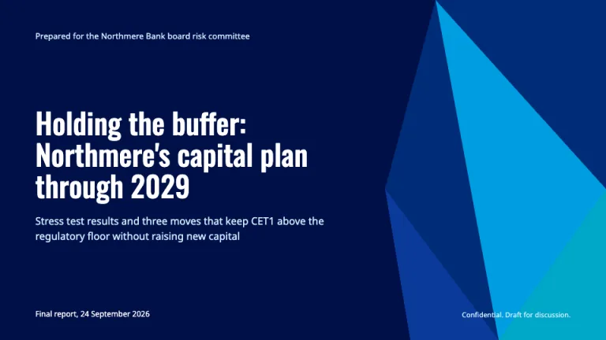
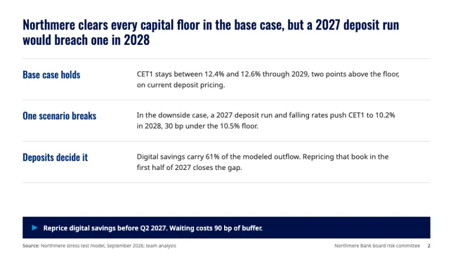
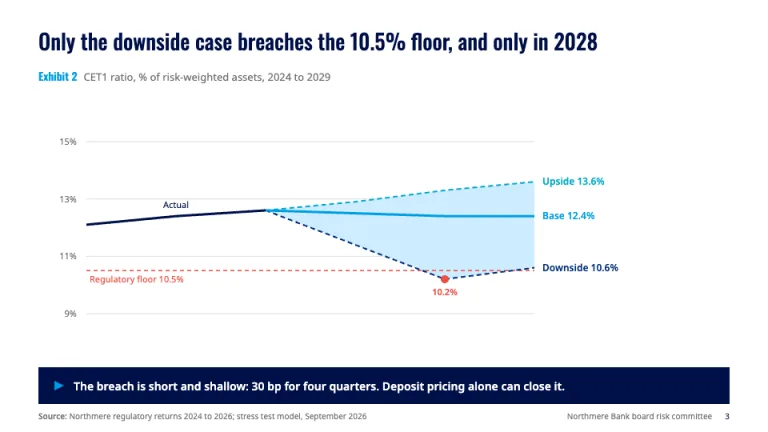
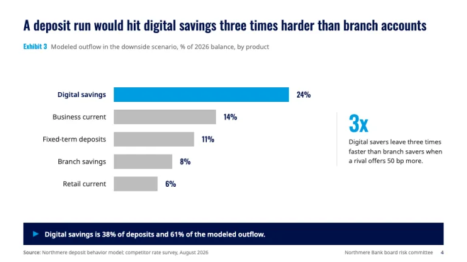
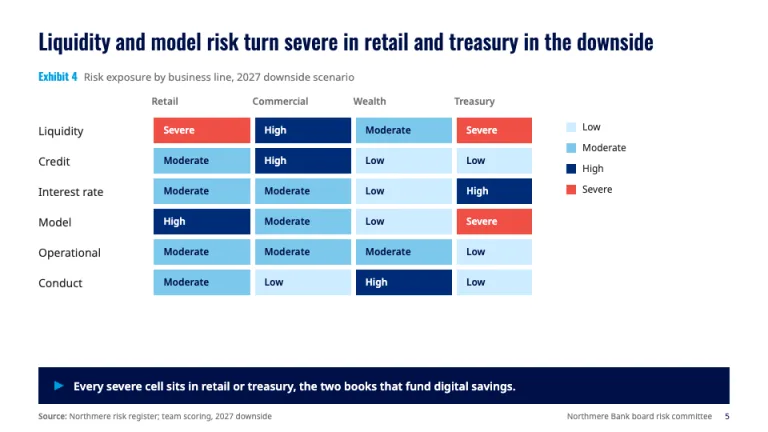
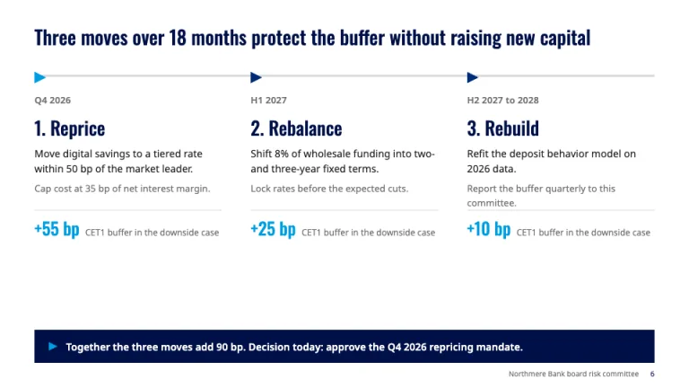

[← All prompts](../README.md) · [Live site](https://slidespeak.co/slide-design-prompts) · [SlideSpeak](https://slidespeak.co)

# Oliver Wyman Style

> Action title on top, the so-what in a bumper below

An Oliver Wyman style presentation format for risk and strategy decks: full-sentence action titles in a condensed face, a midnight bumper band that states the so-what on every slide, scenario fan charts and risk heat maps. An unofficial homage to the Oliver Wyman presentation style. Not affiliated with, endorsed by, or connected to Oliver Wyman or Marsh McLennan.

**Category:** Consulting &nbsp;·&nbsp; **Style:** Corporate, Bold &nbsp;·&nbsp; **Mode:** Light &nbsp;·&nbsp; **Fonts:** Oswald + Noto Sans

<table>
    <tr>
      <td align="center" width="33%"><br><sub>Title</sub></td>
      <td align="center" width="33%"><br><sub>Executive summary</sub></td>
      <td align="center" width="33%"><br><sub>Scenario fan chart</sub></td>
    </tr>
    <tr>
      <td align="center" width="33%"><br><sub>Ranked bar exhibit</sub></td>
      <td align="center" width="33%"><br><sub>Risk heat map</sub></td>
      <td align="center" width="33%"><br><sub>Roadmap and decision</sub></td>
    </tr>
</table>

## The prompt

Copy the prompt below into **ChatGPT**, **Claude**, or any AI chat — or grab the raw [`PROMPT.md`](./PROMPT.md). It asks what your presentation is about first, then applies the design to every slide.

```text
Create a presentation in the 'Oliver Wyman Style' theme, an unofficial homage to the risk-and-strategy consulting deck. Background: white (#ffffff) on content slides; the cover and section slides are midnight blue (#000f47) edge to edge. Typography: 'Oswald' (Google Fonts) weight 500 for titles, exhibit labels and big numbers; 'Noto Sans' for all body text, table cells and chart labels at 13 to 16px in #202020. Every content slide opens with a full-sentence action title that states the finding, Oswald 500 at 26 to 30px in #000f47, sentence case, left-aligned, two lines maximum, with no rule under it. The signature device is the bumper: a full-width midnight #000f47 band, 46px tall, sitting just above the footer, holding one white Noto Sans 600 sentence at 14px that states the so-what, led by a small sky-blue (#009de0) right-pointing triangle. Cover: midnight background, a faceted shard of flat triangles in MMC blue #002c77, sky #009de0, turquoise #00a8c8 and #0a3a99 bleeding off the right edge, the answer as the title in white Oswald at 44 to 48px, a one-line subtitle in ice blue #ceecff, and 'Confidential. Draft for discussion.' bottom-right. Exhibits: label each one 'Exhibit N' in sky #009de0 Oswald 14px followed by the measure and unit in #707070. Signature exhibits: a scenario fan chart with history as a solid 3px midnight line, the base case solid sky, upside dashed turquoise, downside dashed #002c77, an ice-blue #ceecff band between upside and downside, the threshold as a dashed coral (#ef4e45) line with a direct label, and direct end labels with values; and a risk heat map with rows of risks and columns of business lines, cells filled on a four-step scale: Low #ceecff, Moderate #7cc8ec, High #002c77 with white text, Severe #ef4e45 with white text, a small legend beside it. Bar charts: horizontal, sorted, the bar that proves the title in sky #009de0 and all others gray #bcbcbc, values in Oswald at the bar ends. Coral #ef4e45 marks breaches and severe risk only; yellow #ffbe00 is for warnings in tables, at most once per slide. Roadmaps: one #dadada track with triangle markers, phases numbered only when sequential. Footer: 'Source:' line bottom-left in 10px #707070 on every data slide, client and committee name plus the page number bottom-right. Strictly avoid: the Oliver Wyman or Marsh McLennan logos and wordmarks, claiming affiliation with Oliver Wyman or Marsh McLennan, topic titles like 'Market overview', gradients, drop shadows, rounded corners, 3D charts, pie charts, legends where direct labels fit, rainbow palettes, coral used as decoration, more than one bumper per slide, centered body text, stock photos, decorative icons, and bullet lists nested more than one level.

Use this theme for my slides. Ask me what the presentation is about first, then apply the theme to every slide.
```

**[Open ChatGPT ↗](https://chatgpt.com/)** &nbsp;·&nbsp; **[Open Claude ↗](https://claude.ai/new)** &nbsp;·&nbsp; **[Generate a finished deck with SlideSpeak ↗](https://app.slidespeak.co/presentation?utm_source=github&utm_medium=referral&utm_campaign=slide-design-prompts)**

## Palette

| Role | Hex |
| --- | --- |
| Background | `#ffffff` |
| Surface / panel | `#f2f2f2` |
| Border | `#dadada` |
| Primary accent | `#002c77` |
| Primary (soft tint) | `#ceecff` |
| Text on primary | `#ffffff` |
| Heading text | `#000f47` |
| Body text | `#202020` |
| Muted text | `#707070` |

**Chart series:** `#009de0` `#002c77` `#00a8c8` `#ef4e45`

## Fonts

- **Oswald** (heading, Google Fonts)
- **Noto Sans** (supporting, Google Fonts)

---

<sub>Part of [SlideSpeak Slide Design Prompts](../../README.md) · MIT licensed</sub>
