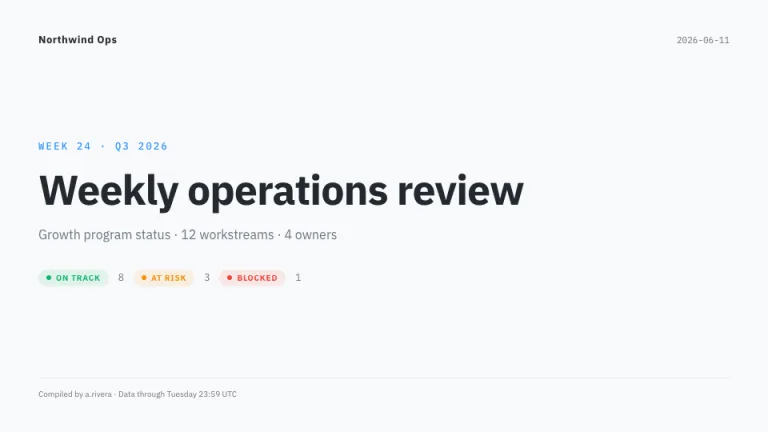
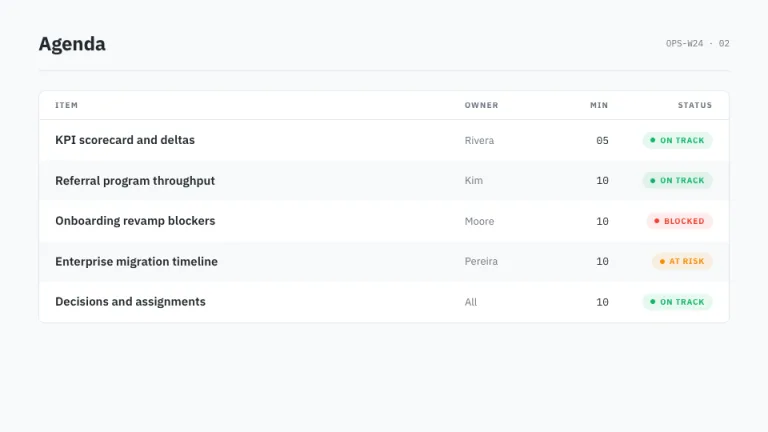
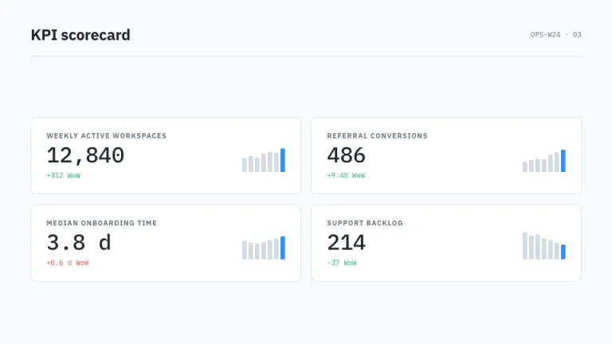
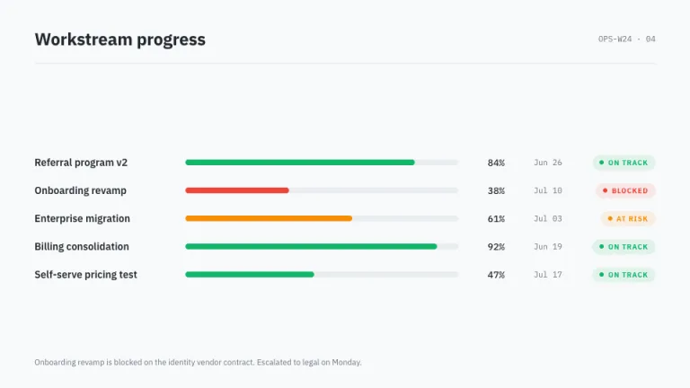
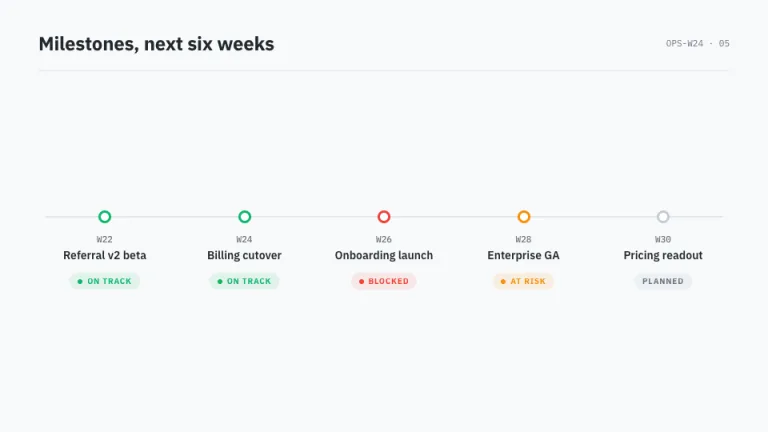
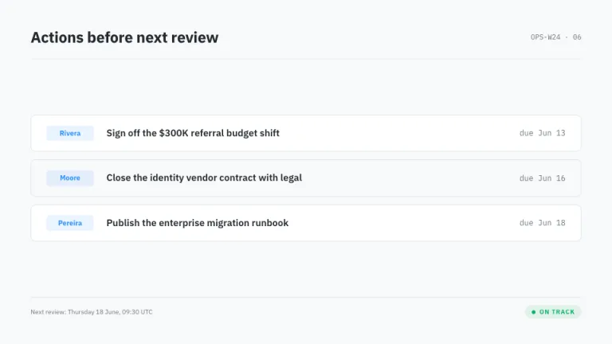

[← All prompts](../README.md) · [Live site](https://slidespeak.co/slide-design-prompts) · [SlideSpeak](https://slidespeak.co)

# Operator

> Status, not stories

A weekly ops report built to be read in four minutes. RAG chips and mono numbers everywhere, so nothing hides.

**Category:** Business & strategy &nbsp;·&nbsp; **Style:** Corporate, Tech &nbsp;·&nbsp; **Mode:** Light &nbsp;·&nbsp; **Fonts:** IBM Plex Sans + IBM Plex Mono

<table>
    <tr>
      <td align="center" width="33%"><br><sub>Title</sub></td>
      <td align="center" width="33%"><br><sub>Agenda</sub></td>
      <td align="center" width="33%"><br><sub>Key metrics</sub></td>
    </tr>
    <tr>
      <td align="center" width="33%"><br><sub>Chart & insight</sub></td>
      <td align="center" width="33%"><br><sub>Timeline</sub></td>
      <td align="center" width="33%"><br><sub>Closing</sub></td>
    </tr>
</table>

## The prompt

Copy the prompt below into **ChatGPT**, **Claude**, or any AI chat — or grab the raw [`PROMPT.md`](./PROMPT.md). It asks what your presentation is about first, then applies the design to every slide.

```text
Create a presentation in the 'Operator' theme, a weekly ops status report. Background: light gray (#F8F9FA) with white (#FFFFFF) cards, 8px radius, 1px #E3E7EB borders, no shadows. Typography: headings and body in clean 'IBM Plex Sans' with near-black ink (#23292F) headings; every number in 'IBM Plex Mono' (both Google Fonts), right-aligned. Signature motifs: RAG status chips, small rounded pills holding a 6px dot plus an uppercase bold label, ON TRACK in green #12B76A, AT RISK in amber #F79009, BLOCKED in red #F04438, each chip on a 10% tint of its color; compact data tables with zebra rows alternating white and #F8F9FA; slim 8px rounded progress bars colored by status with mono percentage labels; KPI tiles pairing a large mono value and a green or red delta with a tiny bar sparkline whose latest bar is blue #2E90FA. Header on every slide: title left, mono reference code right, hairline rule beneath. Strictly avoid: gradients, drop shadows, decorative illustration, serif fonts, centered body text, status colors used for anything except status.

Use this theme for my slides. Ask me what the presentation is about first, then apply the theme to every slide.
```

**[Open ChatGPT ↗](https://chatgpt.com/)** &nbsp;·&nbsp; **[Open Claude ↗](https://claude.ai/new)** &nbsp;·&nbsp; **[Generate a finished deck with SlideSpeak ↗](https://app.slidespeak.co/presentation?utm_source=github&utm_medium=referral&utm_campaign=slide-design-prompts)**

## Palette

| Role | Hex |
| --- | --- |
| Background | `#F8F9FA` |
| Surface / panel | `#FFFFFF` |
| Border | `#E3E7EB` |
| Primary accent | `#2E90FA` |
| Primary (soft tint) | `#EAF4FF` |
| Text on primary | `#FFFFFF` |
| Heading text | `#23292F` |
| Body text | `#5C6670` |
| Muted text | `#6B7480` |

**Chart series:** `#2E90FA` `#12B76A` `#F79009` `#F04438`

## Fonts

- **IBM Plex Sans** (heading, Google Fonts)
- **IBM Plex Mono** (supporting, Google Fonts)

---

<sub>Part of [SlideSpeak Slide Design Prompts](../../README.md) · MIT licensed</sub>
