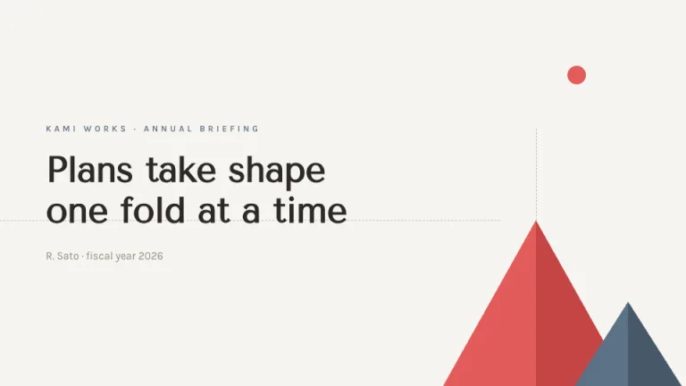
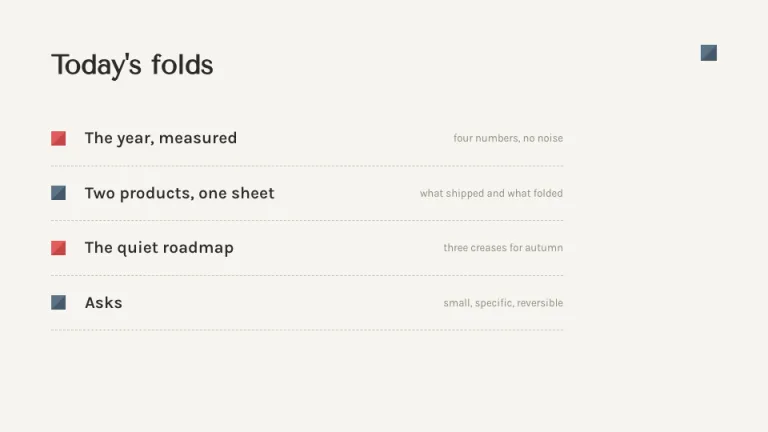
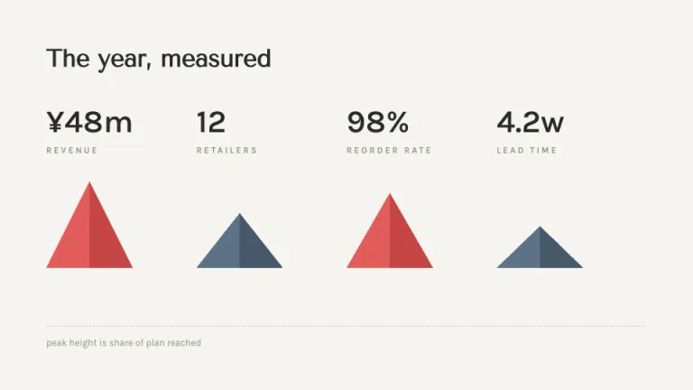
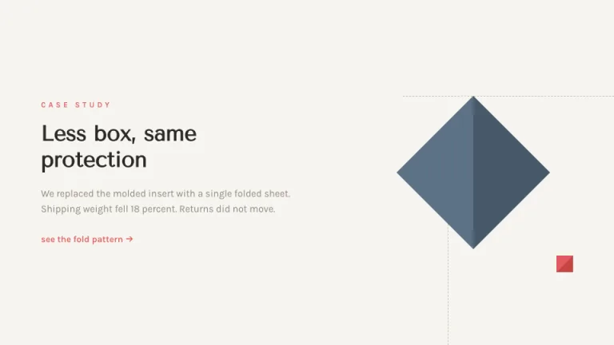
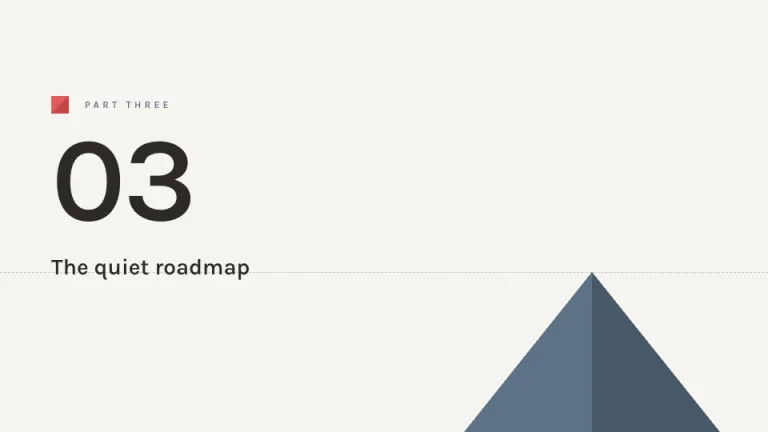
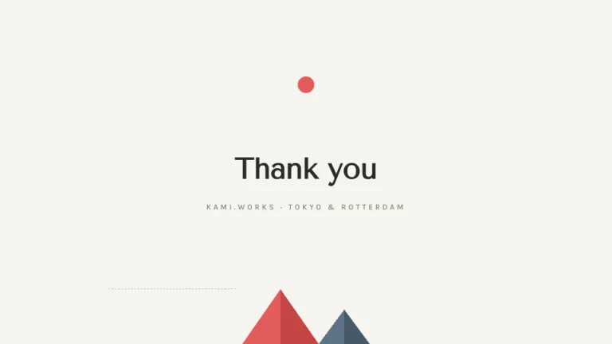

[← All prompts](../README.md) · [Live site](https://slidespeak.co/slide-design-prompts) · [SlideSpeak](https://slidespeak.co)

# Origami

> Folded, not decorated

Folds suggested with two tones of the same hue and thin dashed fold lines. One small red sun, plenty of empty paper.

**Category:** Creative & portfolio &nbsp;·&nbsp; **Style:** Minimal, Calm &nbsp;·&nbsp; **Mode:** Light &nbsp;·&nbsp; **Fonts:** Tenor Sans + Karla

<table>
    <tr>
      <td align="center" width="33%"><br><sub>Title</sub></td>
      <td align="center" width="33%"><br><sub>Agenda</sub></td>
      <td align="center" width="33%"><br><sub>Key metrics</sub></td>
    </tr>
    <tr>
      <td align="center" width="33%"><br><sub>Image + text</sub></td>
      <td align="center" width="33%"><br><sub>Section divider</sub></td>
      <td align="center" width="33%"><br><sub>Closing</sub></td>
    </tr>
</table>

## The prompt

Copy the prompt below into **ChatGPT**, **Claude**, or any AI chat — or grab the raw [`PROMPT.md`](./PROMPT.md). It asks what your presentation is about first, then applies the design to every slide.

```text
Create a presentation in the 'Origami' theme, folded paper geometry with Japanese restraint. Background: warm paper #F6F4EF; ink #2D2A26; muted gray #8F897E for secondary text. Typography: headings in 'Tenor Sans', body in 'Karla' (both Google Fonts). Signature device: faceted shapes built from adjacent triangles in two tones of one hue to suggest a fold, coral #E25C5C with shadow tone #C44545 or slate #5C7185 with #46586A, drawn as flat SVG polygons sharing a ridge edge. Thin 1px dashed gray (#C9C3B8) fold lines extend horizontally or vertically from shape vertices into empty space. One small solid red circle (#E25C5C, 26px), the sun, appears on the title and closing slides only. Compositions are asymmetric with generous calm space; text blocks sit far from shapes. Charts are triangular two-tone mountains on a shared baseline, peak height encoding value, alternating coral and slate. List separators are dashed fold lines. Strictly avoid: gradients, shadows, rounded corners, more than two hues per slide, dense layouts, decorative borders.

Use this theme for my slides. Ask me what the presentation is about first, then apply the theme to every slide.
```

**[Open ChatGPT ↗](https://chatgpt.com/)** &nbsp;·&nbsp; **[Open Claude ↗](https://claude.ai/new)** &nbsp;·&nbsp; **[Generate a finished deck with SlideSpeak ↗](https://app.slidespeak.co/presentation?utm_source=github&utm_medium=referral&utm_campaign=slide-design-prompts)**

## Palette

| Role | Hex |
| --- | --- |
| Background | `#F6F4EF` |
| Surface / panel | `#FFFFFF` |
| Border | `#DDD8CD` |
| Primary accent | `#E25C5C` |
| Primary (soft tint) | `#F8DEDE` |
| Text on primary | `#FFFFFF` |
| Heading text | `#2D2A26` |
| Body text | `#57524B` |
| Muted text | `#8F897E` |

**Chart series:** `#E25C5C` `#5C7185` `#C44545` `#46586A`

## Fonts

- **Tenor Sans** (heading, Google Fonts)
- **Karla** (supporting, Google Fonts)

---

<sub>Part of [SlideSpeak Slide Design Prompts](../../README.md) · MIT licensed</sub>
