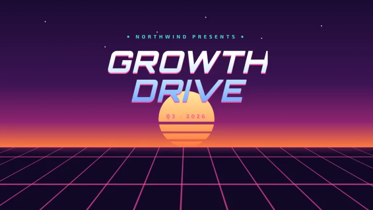
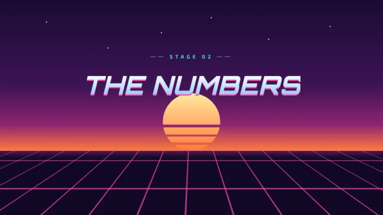
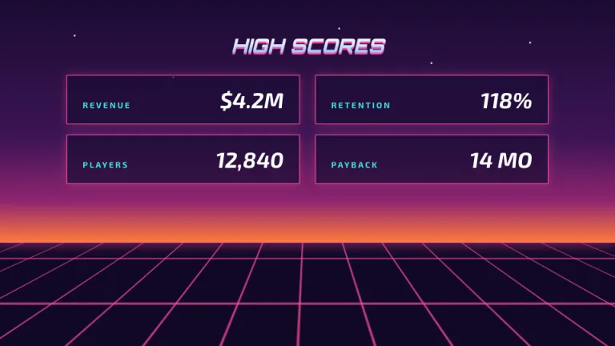
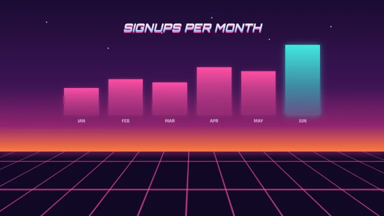
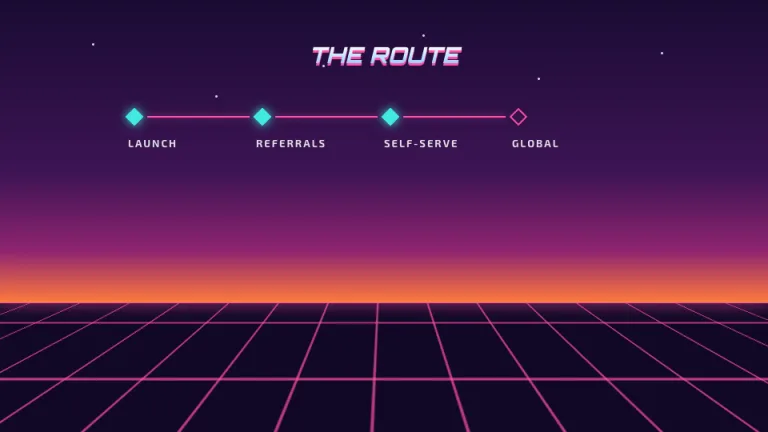
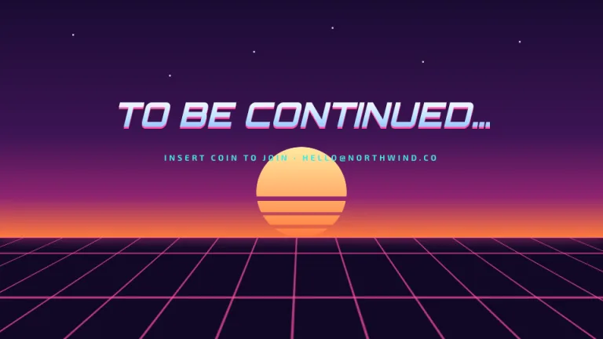

[← All prompts](../README.md) · [Live site](https://slidespeak.co/slide-design-prompts) · [SlideSpeak](https://slidespeak.co)

# Outrun

> Straight out of 1986

A synthwave sunset with a glowing grid floor, a striped sun and chrome headlines. Completely over the top, which is the point.

**Category:** Marketing & brand &nbsp;·&nbsp; **Style:** Playful, Dark &nbsp;·&nbsp; **Mode:** Dark &nbsp;·&nbsp; **Fonts:** Orbitron + Exo 2

<table>
    <tr>
      <td align="center" width="33%"><br><sub>Title</sub></td>
      <td align="center" width="33%"><br><sub>Section divider</sub></td>
      <td align="center" width="33%"><br><sub>Key metrics</sub></td>
    </tr>
    <tr>
      <td align="center" width="33%"><br><sub>Chart & insight</sub></td>
      <td align="center" width="33%"><br><sub>Timeline</sub></td>
      <td align="center" width="33%"><br><sub>Closing</sub></td>
    </tr>
</table>

## The prompt

Copy the prompt below into **ChatGPT**, **Claude**, or any AI chat — or grab the raw [`PROMPT.md`](./PROMPT.md). It asks what your presentation is about first, then applies the design to every slide.

```text
Create a presentation styled like a 1980s synthwave poster, the 'Outrun' theme. Background: a vertical gradient sky from deep violet (#1A0B33) through magenta (#8E2470) to sunset orange (#FF7A3C), ending at a horizon line about 70 percent down the slide; below the horizon, a dark floor with a glowing pink (#FF4FA3) perspective grid converging toward the center, and a glowing pink horizon line. Scatter a few tiny white stars in the sky. On title and section slides, a striped sun sits on the horizon: a semicircle with a yellow-to-orange gradient and transparent horizontal slices. Typography: headlines in 'Orbitron', body in 'Exo 2' (both Google Fonts). Headlines: heavy uppercase italic with a chrome effect, a vertical gradient from white through pale blue (#BFE3FF) to steel blue (#6FA7FF), plus a hard pink drop shadow offset about 3px down. Accents: hot pink (#FF4FA3) and cyan (#41E8E0); panels are dark violet with thin pink borders and a soft pink outer glow; key chart elements glow cyan. Strictly avoid: serif fonts, white backgrounds, muted or pastel colors, corporate gray.

Use this theme for my slides. Ask me what the presentation is about first, then apply the theme to every slide.
```

**[Open ChatGPT ↗](https://chatgpt.com/)** &nbsp;·&nbsp; **[Open Claude ↗](https://claude.ai/new)** &nbsp;·&nbsp; **[Generate a finished deck with SlideSpeak ↗](https://app.slidespeak.co/presentation?utm_source=github&utm_medium=referral&utm_campaign=slide-design-prompts)**

## Palette

| Role | Hex |
| --- | --- |
| Background | `#1A0B33` |
| Surface / panel | `#2A1548` |
| Border | `#4A2670` |
| Primary accent | `#FF4FA3` |
| Primary (soft tint) | `#3A1B5C` |
| Text on primary | `#FFFFFF` |
| Heading text | `#FFFFFF` |
| Body text | `#C9A8E8` |
| Muted text | `#8E6BB8` |

**Chart series:** `#FF4FA3` `#41E8E0` `#FF7A3C` `#4A2670`

## Fonts

- **Orbitron** (heading, Google Fonts)
- **Exo 2** (supporting, Google Fonts)

---

<sub>Part of [SlideSpeak Slide Design Prompts](../../README.md) · MIT licensed</sub>
