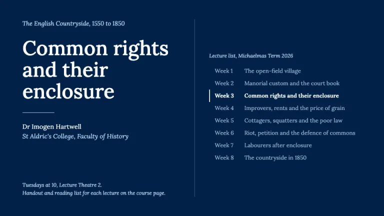
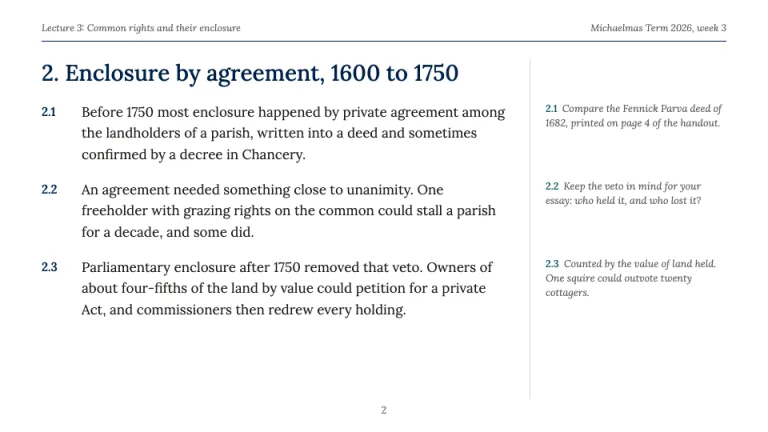
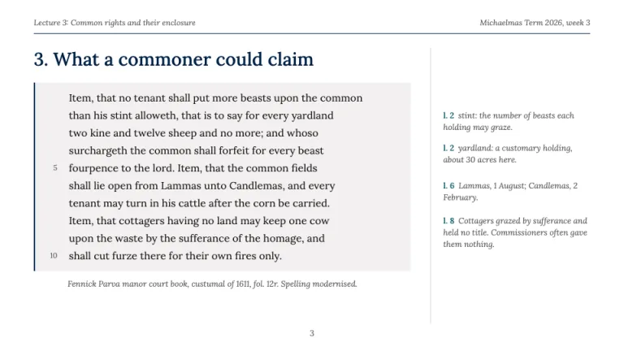
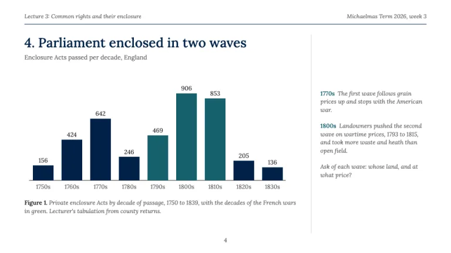
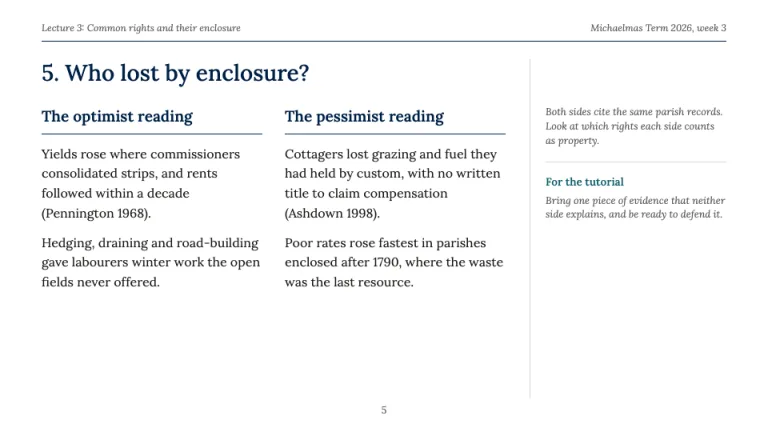
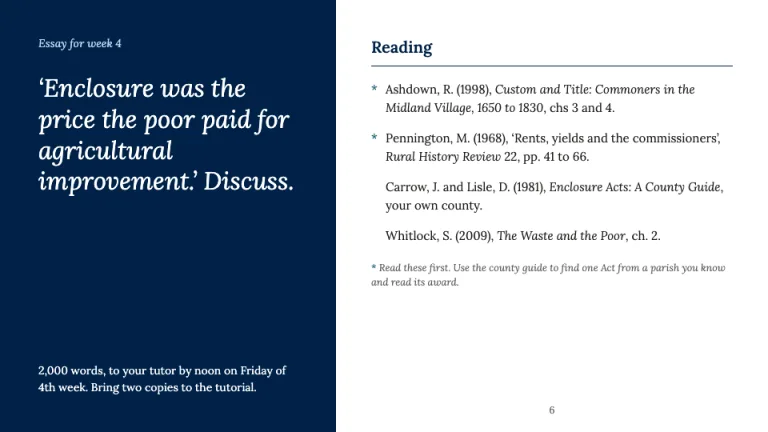

[← All prompts](../README.md) · [Live site](https://slidespeak.co/slide-design-prompts) · [SlideSpeak](https://slidespeak.co)

# Oxford Style

> The lecture handout, glossed in the margin

An Oxford presentation template set as a lecture handout: Oxford blue #002147, Lora serif, numbered paragraphs and italic notes in the margin. An unofficial homage to the Oxford lecture and tutorial style. Not affiliated with, endorsed by, or connected to the University of Oxford.

**Category:** Education & research &nbsp;·&nbsp; **Style:** Elegant, Calm &nbsp;·&nbsp; **Mode:** Light &nbsp;·&nbsp; **Fonts:** Lora

<table>
    <tr>
      <td align="center" width="33%"><br><sub>Title and lecture list</sub></td>
      <td align="center" width="33%"><br><sub>Handout section</sub></td>
      <td align="center" width="33%"><br><sub>Close reading</sub></td>
    </tr>
    <tr>
      <td align="center" width="33%"><br><sub>Figure with caption</sub></td>
      <td align="center" width="33%"><br><sub>The debate</sub></td>
      <td align="center" width="33%"><br><sub>Essay and reading</sub></td>
    </tr>
</table>

## The prompt

Copy the prompt below into **ChatGPT**, **Claude**, or any AI chat — or grab the raw [`PROMPT.md`](./PROMPT.md). It asks what your presentation is about first, then applies the design to every slide.

```text
Create a presentation in the 'Oxford Style' theme, an unofficial homage to the Oxford lecture and tutorial register, built like a printed lecture handout. Background: white (#ffffff) on content slides; Oxford blue (#002147) fills the title slide and the essay panel. Typography: 'Lora' (Google Fonts) throughout. Slide titles 500 weight, 28 to 32px, #002147, sentence case, prefixed with the section number ('2. Enclosure by agreement'); title slide 48 to 52px white; body 400 at 15 to 16px in charcoal #211D1C, line-height 1.55; marginal notes Lora italic 12 to 13px in ash grey #61615F; running head and folio italic 12px #61615F. Signature layout on every content slide: a running head (lecture title left, term and week right) over a 1px #002147 rule; a main column about 610px wide; a 1px stone grey #D9D8D6 vertical rule; a margin column about 220px wide holding italic glosses, each placed level with the paragraph it comments on and keyed in semibold viridian #15616D to that paragraph number, line number or bar label; a centred page number. Title slide: #002147 field, course name in italic sky blue #B9D6F2, lecture title in white, a short 1px sky blue rule, lecturer and college; on the right the term's lecture list, weeks 1 to 8, the current week in white semibold with a 2px white left rule, the others in #B9D6F2 at reduced opacity. Handout section slide: paragraphs numbered 2.1, 2.2, 2.3 with the number hung in a 30px column in semibold #002147. Close reading slide: a primary source set on off white #F2F0F0 with a 2px #002147 left rule, line numbers in 11px #61615F every fifth line, a citation caption in italic below, and margin glosses keyed 'l. 2', 'l. 6'. Figure slide: one chart per slide, bars in #002147, the period under discussion in viridian #15616D, further series in umber #89827A and sky blue #B9D6F2, values written above each bar, a 1px charcoal baseline, no gridlines, no legend box, and a caption beginning 'Figure 1.' in italic 12.5px. Debate slide: two facing columns ('The optimist reading', 'The pessimist reading') under 1px #002147 rules, author and year references in brackets. Essay slide: left #002147 panel with the essay title as a white italic quotation followed by 'Discuss.', word count and deadline by week of term; right a reading list with hanging entries, essential items marked by a viridian asterisk and a key beneath. Square corners, 1px rules. Strictly avoid: crimson or red accents, full-width header bars, rounded cards, drop shadows, gradients, icons, clipart of spires or gowns, all-caps labels, bullet points where numbered paragraphs fit, sans-serif body text, crests, coats of arms, university logos or wordmarks, and any claim of affiliation with or endorsement by the University of Oxford.

Use this theme for my slides. Ask me what the presentation is about first, then apply the theme to every slide.
```

**[Open ChatGPT ↗](https://chatgpt.com/)** &nbsp;·&nbsp; **[Open Claude ↗](https://claude.ai/new)** &nbsp;·&nbsp; **[Generate a finished deck with SlideSpeak ↗](https://app.slidespeak.co/presentation?utm_source=github&utm_medium=referral&utm_campaign=slide-design-prompts)**

## Palette

| Role | Hex |
| --- | --- |
| Background | `#ffffff` |
| Surface / panel | `#f2f0f0` |
| Border | `#d9d8d6` |
| Primary accent | `#002147` |
| Primary (soft tint) | `#b9d6f2` |
| Text on primary | `#ffffff` |
| Heading text | `#002147` |
| Body text | `#211d1c` |
| Muted text | `#61615f` |

**Chart series:** `#002147` `#15616d` `#89827a` `#b9d6f2`

## Fonts

- **Lora** (heading, Google Fonts)

---

<sub>Part of [SlideSpeak Slide Design Prompts](../../README.md) · MIT licensed</sub>
