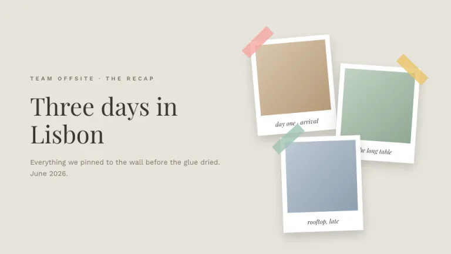
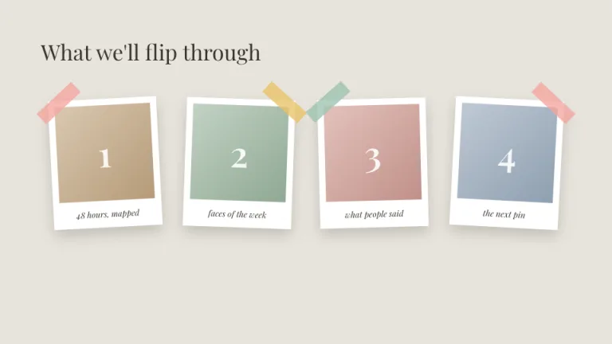
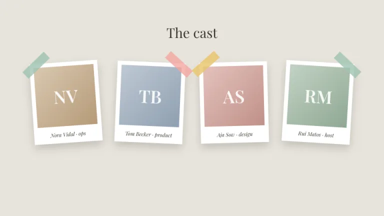
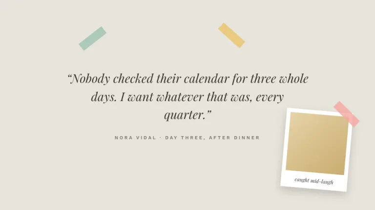
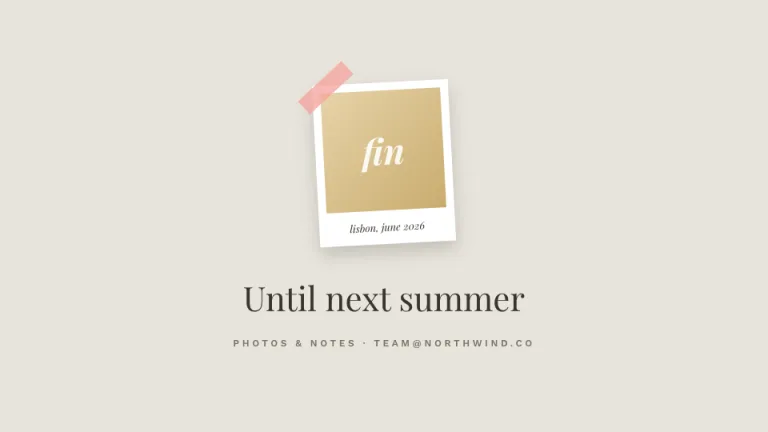

[← All prompts](../README.md) · [Live site](https://slidespeak.co/slide-design-prompts) · [SlideSpeak](https://slidespeak.co)

# Polaroid

> Pinned to the wall

White-framed instant photos taped to a warm wall, each tilted a few degrees. Captions go in the thick bottom margin, in italic serif.

**Category:** Marketing & brand &nbsp;·&nbsp; **Style:** Warm, Playful &nbsp;·&nbsp; **Mode:** Light &nbsp;·&nbsp; **Fonts:** Playfair Display + Work Sans

<table>
    <tr>
      <td align="center" width="33%"><br><sub>Title</sub></td>
      <td align="center" width="33%"><br><sub>Agenda</sub></td>
      <td align="center" width="33%"><br><sub>Team</sub></td>
    </tr>
    <tr>
      <td align="center" width="33%"><br><sub>Quote</sub></td>
      <td align="center" width="33%"><br><sub>Closing</sub></td>
    </tr>
</table>

## The prompt

Copy the prompt below into **ChatGPT**, **Claude**, or any AI chat — or grab the raw [`PROMPT.md`](./PROMPT.md). It asks what your presentation is about first, then applies the design to every slide.

```text
Create a presentation in the 'Polaroid' theme, an instant photo wall. Background: warm wall #E8E4DC; text ink #3A352E, secondary #7A7367. Signature device: polaroid cards, white frames with a 10px border, a 150px square photo area filled with a soft two-tone diagonal gradient placeholder, and a thick 42px bottom margin carrying a short caption in 13px italic 'Playfair Display'. Each polaroid is rotated a different few degrees (between -6 and 6) and casts a soft shadow (0 10px 22px at 22% opacity). Washi tape strips (74x22px, rotated about 40 degrees, 80% opacity) in dusty pink #F4A6A0, sage #9EC3B0 and mustard #E9C46A hold the top corners. Headlines in 'Playfair Display'; small labels in uppercase 'Work Sans' with wide letter-spacing (both are Google Fonts). Numbers, initials and moments live inside the photo squares as content. Strictly avoid: real photographs, perfectly straight cards, hard-edged shadows, dark backgrounds, neon colors, sans-serif captions.

Use this theme for my slides. Ask me what the presentation is about first, then apply the theme to every slide.
```

**[Open ChatGPT ↗](https://chatgpt.com/)** &nbsp;·&nbsp; **[Open Claude ↗](https://claude.ai/new)** &nbsp;·&nbsp; **[Generate a finished deck with SlideSpeak ↗](https://app.slidespeak.co/presentation?utm_source=github&utm_medium=referral&utm_campaign=slide-design-prompts)**

## Palette

| Role | Hex |
| --- | --- |
| Background | `#E8E4DC` |
| Surface / panel | `#FFFFFF` |
| Border | `#D3CDC1` |
| Primary accent | `#D87C72` |
| Primary (soft tint) | `#F4A6A0` |
| Text on primary | `#FFFFFF` |
| Heading text | `#3A352E` |
| Body text | `#7A7367` |
| Muted text | `#A39C8F` |

**Chart series:** `#F4A6A0` `#9EC3B0` `#E9C46A` `#B9AFA0`

## Fonts

- **Playfair Display** (heading, Google Fonts)
- **Work Sans** (supporting, Google Fonts)

---

<sub>Part of [SlideSpeak Slide Design Prompts](../../README.md) · MIT licensed</sub>
