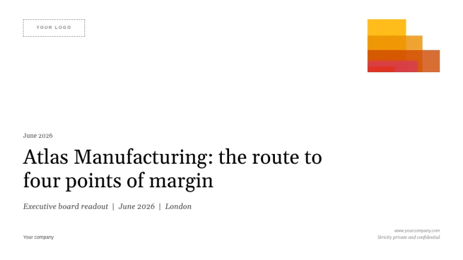
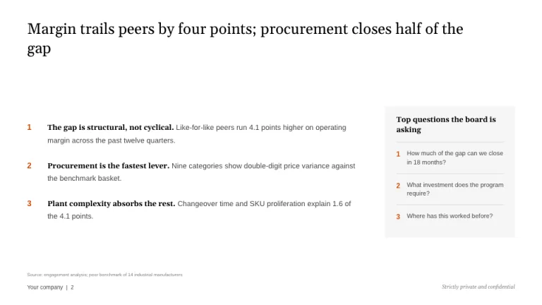
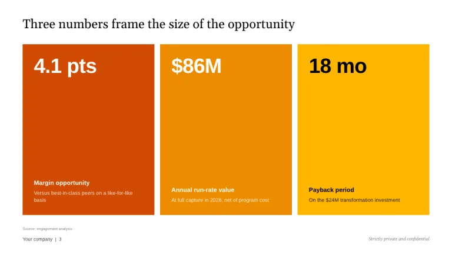
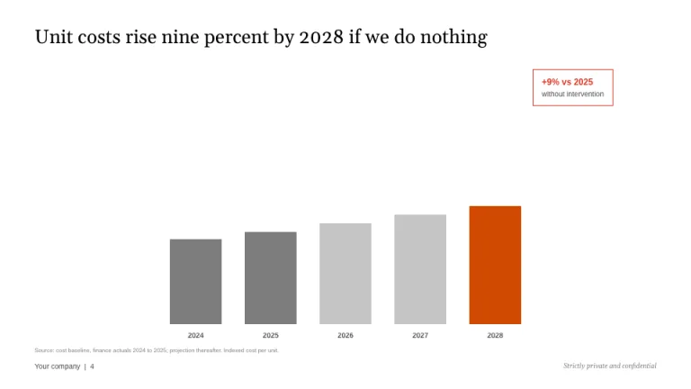
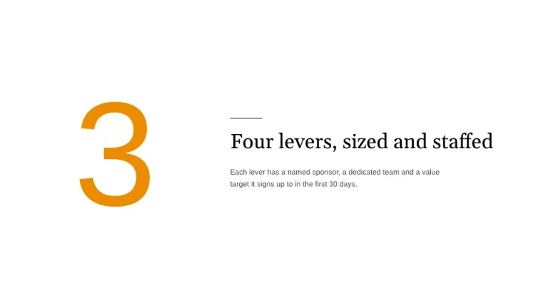
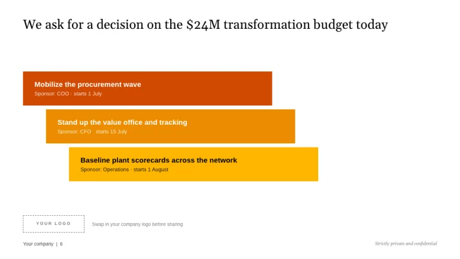

[← All prompts](../README.md) · [Live site](https://slidespeak.co/slide-design-prompts) · [SlideSpeak](https://slidespeak.co)

# PwC Style

> Serif headlines, five warm colors

An unofficial homage to the PwC deck: Georgia-style serif headlines in sentence case, the five warm colors, a fanned mosaic of translucent frames and a logo placeholder ready for your own brand. Not affiliated with PwC.

**Category:** Finance & consulting &nbsp;·&nbsp; **Style:** Corporate, Warm &nbsp;·&nbsp; **Mode:** Light &nbsp;·&nbsp; **Fonts:** Gelasio + Arimo

<table>
    <tr>
      <td align="center" width="33%"><br><sub>Title</sub></td>
      <td align="center" width="33%"><br><sub>Executive summary</sub></td>
      <td align="center" width="33%"><br><sub>Key figures</sub></td>
    </tr>
    <tr>
      <td align="center" width="33%"><br><sub>Chart & callout</sub></td>
      <td align="center" width="33%"><br><sub>Section divider</sub></td>
      <td align="center" width="33%"><br><sub>Next steps</sub></td>
    </tr>
</table>

## The prompt

Copy the prompt below into **ChatGPT**, **Claude**, or any AI chat — or grab the raw [`PROMPT.md`](./PROMPT.md). It asks what your presentation is about first, then applies the design to every slide.

```text
Create a presentation in the 'PwC Style' theme, an unofficial homage to the Big Four advisory deck. Background: white (#FFFFFF). Typography: headlines in 'Gelasio', a warm Georgia-style serif, regular weight, sentence case, pure black (#000000); body copy in 'Arimo', a neutral Arial-metric sans, in dark gray (#464646), both Google Fonts; emphasis through bold serif runs, never colored type. Accent palette is five warm colors used sparingly, one or two per slide: yellow #FFB600, tangerine #EB8C00, burnt orange #D04A02 (the hero), rose #D93954, red #E0301E. Greys are pure black tints: #2D2D2D, #464646, #7D7D7D, #DEDEDE. The signature motif is a mosaic of translucent rectangles sharing one bottom-left corner and fanning up and to the right, in the warm colors with visible overlap blends; place it in a corner of the title slide only. Title and closing slides carry a logo placeholder: a dashed 1px #7D7D7D box labeled 'YOUR LOGO' in letterspaced caps, replaced with the company's logo. Title slide: small serif date top-left, large serif title in the lower-left third, an italic serif event line beneath, and 'Strictly private and confidential' in tiny italics bottom-right. Footer on every content slide: 'Company | page number' in tiny gray text bottom-left, with 8px gray source and footnote lines directly above. Stat slides use flat full-bleed color blocks in orange, tangerine and yellow with white or black type. Charts: gray columns or bars with exactly one warm-colored highlight series and a thin 1px red-outlined callout box annotating the key delta. Section dividers: a giant warm-colored numeral, around 260px, beside a serif section title. Generous white space throughout. Strictly avoid: blues and greens, gradients, drop shadows, rounded corners, bold or colored headlines, all five accents on one slide, claiming affiliation with PwC.

Use this theme for my slides. Ask me what the presentation is about first, then apply the theme to every slide.
```

**[Open ChatGPT ↗](https://chatgpt.com/)** &nbsp;·&nbsp; **[Open Claude ↗](https://claude.ai/new)** &nbsp;·&nbsp; **[Generate a finished deck with SlideSpeak ↗](https://app.slidespeak.co/presentation?utm_source=github&utm_medium=referral&utm_campaign=slide-design-prompts)**

## Palette

| Role | Hex |
| --- | --- |
| Background | `#FFFFFF` |
| Surface / panel | `#F5F5F5` |
| Border | `#DEDEDE` |
| Primary accent | `#D04A02` |
| Primary (soft tint) | `#FAE8DC` |
| Text on primary | `#FFFFFF` |
| Heading text | `#000000` |
| Body text | `#464646` |
| Muted text | `#7D7D7D` |

**Chart series:** `#D04A02` `#EB8C00` `#FFB600` `#DEDEDE`

## Fonts

- **Gelasio** (heading, Google Fonts)
- **Arimo** (supporting, Google Fonts)

---

<sub>Part of [SlideSpeak Slide Design Prompts](../../README.md) · MIT licensed</sub>
