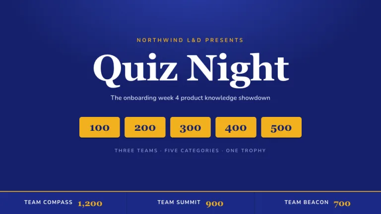
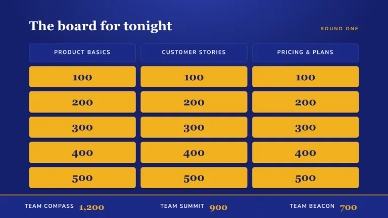
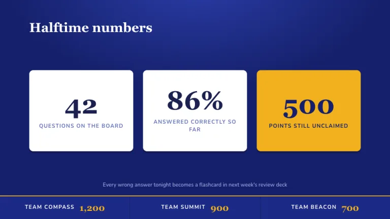
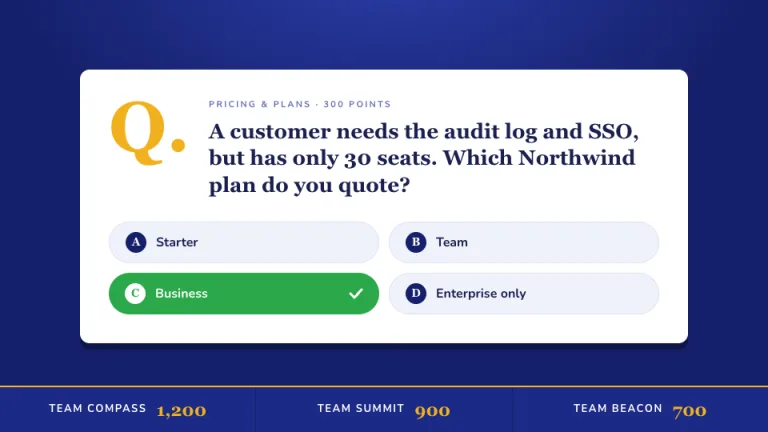
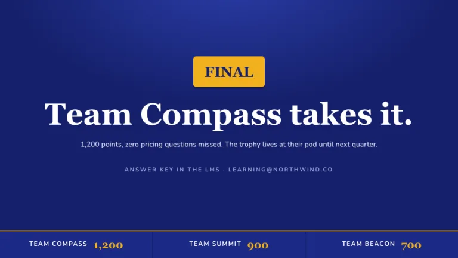

[← All prompts](../README.md) · [Live site](https://slidespeak.co/slide-design-prompts) · [SlideSpeak](https://slidespeak.co)

# Quiz Night

> Training, but with buzzers

A game show board for knowledge checks. The score strip at the bottom keeps every team honest.

**Category:** Education & research &nbsp;·&nbsp; **Style:** Playful, Bold &nbsp;·&nbsp; **Mode:** Dark &nbsp;·&nbsp; **Fonts:** Alfa Slab One + Nunito

<table>
    <tr>
      <td align="center" width="33%"><br><sub>Title</sub></td>
      <td align="center" width="33%"><br><sub>Agenda</sub></td>
      <td align="center" width="33%"><br><sub>Key metrics</sub></td>
    </tr>
    <tr>
      <td align="center" width="33%"><br><sub>Quote</sub></td>
      <td align="center" width="33%"><br><sub>Closing</sub></td>
    </tr>
</table>

## The prompt

Copy the prompt below into **ChatGPT**, **Claude**, or any AI chat — or grab the raw [`PROMPT.md`](./PROMPT.md). It asks what your presentation is about first, then applies the design to every slide.

```text
Create a presentation styled as a TV game show training quiz, the 'Quiz Night' theme. Background: deep game-board blue (#15206B) with a subtle radial spotlight, a lighter blue glow (#2B3DA8) centered at the top edge and fading out by 60 percent of the slide height. Typography: headlines and every number in 'Alfa Slab One', a chunky slab serif; labels in the clean sans 'Nunito', both Google Fonts. Signature motifs: gold value tiles (#F2B01E, 6px corners, a hard 3px dark drop shadow, deep blue 'Alfa Slab One' point values 100 to 500) arranged in board grids beneath dark category headers (#1B2A86); a large white question card with an oversized gold 'Alfa Slab One' 'Q.' and four rounded answer pills labeled A, B, C, D, the correct one filled green (#2BA84A) with a white check; a fixed score strip along the bottom edge showing three team names with gold 'Alfa Slab One' points, separated by thin rules. Strictly avoid: pastel colors, photographs, thin elegant typography, gradients other than the single spotlight, rounded corners beyond 12px, slides without at least one gold element.

Use this theme for my slides. Ask me what the presentation is about first, then apply the theme to every slide.
```

**[Open ChatGPT ↗](https://chatgpt.com/)** &nbsp;·&nbsp; **[Open Claude ↗](https://claude.ai/new)** &nbsp;·&nbsp; **[Generate a finished deck with SlideSpeak ↗](https://app.slidespeak.co/presentation?utm_source=github&utm_medium=referral&utm_campaign=slide-design-prompts)**

## Palette

| Role | Hex |
| --- | --- |
| Background | `#15206B` |
| Surface / panel | `#FFFFFF` |
| Border | `#2B3DA8` |
| Primary accent | `#F2B01E` |
| Primary (soft tint) | `#1B2A86` |
| Text on primary | `#15206B` |
| Heading text | `#FFFFFF` |
| Body text | `#D8DCF5` |
| Muted text | `#9AA3D8` |

**Chart series:** `#F2B01E` `#2BA84A` `#FFFFFF` `#6B79D6`

## Fonts

- **Alfa Slab One** (heading, Google Fonts)
- **Nunito** (supporting, Google Fonts)

---

<sub>Part of [SlideSpeak Slide Design Prompts](../../README.md) · MIT licensed</sub>
