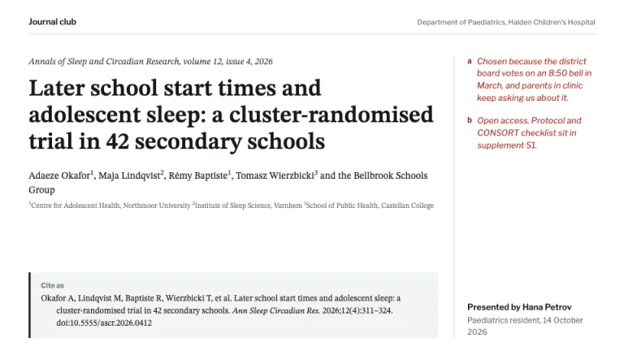
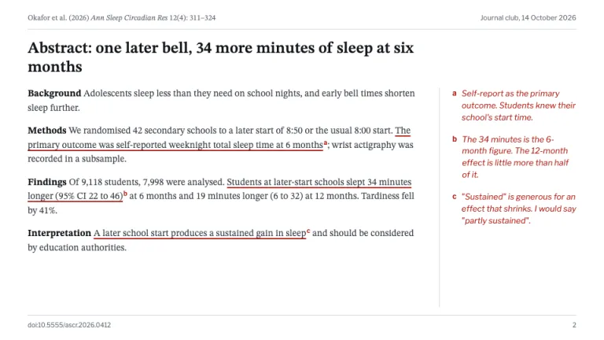
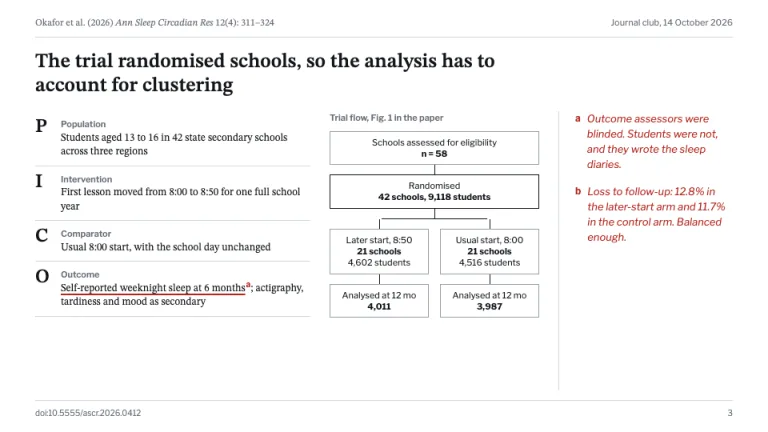
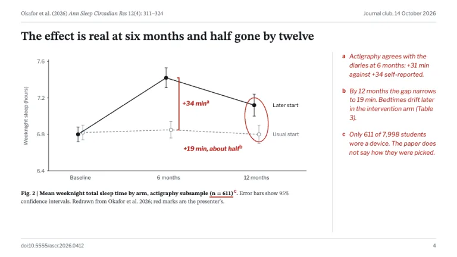
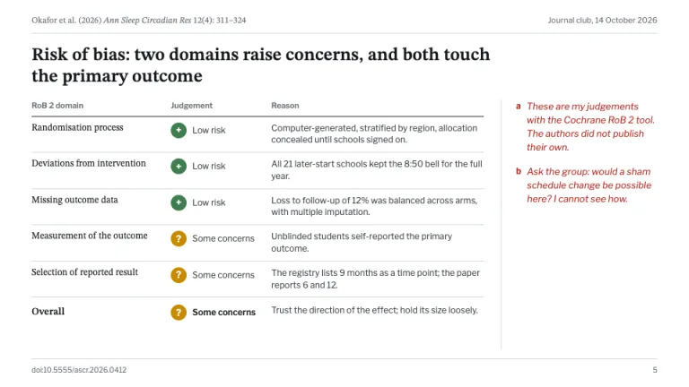
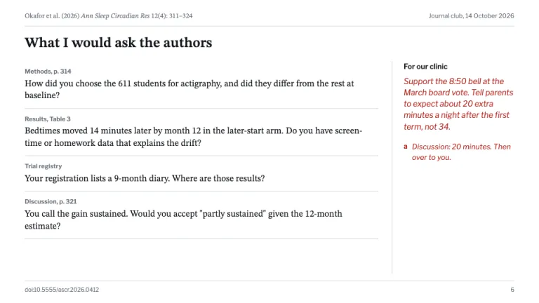

[← All prompts](../README.md) · [Live site](https://slidespeak.co/slide-design-prompts) · [SlideSpeak](https://slidespeak.co)

# Research Paper

> The paper in ink, your reading in red pen

A research paper presentation for journal club: the abstract and key figure in serif type, your critique in red pen, PICO and a risk-of-bias table. You close on the questions you would ask the authors.

**Category:** Education & research &nbsp;·&nbsp; **Style:** Minimal, Calm &nbsp;·&nbsp; **Mode:** Light &nbsp;·&nbsp; **Fonts:** STIX Two Text + Libre Franklin

<table>
    <tr>
      <td align="center" width="33%"><br><sub>Title and citation</sub></td>
      <td align="center" width="33%"><br><sub>Abstract in one slide</sub></td>
      <td align="center" width="33%"><br><sub>PICO and trial flow</sub></td>
    </tr>
    <tr>
      <td align="center" width="33%"><br><sub>Figure reproduced</sub></td>
      <td align="center" width="33%"><br><sub>Methods critique</sub></td>
      <td align="center" width="33%"><br><sub>What I'd ask the authors</sub></td>
    </tr>
</table>

## The prompt

Copy the prompt below into **ChatGPT**, **Claude**, or any AI chat — or grab the raw [`PROMPT.md`](./PROMPT.md). It asks what your presentation is about first, then applies the design to every slide.

```text
Create a presentation in the 'Research Paper' theme, a journal club deck that presents one published paper as a reader's marked-up copy. Background: white (#ffffff); panels #f2f3f5, rules 1px #d5d8dd, square corners. Typography: 'STIX Two Text' (Google Fonts), 600 for slide titles at 24 to 28px and the paper's title at 34 to 38px, 400 for everything quoted from the paper at 12 to 16px, line-height 1.45. 'Libre Franklin' 400/600 is the presenter's voice: labels, axes, tables and notes at 11 to 13px. Ink #15181d for headings, #3b4048 for body, #6c727c for supporting text. The signature is the red pen: #b3261e marks the presenter's reading and nothing else. When a slide quotes the paper, underline the key passage with a 2px #b3261e underline and a small bold superscript letter (a, b, c). A 220px right margin column behind a 1px #d5d8dd rule answers each letter with a short note in Libre Franklin italic 13px #b3261e. Running head on every content slide: the short citation (author et al., year, italic journal abbreviation, volume, pages) left in 12px STIX #6c727c, the journal club date right, over a 1px rule. Footer: the DOI bottom-left and slide number bottom-right in 10px #6c727c above a 1px rule. Title slide: journal name and issue in STIX italic, the paper's full title as the headline, authors with superscript affiliation numbers, a 'Cite as' block on #f2f3f5 with a 3px #15181d left border and a hanging-indent reference; the margin says why the group reads it and who presents. Abstract slide: the structured abstract with bold run-in heads (Background, Methods, Findings, Interpretation). Methods slide: PICO as four rows with large serif initials beside a redrawn CONSORT flow diagram in 1px ink boxes. Figure slide: the paper's key figure redrawn in ink #15181d and gray #8a9099 (dashed comparator) with 95% CI whiskers and direct labels, no gridlines, a caption opening with bold 'Fig. 2 |' that says it was redrawn. The presenter draws on top in red pen: a bracket for an effect size, a loose circle around the weak point. Critique slide: a Cochrane RoB 2 table, a row per domain, a 22px circle per judgement (+ low risk #3f7d4e, ? some concerns #c98a00, - high risk #b3261e), one line of reasoning, an overall row below a 1px ink rule. Closing slide: 'What I would ask the authors', each question in STIX 16px tagged with its page, table or registry source; the margin gives the bottom line for the group's practice. Report effect sizes with confidence intervals, not p-values alone. Strictly avoid: highlighter yellow, red on anything the presenter did not mark, logos of real journals or publishers, photos, icons, gradients, drop shadows, rounded cards, centered body text, bullet walls, tracked all-caps labels, invented results attributed to the real paper.

Use this theme for my slides. Ask me what the presentation is about first, then apply the theme to every slide.
```

**[Open ChatGPT ↗](https://chatgpt.com/)** &nbsp;·&nbsp; **[Open Claude ↗](https://claude.ai/new)** &nbsp;·&nbsp; **[Generate a finished deck with SlideSpeak ↗](https://app.slidespeak.co/presentation?utm_source=github&utm_medium=referral&utm_campaign=slide-design-prompts)**

## Palette

| Role | Hex |
| --- | --- |
| Background | `#ffffff` |
| Surface / panel | `#f2f3f5` |
| Border | `#d5d8dd` |
| Primary accent | `#b3261e` |
| Primary (soft tint) | `#f6e2e0` |
| Text on primary | `#ffffff` |
| Heading text | `#15181d` |
| Body text | `#3b4048` |
| Muted text | `#6c727c` |

**Chart series:** `#15181d` `#8a9099` `#b3261e` `#3f7d4e`

## Fonts

- **STIX Two Text** (heading, Google Fonts)
- **Libre Franklin** (supporting, Google Fonts)

---

<sub>Part of [SlideSpeak Slide Design Prompts](../../README.md) · MIT licensed</sub>
