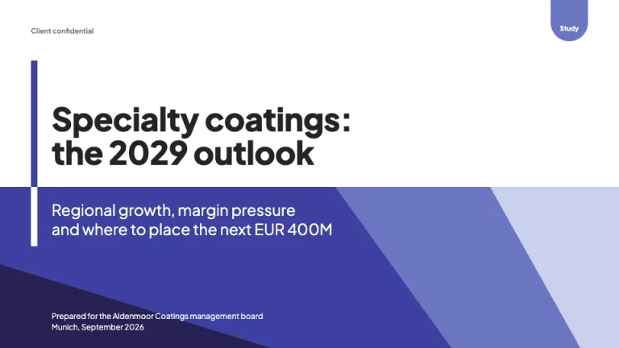
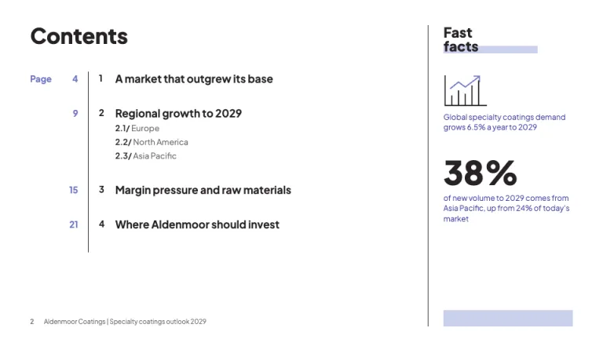
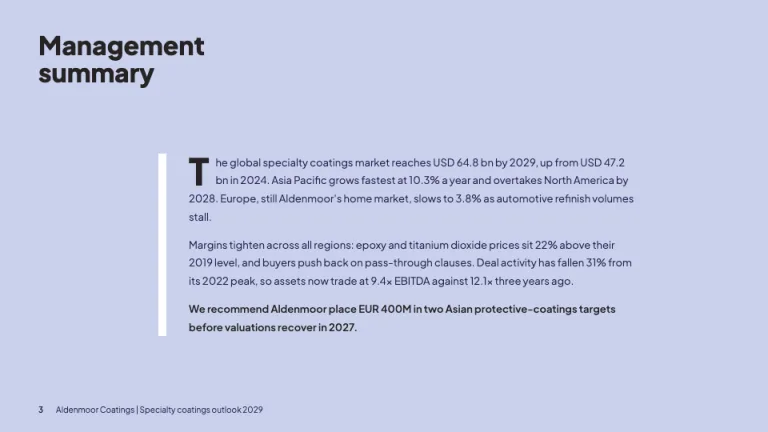
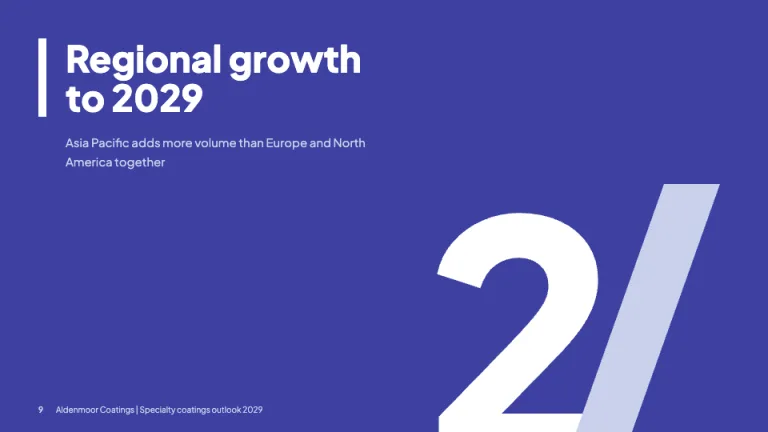
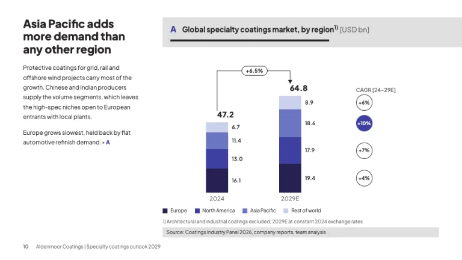
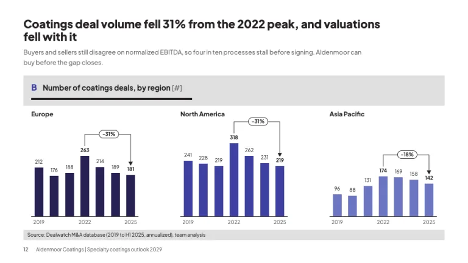

[← All prompts](../README.md) · [Live site](https://slidespeak.co/slide-design-prompts) · [SlideSpeak](https://slidespeak.co)

# Roland Berger Style

> One indigo ramp, lettered exhibits

A Roland Berger style presentation format for study-grade slides: thick title bars, a single indigo ramp from #272252 to #c9d1ed, lettered exhibits with CAGR pills and slashed chapter numerals. An unofficial homage to the Roland Berger presentation style. Not affiliated with, endorsed by, or connected to Roland Berger Holding GmbH.

**Category:** Consulting &nbsp;·&nbsp; **Style:** Corporate, Elegant &nbsp;·&nbsp; **Mode:** Light &nbsp;·&nbsp; **Fonts:** Plus Jakarta Sans

<table>
    <tr>
      <td align="center" width="33%"><br><sub>Title</sub></td>
      <td align="center" width="33%"><br><sub>Contents and fast facts</sub></td>
      <td align="center" width="33%"><br><sub>Management summary</sub></td>
    </tr>
    <tr>
      <td align="center" width="33%"><br><sub>Section divider</sub></td>
      <td align="center" width="33%"><br><sub>Market exhibit with CAGR</sub></td>
      <td align="center" width="33%"><br><sub>Regional small multiples</sub></td>
    </tr>
</table>

## The prompt

Copy the prompt below into **ChatGPT**, **Claude**, or any AI chat — or grab the raw [`PROMPT.md`](./PROMPT.md). It asks what your presentation is about first, then applies the design to every slide.

```text
Create a presentation in the 'Roland Berger Style' theme, an unofficial homage to the look of a European strategy consultancy's published studies. Palette: white (#ffffff) content slides, ink text #272324, muted text #6d6b6b, and one indigo ramp for everything else: deep #272252, indigo #3d40a0, mid #6c75c2, lavender #c9d1ed. Exhibit bands and source strips use light gray #e0e0e0. Typography: 'Plus Jakarta Sans' (Google Fonts) throughout. Titles 800 weight, 44 to 50px on covers and dividers, 22 to 24px on content slides; body 400 at 12 to 13px with 1.7 line height; cover subtitles 300 weight at 24px. Signature device: a solid 10px vertical bar in #3d40a0 (white on colored slides) running beside the cover title and every chapter title. Title slide: bold two-line study title on white above a lower panel of flat angled planes in #272252, #3d40a0, #6c75c2 and #c9d1ed, subtitle in light white type, a rounded-bottom #6c75c2 tab hanging from the top edge labeled 'Study', 'Prepared for' and city plus date bottom-left. Contents slide: large bold 'Contents', a #6c75c2 'Page' column, a thin #272324 vertical rule, chapter numbers and bold chapter names, subsections written 2.1/ 2.2/; a right rail headed 'Fast facts' over a #c9d1ed highlight bar, holding one thin line icon and one 46px statistic with #3d40a0 captions. Management summary: full-bleed #c9d1ed page, narrow #272252 prose column with a 46px bold drop cap and a white 10px bar beside it, closing on the recommendation in semibold. Chapter dividers: full-bleed #3d40a0, white bar-flagged title, and the chapter number drawn huge in the lower right as a white numeral followed by a #c9d1ed slash (2/). Exhibits: a #e0e0e0 header band holding an indigo capital letter (A, B, C) and a bold exhibit title with the unit in brackets such as [USD bn], underlined by a short 4px #272324 rule. Body text cross-references the exhibit with a small triangle and its letter. Charts: stacked bars in the indigo ramp, darkest at the base; value labels beside segments; a thin bracket arrow between bars with an outlined pill showing growth; a right-hand 'CAGR [24-29E]' column of outlined circles, only the key segment filled #3d40a0. Small multiples share one scale, one ramp shade per panel, with peak-to-latest delta pills. Footnotes as 1) in 10px #6d6b6b, then a #e0e0e0 strip with 'Source: ...' in 10px. Footer: page number, then client and study title separated by a pipe, 10px, bottom-left. Strictly avoid: logos, wordmarks, the letter B as a graphic or image window, claiming affiliation with Roland Berger, rainbow or multi-hue charts, red or green accents, gradients, drop shadows, rounded cards, stock photos, centered body text, 3D charts, gridlines, legends where direct labels fit, exhibits without a letter and source strip.

Use this theme for my slides. Ask me what the presentation is about first, then apply the theme to every slide.
```

**[Open ChatGPT ↗](https://chatgpt.com/)** &nbsp;·&nbsp; **[Open Claude ↗](https://claude.ai/new)** &nbsp;·&nbsp; **[Generate a finished deck with SlideSpeak ↗](https://app.slidespeak.co/presentation?utm_source=github&utm_medium=referral&utm_campaign=slide-design-prompts)**

## Palette

| Role | Hex |
| --- | --- |
| Background | `#ffffff` |
| Surface / panel | `#e0e0e0` |
| Border | `#c9d1ed` |
| Primary accent | `#3d40a0` |
| Primary (soft tint) | `#c9d1ed` |
| Text on primary | `#ffffff` |
| Heading text | `#272324` |
| Body text | `#272324` |
| Muted text | `#6d6b6b` |

**Chart series:** `#272252` `#3d40a0` `#6c75c2` `#c9d1ed`

## Fonts

- **Plus Jakarta Sans** (heading, Google Fonts)

---

<sub>Part of [SlideSpeak Slide Design Prompts](../../README.md) · MIT licensed</sub>
