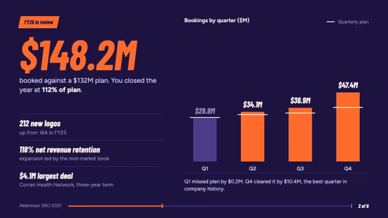
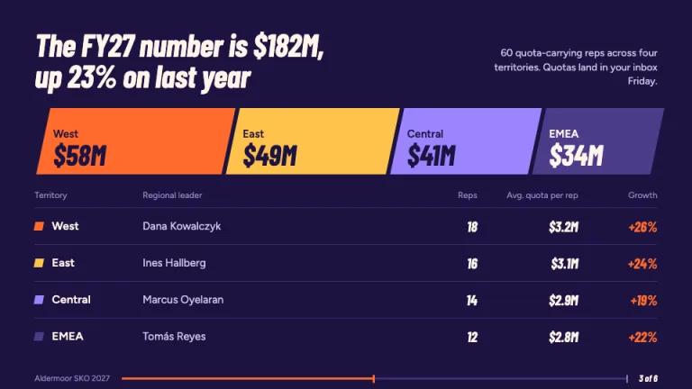
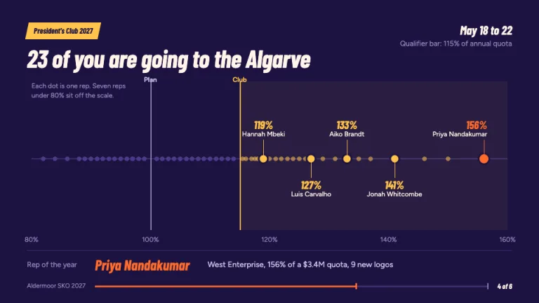
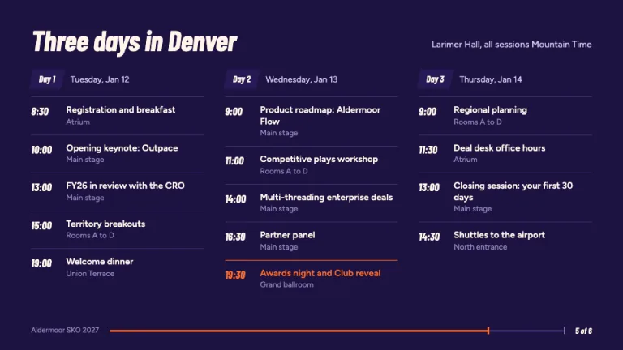
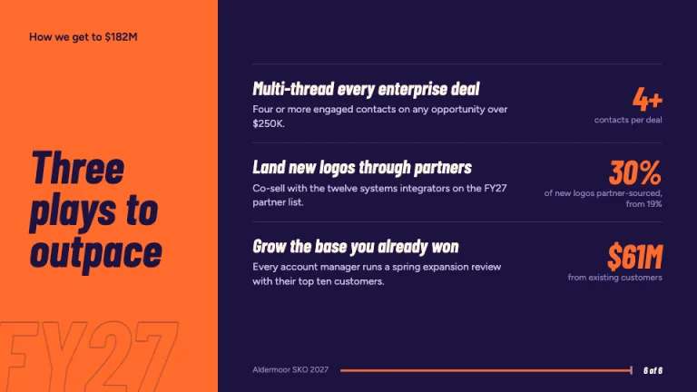

[← All prompts](../README.md) · [Live site](https://slidespeak.co/slide-design-prompts) · [SlideSpeak](https://slidespeak.co)

# Sales Kickoff

> From theme reveal to President's Club

A sales kickoff presentation for your January SKO: a theme-word reveal, last year's wins against plan, quota by territory and a President's Club strip. Set in deep indigo and tangerine with condensed italic numbers.

**Category:** Events & seasonal &nbsp;·&nbsp; **Style:** Bold, Dark &nbsp;·&nbsp; **Mode:** Dark &nbsp;·&nbsp; **Fonts:** Barlow Condensed + Figtree

<table>
    <tr>
      <td align="center" width="33%"><br><sub>Theme reveal</sub></td>
      <td align="center" width="33%"><br><sub>Last year's wins</sub></td>
      <td align="center" width="33%"><br><sub>Quota and territories</sub></td>
    </tr>
    <tr>
      <td align="center" width="33%"><br><sub>President's Club</sub></td>
      <td align="center" width="33%"><br><sub>Agenda</sub></td>
      <td align="center" width="33%"><br><sub>Plays for the year</sub></td>
    </tr>
</table>

## The prompt

Copy the prompt below into **ChatGPT**, **Claude**, or any AI chat — or grab the raw [`PROMPT.md`](./PROMPT.md). It asks what your presentation is about first, then applies the design to every slide.

```text
Create a presentation in the 'Sales Kickoff' theme, a January SKO deck for a revenue team: theme reveal, last year's wins, the new number, territories, President's Club and agenda. Background: deep stage indigo (#1C1240) on every slide, surfaces #271A55, 1px rules #3D2F72. Accent: tangerine (#FF6B2C) for the theme word and one highlight per slide; marigold (#FFC24B) is reserved for President's Club and awards; lavender (#9C84FF) and violet (#4B3C8A) are secondary chart series. Text: warm white (#FFF4EA) headings, #CFC6EC body, #9186BE labels. Typography: 'Barlow Condensed' 700 italic for headlines at 40 to 64px, 0.95 leading, sentence case, and for every numeral; 'Figtree' 400 to 600 for body at 14 to 18px (both Google Fonts). The slant is the motif: tags are parallelograms skewed 12 degrees holding condensed italic text, and the territory bar shares the slant. Signature theme reveal: the year's one-word theme in uppercase Barlow Condensed 700 italic at about 210px in tangerine, trailed by two outlined copies (2px stroke, no fill, #6A55B8 and #3D2F72) offset 32px and 64px to the left, then a one-line promise and the event dates beside a 2px tangerine rule. Last year's wins: the booking total as a 100px tangerine numeral, 'booked against a $X plan', three win lines split by rules, and quarterly bars each crossed by a 2px warm white plan tick; bars that beat plan are tangerine, misses violet. Quota and territories: the new number as one full-width bar split by territory at true proportion, each slanted segment labeled with region and value, above a table of leader, reps, average quota and growth with right-aligned condensed numerals. President's Club: an attainment strip from 80% to 160% with every rep as an 8px dot, a plan line at 100%, a marigold Club line and faint marigold zone past the qualifier bar, the top five named on stems with percentages, and a rep-of-the-year line in tangerine. Agenda: three day columns under slanted day tags, times in condensed italic, rooms in muted text, the awards session marked with a tangerine rule. Plays slide: a 300px tangerine panel on the left with the rally headline in indigo, three plays on the right, each with a large tangerine target number. Footer on every slide: company name and 'SKO' plus year in 11px muted text left, a 3px run-rate track that fills tangerine in proportion to slide position, and 'n of N' in condensed italic right. Strictly avoid: neon glows, gradients, glassmorphism, sports clipart, trophies, confetti, crowd stock photos, black backgrounds with acid green, tracked uppercase labels over headings, emoji, centered body text, more than one tangerine highlight per slide, pie charts, 3D charts, motivational quotes.

Use this theme for my slides. Ask me what the presentation is about first, then apply the theme to every slide.
```

**[Open ChatGPT ↗](https://chatgpt.com/)** &nbsp;·&nbsp; **[Open Claude ↗](https://claude.ai/new)** &nbsp;·&nbsp; **[Generate a finished deck with SlideSpeak ↗](https://app.slidespeak.co/presentation?utm_source=github&utm_medium=referral&utm_campaign=slide-design-prompts)**

## Palette

| Role | Hex |
| --- | --- |
| Background | `#1C1240` |
| Surface / panel | `#271A55` |
| Border | `#3D2F72` |
| Primary accent | `#FF6B2C` |
| Primary (soft tint) | `#49243C` |
| Text on primary | `#1C1240` |
| Heading text | `#FFF4EA` |
| Body text | `#CFC6EC` |
| Muted text | `#9186BE` |

**Chart series:** `#FF6B2C` `#FFC24B` `#9C84FF` `#4B3C8A`

## Fonts

- **Barlow Condensed** (heading, Google Fonts)
- **Figtree** (supporting, Google Fonts)

---

<sub>Part of [SlideSpeak Slide Design Prompts](../../README.md) · MIT licensed</sub>
