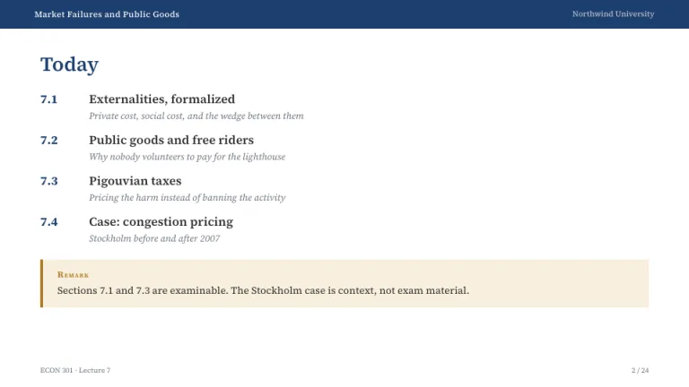
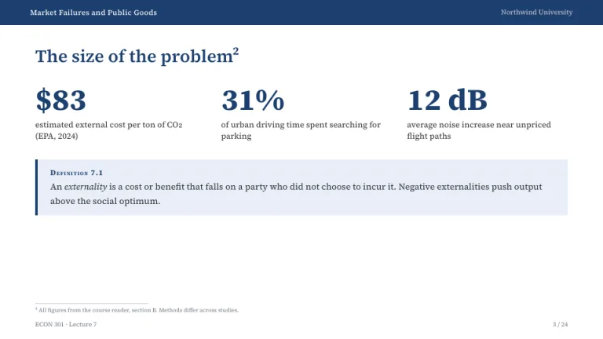
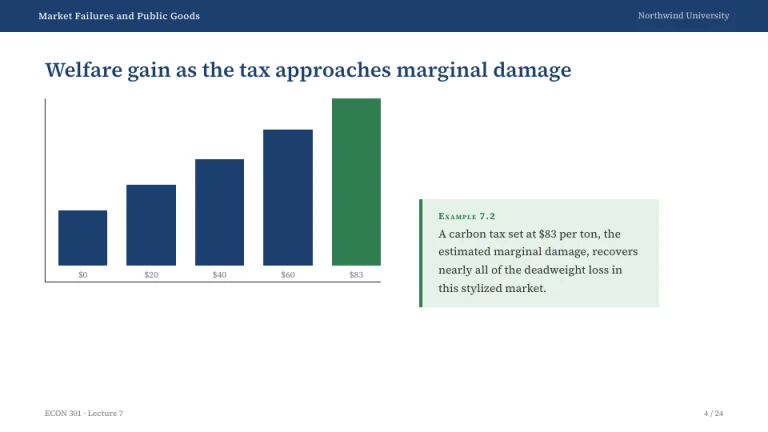
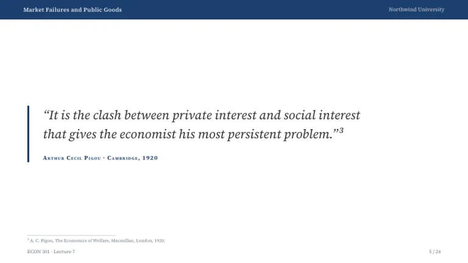
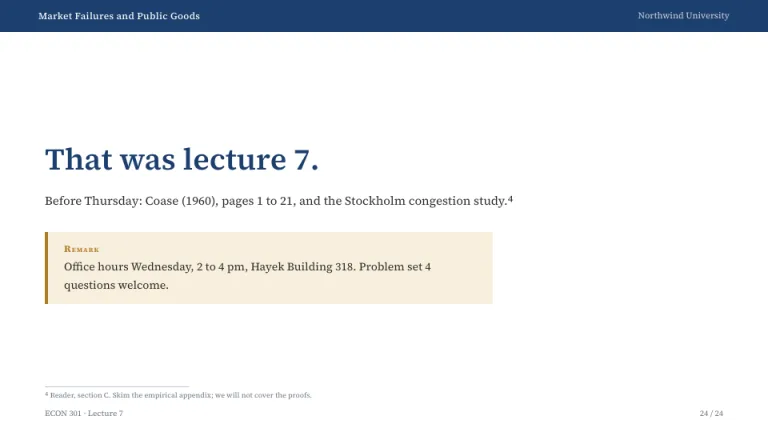

[← All prompts](../README.md) · [Live site](https://slidespeak.co/slide-design-prompts) · [SlideSpeak](https://slidespeak.co)

# Seminar

> Beamer, but nicer

Lecture slides typeset like LaTeX Beamer. A navy header bar on every slide and color-coded theorem boxes do the organizing.

**Category:** Education & research &nbsp;·&nbsp; **Style:** Minimal, Corporate &nbsp;·&nbsp; **Mode:** Light &nbsp;·&nbsp; **Fonts:** Source Serif 4

<table>
    <tr>
      <td align="center" width="33%"><br><sub>Title</sub></td>
      <td align="center" width="33%"><br><sub>Agenda</sub></td>
      <td align="center" width="33%"><br><sub>Key metrics</sub></td>
    </tr>
    <tr>
      <td align="center" width="33%"><br><sub>Chart & insight</sub></td>
      <td align="center" width="33%"><br><sub>Quote</sub></td>
      <td align="center" width="33%"><br><sub>Closing</sub></td>
    </tr>
</table>

## The prompt

Copy the prompt below into **ChatGPT**, **Claude**, or any AI chat — or grab the raw [`PROMPT.md`](./PROMPT.md). It asks what your presentation is about first, then applies the design to every slide.

```text
Create a lecture deck in the 'Seminar' theme, an academic LaTeX Beamer style. Background: pure white #FFFFFF. Every slide carries a full-width navy #1C3F6E header bar about 40px tall, lecture title on the left and the institution name on the right in small white text. Typography: 'Source Serif 4' (a Google Font) for everything; body text in #2B2B2B at 13 to 16px; semibold headings in navy #1C3F6E. Signature motif: theorem boxes, light tinted panels with a 4px solid left border and a bold small-caps label. Blue #1C3F6E on #E8EEF7 for Definition, green #2F7D4F on #E5F2EA for Example, amber #B07D2B on #F8EFDD for Remark. Near the bottom of relevant slides, a thin 180px footnote rule with 9px 'Source Serif 4' footnotes, then a footer with the course code and lecture number left and the slide number right in #6B7280. Charts are flat navy bars on one hairline axis, the key bar in green. Strictly avoid: gradients, drop shadows, rounded corners, decorative icons, photography, sans-serif body text.

Use this theme for my slides. Ask me what the presentation is about first, then apply the theme to every slide.
```

**[Open ChatGPT ↗](https://chatgpt.com/)** &nbsp;·&nbsp; **[Open Claude ↗](https://claude.ai/new)** &nbsp;·&nbsp; **[Generate a finished deck with SlideSpeak ↗](https://app.slidespeak.co/presentation?utm_source=github&utm_medium=referral&utm_campaign=slide-design-prompts)**

## Palette

| Role | Hex |
| --- | --- |
| Background | `#FFFFFF` |
| Surface / panel | `#F4F7FB` |
| Border | `#D8DEE9` |
| Primary accent | `#1C3F6E` |
| Primary (soft tint) | `#E8EEF7` |
| Text on primary | `#FFFFFF` |
| Heading text | `#1C3F6E` |
| Body text | `#2B2B2B` |
| Muted text | `#6B7280` |

**Chart series:** `#1C3F6E` `#2F7D4F` `#B07D2B` `#C9D4E5`

## Fonts

- **Source Serif 4** (heading and body, Google Fonts)

---

<sub>Part of [SlideSpeak Slide Design Prompts](../../README.md) · MIT licensed</sub>
