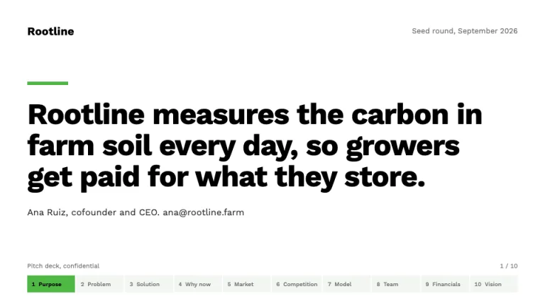
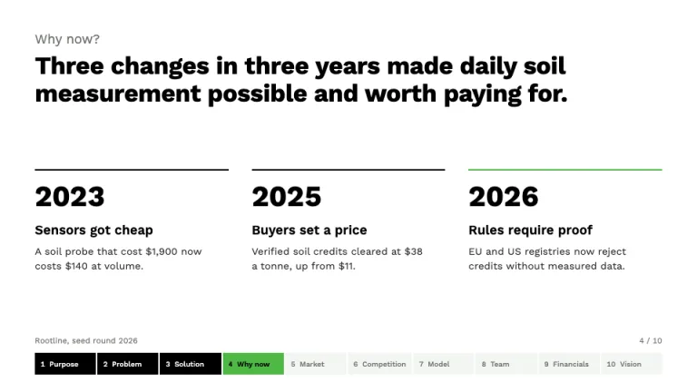
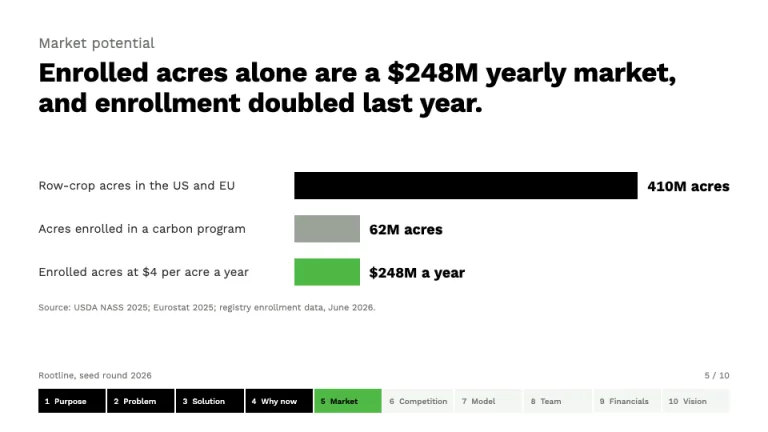
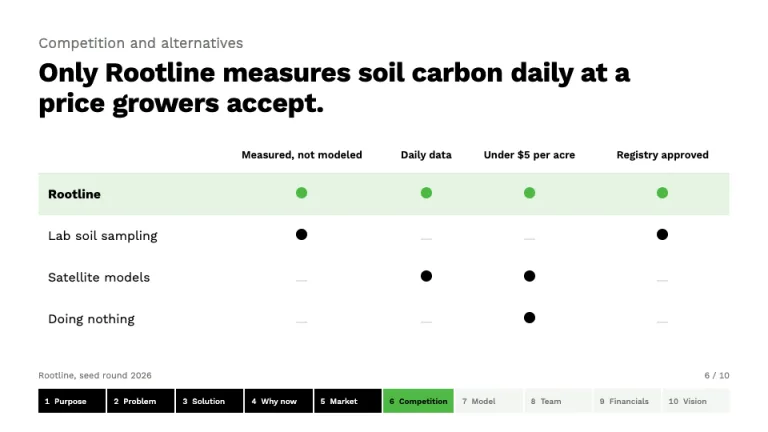
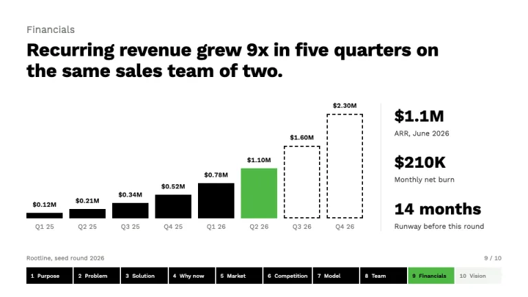
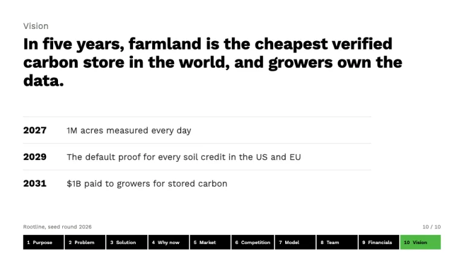

[← All prompts](../README.md) · [Live site](https://slidespeak.co/slide-design-prompts) · [SlideSpeak](https://slidespeak.co)

# Sequoia Pitch Deck

> Ten questions, in order, on every slide

A Sequoia pitch deck template prompt built on the ten-part business plan outline Sequoia Capital publishes for founders. A green-and-black strip at the foot of each slide tracks where you are, and each slide answers one of Sequoia's questions in a single sentence. An unofficial homage to the Sequoia Capital business plan format. Not affiliated with, endorsed by, or connected to Sequoia Capital.

**Category:** Pitch decks &nbsp;·&nbsp; **Style:** Minimal, Corporate &nbsp;·&nbsp; **Mode:** Light &nbsp;·&nbsp; **Fonts:** Work Sans

<table>
    <tr>
      <td align="center" width="33%"><br><sub>Company purpose</sub></td>
      <td align="center" width="33%"><br><sub>Why now</sub></td>
      <td align="center" width="33%"><br><sub>Market potential</sub></td>
    </tr>
    <tr>
      <td align="center" width="33%"><br><sub>Competition</sub></td>
      <td align="center" width="33%"><br><sub>Financials</sub></td>
      <td align="center" width="33%"><br><sub>Vision</sub></td>
    </tr>
</table>

## The prompt

Copy the prompt below into **ChatGPT**, **Claude**, or any AI chat — or grab the raw [`PROMPT.md`](./PROMPT.md). It asks what your presentation is about first, then applies the design to every slide.

```text
Create a presentation in the 'Sequoia Pitch Deck' theme, an unofficial homage to the ten-part business plan outline Sequoia Capital publishes for founders. The deck follows that outline in order, 1 Company purpose, 2 Problem, 3 Solution, 4 Why now, 5 Market potential, 6 Competition and alternatives, 7 Business model, 8 Team, 9 Financials, 10 Vision. Background: white (#ffffff) on every slide. Typography: 'Work Sans' (Google Fonts) throughout; headlines 700 at 32 to 36px, the cover sentence 700 at 48 to 54px, body 400 at 14 to 18px in #2b2b2b, supporting text #6b6f69, tabular numbers. Text is black #000000 or those grays, never green. Green #4fb946 is a fill color only, in at most two places per slide: the active strip cell and the one bar or row that proves the headline; its tint #e5f4e3 marks the company's row in tables. The signature is the outline strip: a full-width row of ten equal cells, 30px tall with 2px white gaps, at the bottom of every slide, each cell showing number and short section name at 10px: current section #4fb946 with black text, finished sections black with white text, upcoming #f3f5f2 with #6b6f69 text. Above it, an 11px gray line: company and round left, 'n / 10' right. Content slides open with Sequoia's question for that section in 18px #6b6f69 regular (for example 'Why now?'), then a bold black one-sentence headline that answers it, left-aligned, two lines at most. Cover: company name top-left, round and date top-right, a 72px by 6px green rule, the company purpose as one declarative sentence under 20 words, founder name and email. Why now: three dated shifts in columns, each a big year, a bold statement and one line of evidence under a 2px black rule, the latest rule green. Market potential: bottom-up horizontal bars from total market to reachable market, value at each bar end, the reachable-market bar green, a source line. Competition: a comparison table with alternatives as rows (include 'doing nothing'), criteria as columns, filled dots for yes and short gray dashes for no; the company row tinted #e5f4e3 with green dots. Financials: quarterly bars, actuals solid black, the latest quarter green, forecasts as dashed black outlines, values above bars, plus a side column of three figures (revenue, burn, runway). Vision: the five-year outcome as the headline and three dated milestones on hairline #dfe3dd rules. Strictly avoid: skipping or reordering the ten sections, green text, green in more than two places per slide, gradients, drop shadows, rounded cards, stock photos, icons, emoji, dark backgrounds, bullet walls, centered body text, topic-only headlines like 'Market', TAM/SAM/SOM circles, the Sequoia tree logo or wordmark, and claiming affiliation with Sequoia Capital.

Use this theme for my slides. Ask me what the presentation is about first, then apply the theme to every slide.
```

**[Open ChatGPT ↗](https://chatgpt.com/)** &nbsp;·&nbsp; **[Open Claude ↗](https://claude.ai/new)** &nbsp;·&nbsp; **[Generate a finished deck with SlideSpeak ↗](https://app.slidespeak.co/presentation?utm_source=github&utm_medium=referral&utm_campaign=slide-design-prompts)**

## Palette

| Role | Hex |
| --- | --- |
| Background | `#ffffff` |
| Surface / panel | `#f3f5f2` |
| Border | `#dfe3dd` |
| Primary accent | `#4fb946` |
| Primary (soft tint) | `#e5f4e3` |
| Text on primary | `#000000` |
| Heading text | `#000000` |
| Body text | `#2b2b2b` |
| Muted text | `#6b6f69` |

**Chart series:** `#4fb946` `#000000` `#9aa39a` `#cfe9cb`

## Fonts

- **Work Sans** (heading, Google Fonts)

---

<sub>Part of [SlideSpeak Slide Design Prompts](../../README.md) · MIT licensed</sub>
