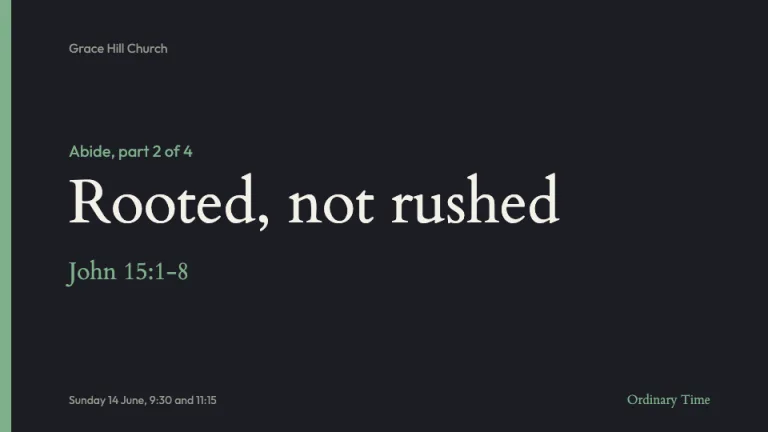
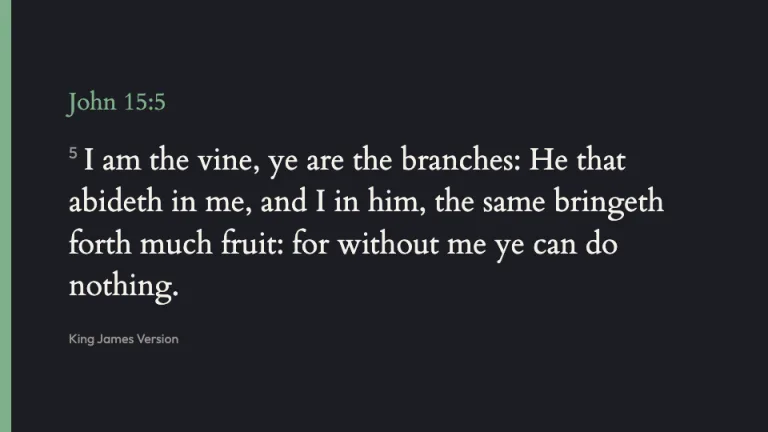
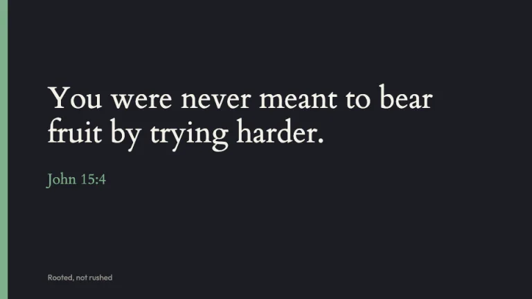
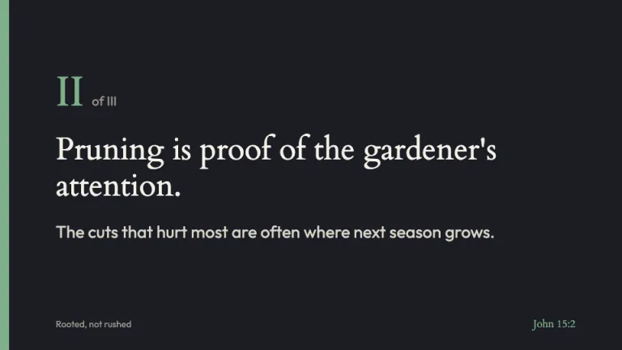
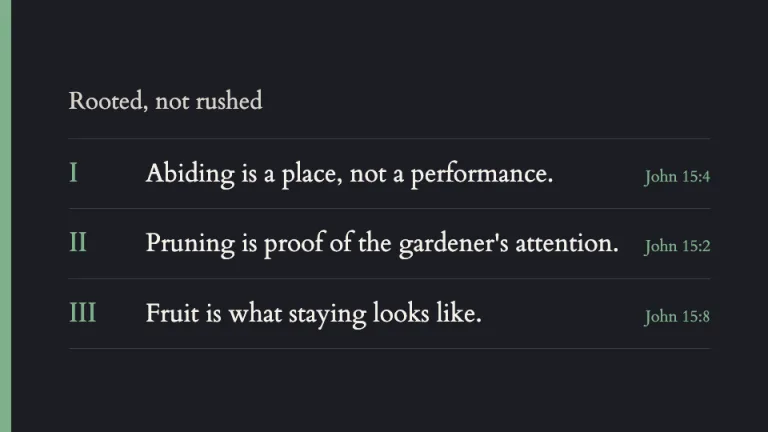
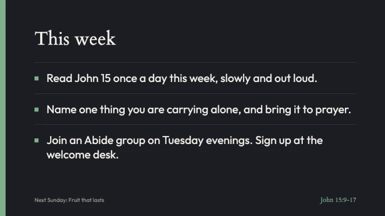

[← All prompts](../README.md) · [Live site](https://slidespeak.co/slide-design-prompts) · [SlideSpeak](https://slidespeak.co)

# Sermon

> Scripture first, readable from the back row

Sermon slides for the projector, with large Cardo scripture and verse numbers, a three-point outline, and a colored band on the left edge that follows the liturgical season. A church presentation template for Sunday services, sermon series and small groups.

**Category:** Events & seasonal &nbsp;·&nbsp; **Style:** Calm, Dark, Elegant &nbsp;·&nbsp; **Mode:** Dark &nbsp;·&nbsp; **Fonts:** Cardo + Outfit

<table>
    <tr>
      <td align="center" width="33%"><br><sub>Series title</sub></td>
      <td align="center" width="33%"><br><sub>Scripture reading</sub></td>
      <td align="center" width="33%"><br><sub>Big idea</sub></td>
    </tr>
    <tr>
      <td align="center" width="33%"><br><sub>Sermon point</sub></td>
      <td align="center" width="33%"><br><sub>Outline recap</sub></td>
      <td align="center" width="33%"><br><sub>Response and next steps</sub></td>
    </tr>
</table>

## The prompt

Copy the prompt below into **ChatGPT**, **Claude**, or any AI chat — or grab the raw [`PROMPT.md`](./PROMPT.md). It asks what your presentation is about first, then applies the design to every slide.

```text
Create a presentation in the 'Sermon' theme, projection-first slides for a church service. Background: deep slate (#1b1d24) on every slide, edge to edge; the rare panel is #252833 and dividers are 1px #3a3e4b rules. Text is warm white #f5f1e8 for titles and scripture, #d9d4c8 for supporting lines and #9a968c for small captions. Typography: 'Cardo' (Google Fonts) 400 for titles, scripture, references and Roman numerals; 'Outfit' 400/500 for supporting lines, next steps and captions. The signature is the season band: a 14px vertical band down the left edge of every slide in the liturgical color of the Sunday, and the same color marks every scripture reference and numeral. Use Ordinary Time green #7fb08a by default; Advent and Lent purple #a88bd8; Christmas and Easter gold #e3b861; Pentecost red #d9674e. Ask which Sunday it is and use exactly one season color for the whole deck. Content is left-aligned with an 86px left margin past the band. Series title slide: church name small in #9a968c at the top, the series and part ('Abide, part 2 of 4') in the season color, the sermon title in Cardo at 72 to 80px, the passage in Cardo 30px in the season color, and service times at the bottom. Scripture slides: the reference in Cardo 30px season color, the verse in Cardo 36 to 40px with line-height 1.4, verse numbers as small #9a968c superscripts, the translation named in 16px Outfit beneath; 40 words maximum per slide, splitting long passages across slides marked '(continued)'. Big idea slide: one sentence in Cardo 50 to 56px with its anchor verse beneath. Point slides: a Cardo Roman numeral (I, II, III) at 64px in the season color with 'of III' in #9a968c, the point in Cardo 44 to 50px, one supporting line in Outfit 26px. Outline recap: the three points stacked on 1px rules, numeral left, point in Cardo 32px, reference right. Response slide: 'This week' then two to four actions in Outfit 28px, each on a rule with a small square in the season color, never numbered. Footer only on content slides: sermon title bottom-left and the reference bottom-right in 14 to 16px. Body text never goes below 26px; only footers and captions go smaller. Use public domain translations (KJV, WEB) in examples. Strictly avoid: stock photos of sunsets, hands or crosses, photo backgrounds under text, lens flares, script or handwritten fonts, clip-art crosses and doves, more than one season color per deck, gradients, drop shadows, centered paragraphs, full paragraphs of sermon notes, bullet walls, text under 26px outside the footer, all-caps titles, and copyrighted song lyrics or modern translations pasted without permission.

Use this theme for my slides. Ask me what the presentation is about first, then apply the theme to every slide.
```

**[Open ChatGPT ↗](https://chatgpt.com/)** &nbsp;·&nbsp; **[Open Claude ↗](https://claude.ai/new)** &nbsp;·&nbsp; **[Generate a finished deck with SlideSpeak ↗](https://app.slidespeak.co/presentation?utm_source=github&utm_medium=referral&utm_campaign=slide-design-prompts)**

## Palette

| Role | Hex |
| --- | --- |
| Background | `#1b1d24` |
| Surface / panel | `#252833` |
| Border | `#3a3e4b` |
| Primary accent | `#7fb08a` |
| Primary (soft tint) | `#2b3a31` |
| Text on primary | `#1b1d24` |
| Heading text | `#f5f1e8` |
| Body text | `#d9d4c8` |
| Muted text | `#9a968c` |

**Chart series:** `#7fb08a` `#a88bd8` `#e3b861` `#d9674e`

## Fonts

- **Cardo** (heading, Google Fonts)
- **Outfit** (supporting, Google Fonts)

---

<sub>Part of [SlideSpeak Slide Design Prompts](../../README.md) · MIT licensed</sub>
