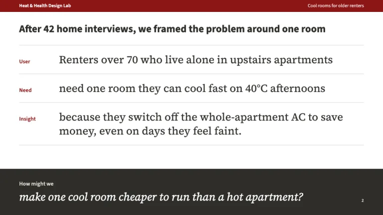
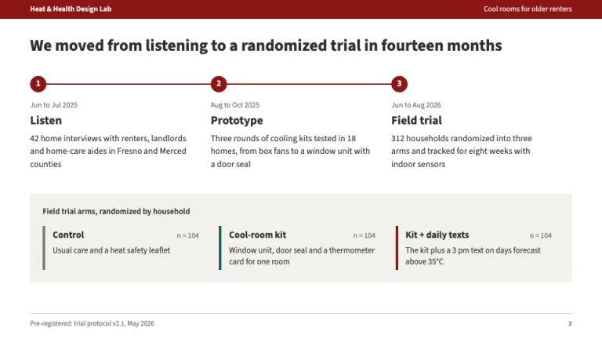
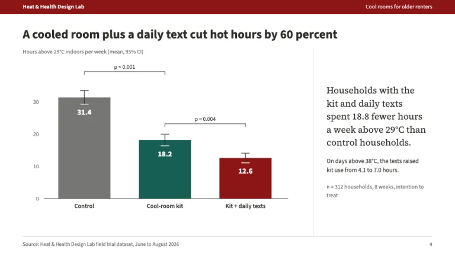
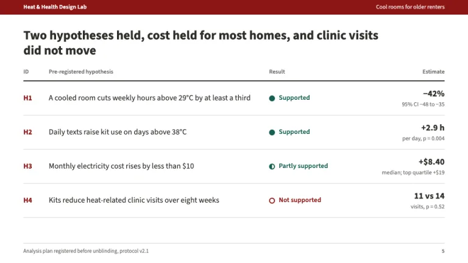
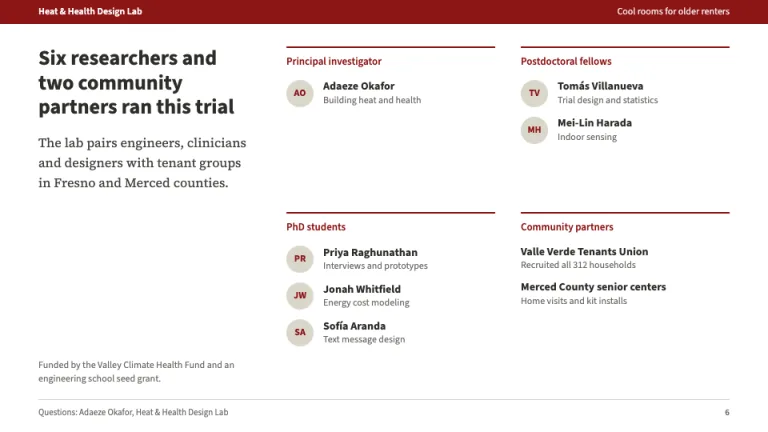

[← All prompts](../README.md) · [Live site](https://slidespeak.co/slide-design-prompts) · [SlideSpeak](https://slidespeak.co)

# Stanford Style

> Cardinal red lab talks, null results included

A Stanford presentation template for lab talks: cardinal red #8C1515, a how-might-we framing slide, charts with error bars and a team roster. An unofficial homage to Stanford University's public visual identity. Not affiliated with, endorsed by, or connected to Stanford University.

**Category:** Education & research &nbsp;·&nbsp; **Style:** Corporate, Bold &nbsp;·&nbsp; **Mode:** Light &nbsp;·&nbsp; **Fonts:** Source Sans 3 + Source Serif 4

<table>
    <tr>
      <td align="center" width="33%"><br><sub>Title</sub></td>
      <td align="center" width="33%"><br><sub>Problem framing</sub></td>
      <td align="center" width="33%"><br><sub>Study design</sub></td>
    </tr>
    <tr>
      <td align="center" width="33%"><br><sub>Experiment results</sub></td>
      <td align="center" width="33%"><br><sub>Hypothesis ledger</sub></td>
      <td align="center" width="33%"><br><sub>Lab team</sub></td>
    </tr>
</table>

## The prompt

Copy the prompt below into **ChatGPT**, **Claude**, or any AI chat — or grab the raw [`PROMPT.md`](./PROMPT.md). It asks what your presentation is about first, then applies the design to every slide.

```text
Create a presentation in the 'Stanford Style' theme, an unofficial homage to a cardinal red university research-lab talk. Background: white (#ffffff) on content slides. Typography: 'Source Sans 3' (Google Fonts) for titles at 700 to 800 (26 to 28px on content slides, 50 to 56px on the cover) and body text at 13 to 16px; 'Source Serif 4' for problem statements, how-might-we questions and plain-language findings at 19 to 28px, italic for the question. Headings #2e2d29, body #43423e, muted notes #6d6c69, rules #d5d5d4. The signature brand bar: a 30px cardinal (#8c1515) strip across the top of every content slide with the lab name in white Source Sans 3 600 12px on the left and the talk's short title in #f3e3e3 on the right. Title slide: full-bleed #8c1515, the brand bar darkened to #820000, a serif italic line naming the study type, a heavy white left-aligned title, a one-sentence serif description, speaker and venue at the bottom. Content titles state the finding in one sentence, such as 'A cooled room plus a daily text cut hot hours by 60 percent'. Problem framing slide: a point-of-view statement split into three ruled rows labeled User, Need and Insight in 14px cardinal 600, each row a Source Serif 4 phrase at 24px, then a full-width #2e2d29 band at the bottom with 'How might we' in #dad7cb and the question in white serif italic 28px. Study design: numbered phases on a 2px cardinal timeline, then trial arms on a #f2f1ec panel, each with a 4px left border in its chart color and its n. Results: one exhibit per slide, bars with 95% confidence intervals and p-value brackets, white values inside the bars, the winning condition #8c1515, comparison Palo Alto green #175e54, control #767674, no gridlines or legends, the effect restated in one serif sentence beside the chart with n. Hypothesis ledger: pre-registered IDs such as H1 in cardinal, the hypothesis, a result marker (filled #175e54 circle for supported, half-filled for partly supported, empty cardinal ring for not supported) and a right-aligned estimate with its interval; report null results in the same table. Lab team: people grouped by role under 2px cardinal rules, 34px #dad7cb monogram circles with cardinal initials, partners and funders credited. Footer on content slides: a 1px #d5d5d4 rule with the source or protocol line bottom-left and the page number bottom-right, both 11px #6d6c69. Strictly avoid: university seals, the tree emblem, wordmarks or any logo, claiming affiliation with Stanford University or any of its schools, cardinal backgrounds on content slides, gradients, drop shadows, stock photos of campuses or labs, clipart lightbulbs and sticky notes, bar charts without error bars or n, hiding null results, centered body text, bullet walls, identical rounded cards, extra chart colors.

Use this theme for my slides. Ask me what the presentation is about first, then apply the theme to every slide.
```

**[Open ChatGPT ↗](https://chatgpt.com/)** &nbsp;·&nbsp; **[Open Claude ↗](https://claude.ai/new)** &nbsp;·&nbsp; **[Generate a finished deck with SlideSpeak ↗](https://app.slidespeak.co/presentation?utm_source=github&utm_medium=referral&utm_campaign=slide-design-prompts)**

## Palette

| Role | Hex |
| --- | --- |
| Background | `#ffffff` |
| Surface / panel | `#f2f1ec` |
| Border | `#d5d5d4` |
| Primary accent | `#8c1515` |
| Primary (soft tint) | `#f3e3e3` |
| Text on primary | `#ffffff` |
| Heading text | `#2e2d29` |
| Body text | `#43423e` |
| Muted text | `#6d6c69` |

**Chart series:** `#8c1515` `#175e54` `#767674` `#dad7cb`

## Fonts

- **Source Sans 3** (heading, Google Fonts)
- **Source Serif 4** (supporting, Google Fonts)

---

<sub>Part of [SlideSpeak Slide Design Prompts](../../README.md) · MIT licensed</sub>
