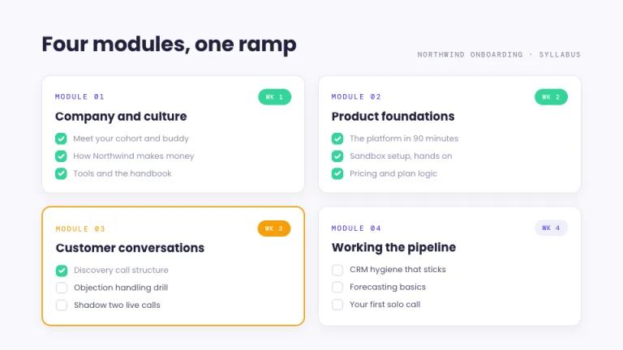

[← All prompts](../README.md) · [Live site](https://slidespeak.co/slide-design-prompts) · [SlideSpeak](https://slidespeak.co)

# Syllabus

> The outline is the design

A course outline turned into slides. Checkboxes fill in as the cohort moves, so progress is visible from the back of the room.

**Category:** Education & research &nbsp;·&nbsp; **Style:** Calm, Playful &nbsp;·&nbsp; **Mode:** Light &nbsp;·&nbsp; **Fonts:** Poppins + DM Mono

<table>
    <tr>
      <td align="center" width="33%"><br><sub>Title</sub></td>
      <td align="center" width="33%"><br><sub>Agenda</sub></td>
      <td align="center" width="33%"><br><sub>Key metrics</sub></td>
    </tr>
    <tr>
      <td align="center" width="33%"><br><sub>Timeline</sub></td>
      <td align="center" width="33%"><br><sub>Closing</sub></td>
    </tr>
</table>

## The prompt

Copy the prompt below into **ChatGPT**, **Claude**, or any AI chat — or grab the raw [`PROMPT.md`](./PROMPT.md). It asks what your presentation is about first, then applies the design to every slide.

```text
Create a presentation styled as a living course outline, the 'Syllabus' theme. Background: pale lavender white (#F8F8FC). Typography: 'Poppins', a friendly geometric sans, with 'DM Mono' for labels (both Google Fonts); bold headings in dark indigo ink (#21213B); module labels in small 'DM Mono' ('MODULE 01') in indigo (#4F46E5). Signature motifs: white module cards with 14px rounded corners, 1px #E4E4F4 borders and very soft shadows, each holding a lesson checklist; 18px rounded checkboxes, completed ones filled mint (#34D399) with a white check, open ones white with a 2px #E4E4F4 border; small rounded week chips reading 'WK 1' in 10px 'DM Mono', mint when done, amber (#F59E0B) when current, soft indigo fill (#EEEEFA) otherwise; a dotted #B9B9E6 connector line linking modules on timelines; an indigo donut completion ring labeled '64% complete' on stats slides. Mark the current module with a 2px amber border. Strictly avoid: sharp corners, dark backgrounds, gradients, photographs, more than three accent colors, decorative icons unrelated to coursework.

Use this theme for my slides. Ask me what the presentation is about first, then apply the theme to every slide.
```

**[Open ChatGPT ↗](https://chatgpt.com/)** &nbsp;·&nbsp; **[Open Claude ↗](https://claude.ai/new)** &nbsp;·&nbsp; **[Generate a finished deck with SlideSpeak ↗](https://app.slidespeak.co/presentation?utm_source=github&utm_medium=referral&utm_campaign=slide-design-prompts)**

## Palette

| Role | Hex |
| --- | --- |
| Background | `#F8F8FC` |
| Surface / panel | `#FFFFFF` |
| Border | `#E4E4F4` |
| Primary accent | `#4F46E5` |
| Primary (soft tint) | `#EEEEFA` |
| Text on primary | `#FFFFFF` |
| Heading text | `#21213B` |
| Body text | `#4A4A68` |
| Muted text | `#8B8BA8` |

**Chart series:** `#4F46E5` `#34D399` `#F59E0B` `#C7C7EE`

## Fonts

- **Poppins** (heading, Google Fonts)
- **DM Mono** (supporting, Google Fonts)

---

<sub>Part of [SlideSpeak Slide Design Prompts](../../README.md) · MIT licensed</sub>
