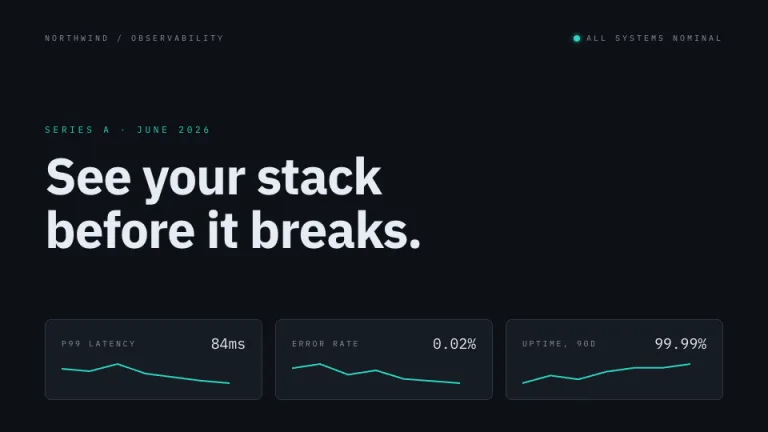
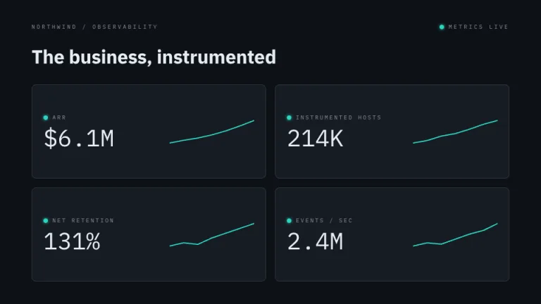
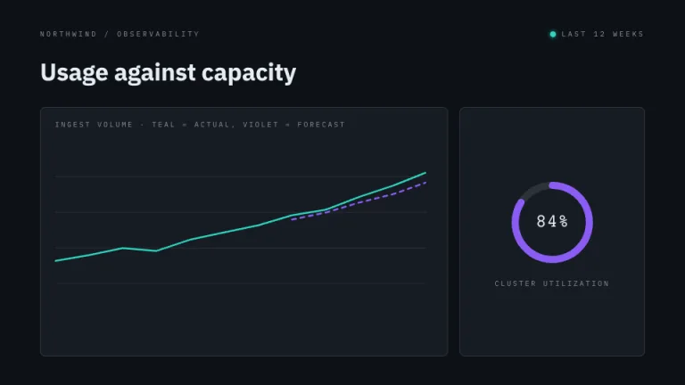
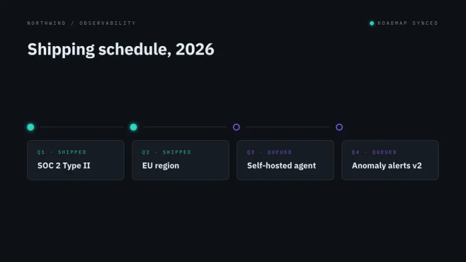
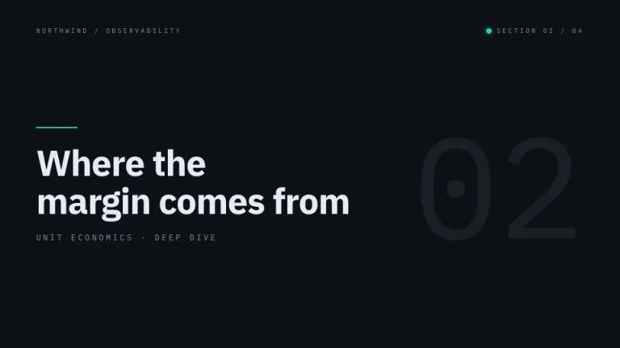
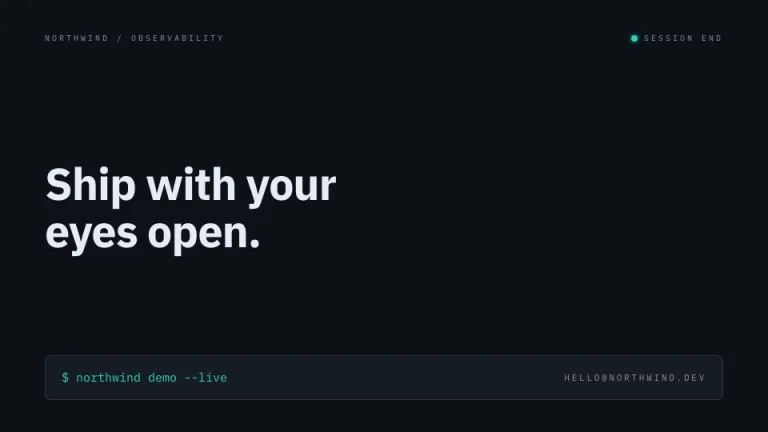

[← All prompts](../README.md) · [Live site](https://slidespeak.co/slide-design-prompts) · [SlideSpeak](https://slidespeak.co)

# Telemetry

> Your deck as a dashboard

Dark observability panels with sparklines, a gauge and status dots. Built for infrastructure teams who present the way they monitor.

**Category:** Tech & product &nbsp;·&nbsp; **Style:** Tech, Dark &nbsp;·&nbsp; **Mode:** Dark &nbsp;·&nbsp; **Fonts:** IBM Plex Sans + IBM Plex Mono

<table>
    <tr>
      <td align="center" width="33%"><br><sub>Title</sub></td>
      <td align="center" width="33%"><br><sub>Key metrics</sub></td>
      <td align="center" width="33%"><br><sub>Chart & insight</sub></td>
    </tr>
    <tr>
      <td align="center" width="33%"><br><sub>Timeline</sub></td>
      <td align="center" width="33%"><br><sub>Section divider</sub></td>
      <td align="center" width="33%"><br><sub>Closing</sub></td>
    </tr>
</table>

## The prompt

Copy the prompt below into **ChatGPT**, **Claude**, or any AI chat — or grab the raw [`PROMPT.md`](./PROMPT.md). It asks what your presentation is about first, then applies the design to every slide.

```text
Create a presentation in the 'Telemetry' theme: a dark observability dashboard. Background: #0D1117. Content sits in panels of #161B22 with 1px #30363D borders and 8px corner radius. Accents: neon teal #2DD4BF for healthy data, sparklines and status, violet #8B5CF6 for the gauge and forecast series. Typography: 'IBM Plex Sans' with 'IBM Plex Mono' for data, both Google Fonts. Every number is 'IBM Plex Mono' in #E6EDF3, 18 to 42px inside panels. Labels are tiny 10px uppercase #8B949E, letter-spaced 0.25em to 0.3em. Four motifs: SVG polyline sparklines in teal, 2px stroke, inside panels; one gauge arc, an SVG circle with violet stroke-dasharray showing a percentage with a mono value centered; small 8px teal status dots with a soft glow meaning healthy; thin horizontal baseline grid lines inside charts at 10 percent white. Headlines 34 to 64px bold 'IBM Plex Sans' in #E6EDF3. A header row on each slide carries 'IBM Plex Mono' metadata and a status dot. Strictly avoid: light backgrounds; serif type; corner radii above 8px; red or warning colors; gradients on panels; decorative illustrations.

Use this theme for my slides. Ask me what the presentation is about first, then apply the theme to every slide.
```

**[Open ChatGPT ↗](https://chatgpt.com/)** &nbsp;·&nbsp; **[Open Claude ↗](https://claude.ai/new)** &nbsp;·&nbsp; **[Generate a finished deck with SlideSpeak ↗](https://app.slidespeak.co/presentation?utm_source=github&utm_medium=referral&utm_campaign=slide-design-prompts)**

## Palette

| Role | Hex |
| --- | --- |
| Background | `#0D1117` |
| Surface / panel | `#161B22` |
| Border | `#30363D` |
| Primary accent | `#2DD4BF` |
| Primary (soft tint) | `#10322E` |
| Text on primary | `#0D1117` |
| Heading text | `#E6EDF3` |
| Body text | `#C9D1D9` |
| Muted text | `#8B949E` |

**Chart series:** `#2DD4BF` `#8B5CF6` `#8B949E` `#30363D`

## Fonts

- **IBM Plex Sans** (heading, Google Fonts)
- **IBM Plex Mono** (supporting, Google Fonts)

---

<sub>Part of [SlideSpeak Slide Design Prompts](../../README.md) · MIT licensed</sub>
