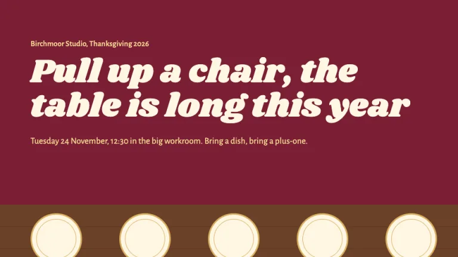
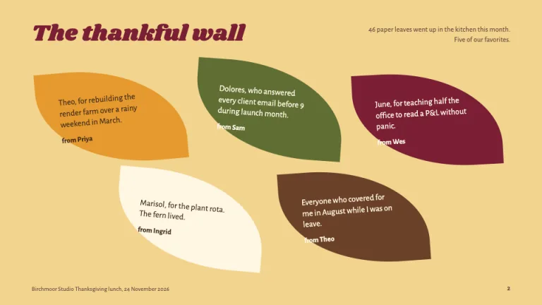
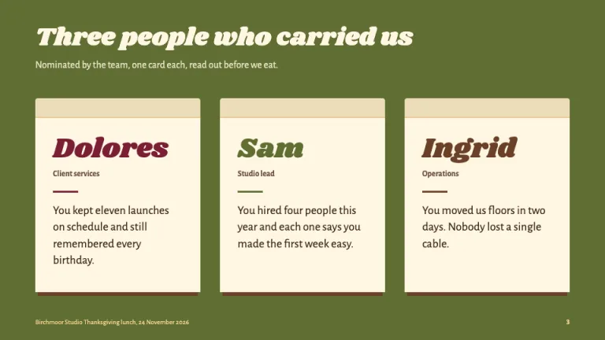
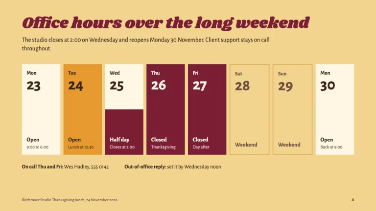
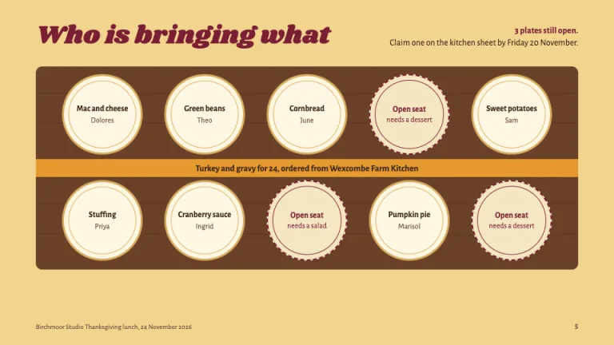
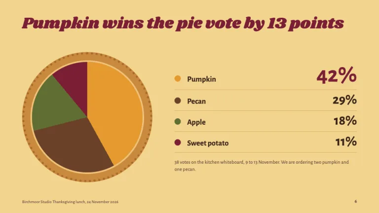

[← All prompts](../README.md) · [Live site](https://slidespeak.co/slide-design-prompts) · [SlideSpeak](https://slidespeak.co)

# Thanksgiving

> Pull up a chair, bring a dish

A Thanksgiving PowerPoint template for work and family: a potluck sign-up drawn as a harvest table, gratitude leaves and a holiday-hours slide. The palette is cranberry, squash and walnut, and the prompt bans turkey clipart.

**Category:** Events & seasonal &nbsp;·&nbsp; **Style:** Warm, Playful &nbsp;·&nbsp; **Mode:** Light &nbsp;·&nbsp; **Fonts:** Shrikhand + Alegreya Sans

<table>
    <tr>
      <td align="center" width="33%"><br><sub>Title</sub></td>
      <td align="center" width="33%"><br><sub>Thankful wall</sub></td>
      <td align="center" width="33%"><br><sub>Team thank-yous</sub></td>
    </tr>
    <tr>
      <td align="center" width="33%"><br><sub>Holiday schedule</sub></td>
      <td align="center" width="33%"><br><sub>Potluck sign-up</sub></td>
      <td align="center" width="33%"><br><sub>Pie vote</sub></td>
    </tr>
</table>

## The prompt

Copy the prompt below into **ChatGPT**, **Claude**, or any AI chat — or grab the raw [`PROMPT.md`](./PROMPT.md). It asks what your presentation is about first, then applies the design to every slide.

```text
Create a presentation in the 'Thanksgiving' theme, a warm harvest-table look for office and family Thanksgiving decks, built from the objects on the dinner table. Palette: butter (#f3d48f) background on most content slides, deep cranberry (#7a1f35) for headings and closed or urgent items, squash (#e59a2f) for the main event and the top result, sprout green (#5f6e33) for one full-bleed people slide, walnut (#6b4128) for the table surface with #5a3620 grain lines, napkin (#fff6e3) for plates and cards, bark (#3a2519) for body text, #6e5140 for secondary text and #d8ae5e for plate rims and hairlines. Typography: 'Shrikhand' (Google Fonts, 400 only, never faux-bolded) for every headline, 40px on content slides and 68 to 76px on the cover; 'Alegreya Sans' 400/500/700 for body at 15 to 19px, labels at 12 to 14px, big figures in Alegreya Sans 700. Headlines are sentence case, left-aligned, in plain words a host would say out loud. Signature: the overhead harvest table. The potluck sign-up slide shows a long walnut table seen from above, five napkin plates along each side with a 3px #d8ae5e rim and an inner ring, each plate holding the dish and the name of who brings it, a squash runner down the middle naming the main dish, and unclaimed seats drawn as dashed cranberry rims that say what is still needed. Cover: full cranberry, a small butter kicker line, the Shrikhand headline in napkin, date, time and room in butter, and the edge of the walnut table along the bottom with empty plates. Gratitude slide: five thank-you notes on CSS leaf shapes (two opposite corners rounded 80%) in squash, sprout, cranberry, napkin and walnut, each tilted 3 to 6 degrees, the note plus 'from <name>'. Team thank-yous: folded place cards, a darker fold strip on top, the name in Shrikhand in cranberry, sprout or walnut, the role, a short matching color bar, one specific sentence at 19px. Holiday schedule: a row of day tiles for the long weekend; closed days filled cranberry, the half day split napkin over cranberry, the event day in squash, weekend days outlined only, plus on-call contact below. Charts: pie charts drawn as a pie with a dotted crust ring, slices squash, walnut, sprout, cranberry, direct percentage labels with the winner largest. Footer: event name and date bottom-left and page number bottom-right in 11px #6e5140, no rule. Strictly avoid: turkey, pilgrim, cornucopia or pumpkin clipart, stock photos, cream and terracotta palettes, orange-to-brown gradients, script fonts, Christmas red-and-green pairings, drop-shadowed identical cards, all-caps labels, centered body text, emoji, more than one pie per deck.

Use this theme for my slides. Ask me what the presentation is about first, then apply the theme to every slide.
```

**[Open ChatGPT ↗](https://chatgpt.com/)** &nbsp;·&nbsp; **[Open Claude ↗](https://claude.ai/new)** &nbsp;·&nbsp; **[Generate a finished deck with SlideSpeak ↗](https://app.slidespeak.co/presentation?utm_source=github&utm_medium=referral&utm_campaign=slide-design-prompts)**

## Palette

| Role | Hex |
| --- | --- |
| Background | `#f3d48f` |
| Surface / panel | `#fff6e3` |
| Border | `#d8ae5e` |
| Primary accent | `#7a1f35` |
| Primary (soft tint) | `#f1c7cf` |
| Text on primary | `#fff6e3` |
| Heading text | `#7a1f35` |
| Body text | `#3a2519` |
| Muted text | `#6e5140` |

**Chart series:** `#e59a2f` `#6b4128` `#5f6e33` `#7a1f35`

## Fonts

- **Shrikhand** (heading, Google Fonts)
- **Alegreya Sans** (supporting, Google Fonts)

---

<sub>Part of [SlideSpeak Slide Design Prompts](../../README.md) · MIT licensed</sub>
