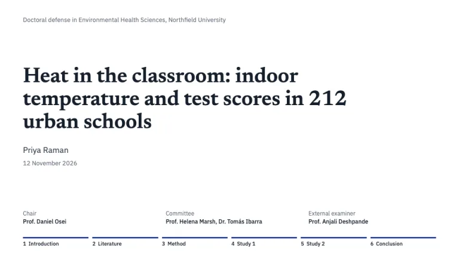
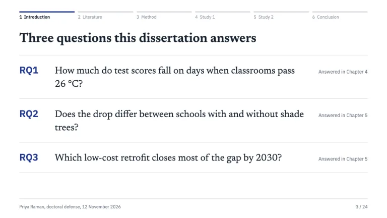
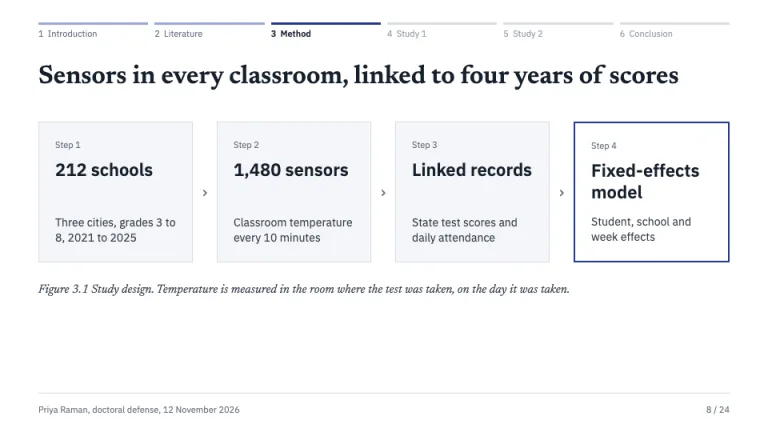
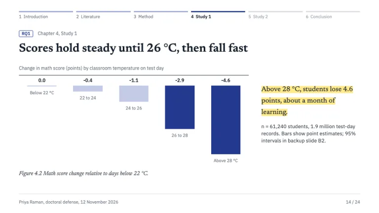
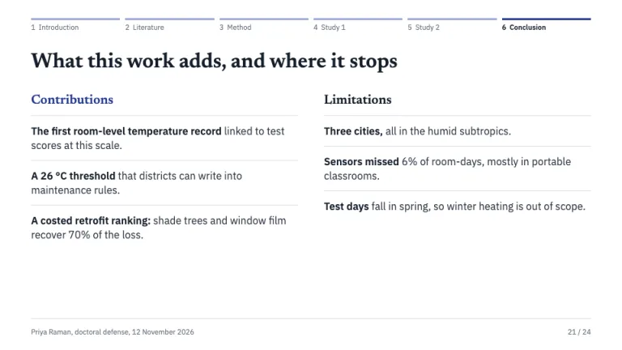
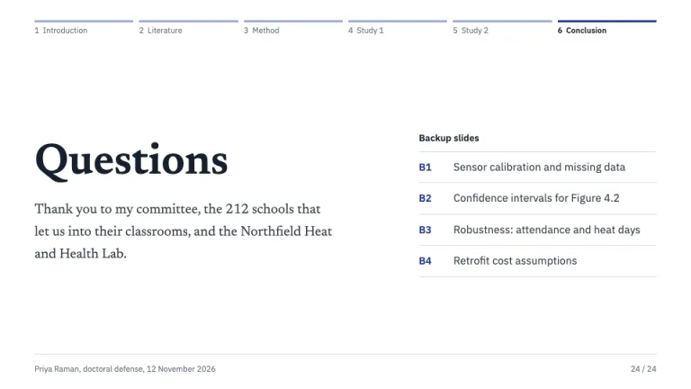

[← All prompts](../README.md) · [Live site](https://slidespeak.co/slide-design-prompts) · [SlideSpeak](https://slidespeak.co)

# Thesis Defense

> Your chapters, one rail, every answer tagged

A thesis defense presentation prompt for PhD and master's candidates: a chapter rail across the top of every slide, research questions tagged RQ1 to RQ3 on each result, numbered figures with captions, and a closing Questions slide that indexes your backup slides.

**Category:** Education & research &nbsp;·&nbsp; **Style:** Calm, Minimal &nbsp;·&nbsp; **Mode:** Light &nbsp;·&nbsp; **Fonts:** Newsreader + IBM Plex Sans

<table>
    <tr>
      <td align="center" width="33%"><br><sub>Title</sub></td>
      <td align="center" width="33%"><br><sub>Research questions</sub></td>
      <td align="center" width="33%"><br><sub>Method</sub></td>
    </tr>
    <tr>
      <td align="center" width="33%"><br><sub>Results figure</sub></td>
      <td align="center" width="33%"><br><sub>Contributions and limitations</sub></td>
      <td align="center" width="33%"><br><sub>Questions and backup index</sub></td>
    </tr>
</table>

## The prompt

Copy the prompt below into **ChatGPT**, **Claude**, or any AI chat — or grab the raw [`PROMPT.md`](./PROMPT.md). It asks what your presentation is about first, then applies the design to every slide.

```text
Create a presentation in the 'Thesis Defense' theme, a committee-facing research talk that follows the chapters of the dissertation. Background: white (#ffffff); panels #f4f5f8 with 1px #d9dce5 borders, square corners. Typography: 'Newsreader' (Google Fonts) 600 for slide titles at 30 to 34px and the thesis title at 40 to 46px, sentence case, left-aligned; Newsreader italic for figure captions and serif passages at 15 to 26px, line-height 1.5; 'IBM Plex Sans' for body text, labels, chart axes and tables at 12 to 17px. Ink #16202c headings, #333b48 body, #6b7280 supporting text. The signature is the chapter rail: a row of six equal segments across the top of every content slide, one per dissertation chapter (for example 1 Introduction to 6 Conclusion, named after the user's chapters), each a 3px bar over an 11px Plex Sans label. Finished chapters have #9aa6d6 bars and gray labels, the current chapter a solid ink-blue #23398f bar and a semibold #16202c label, upcoming chapters #d9dce5 bars and #9ca3af labels. On the title slide the rail sits at the bottom, fully inked, as the roadmap. Research questions get stable labels RQ1 to RQ3 in #23398f; each results slide carries its RQ as an outlined tag (1px #23398f border, 3px radius) plus its chapter. Figures carry thesis numbering and an italic caption below, such as 'Figure 4.2 Score change by classroom temperature.' Highlighter yellow #ffe98a marks exactly one sentence per results slide: the answer to the research question. Charts: ink-blue #23398f for the bars or line that carry the finding, #c3cae6 for context, #b45309 only for a baseline or comparison, a 1px #16202c axis, direct value labels, no legends or gridlines; sample size notes in 13px #333b48 beside the chart. Slide types: Title (department line, thesis title, candidate, date, a committee block with Chair, Committee and External examiner, then the rail); Research questions (RQ label, the question in Newsreader 22 to 24px, 'Answered in Chapter N' at the right); Method (numbered steps in bordered boxes joined by chevrons, the final step outlined in 2px #23398f, a figure caption); Results (RQ tag, a title that states the finding, chart left, highlighted answer right); Contributions and limitations (two columns, each point led by a bold phrase); Questions (a 60px 'Questions' title, a thank-you line, and an index of backup slides coded B1, B2, B3 in #23398f). Footer on every slide: a 1px #d9dce5 rule, candidate name, 'doctoral defense' and date bottom-left, slide number over total bottom-right, 11px #6b7280. Strictly avoid: university crests or logos, stock photos, gradients, drop shadows, rounded cards, dark backgrounds, more than one highlighted sentence per slide, bullet walls of full paragraphs, legends where direct labels work, 3D charts, numbering things that are not a sequence, centered body text, decorative icons, text below 11px.

Use this theme for my slides. Ask me what the presentation is about first, then apply the theme to every slide.
```

**[Open ChatGPT ↗](https://chatgpt.com/)** &nbsp;·&nbsp; **[Open Claude ↗](https://claude.ai/new)** &nbsp;·&nbsp; **[Generate a finished deck with SlideSpeak ↗](https://app.slidespeak.co/presentation?utm_source=github&utm_medium=referral&utm_campaign=slide-design-prompts)**

## Palette

| Role | Hex |
| --- | --- |
| Background | `#ffffff` |
| Surface / panel | `#f4f5f8` |
| Border | `#d9dce5` |
| Primary accent | `#23398f` |
| Primary (soft tint) | `#e3e7f6` |
| Text on primary | `#ffffff` |
| Heading text | `#16202c` |
| Body text | `#333b48` |
| Muted text | `#6b7280` |

**Chart series:** `#23398f` `#7f8fc9` `#c3cae6` `#b45309`

## Fonts

- **Newsreader** (heading, Google Fonts)
- **IBM Plex Sans** (supporting, Google Fonts)

---

<sub>Part of [SlideSpeak Slide Design Prompts](../../README.md) · MIT licensed</sub>
