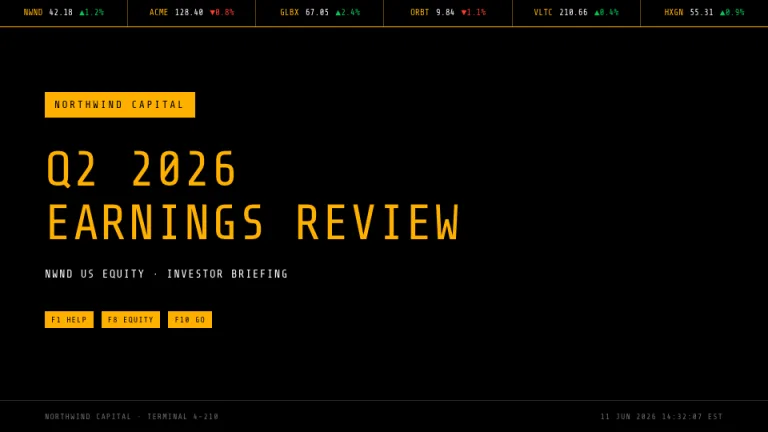
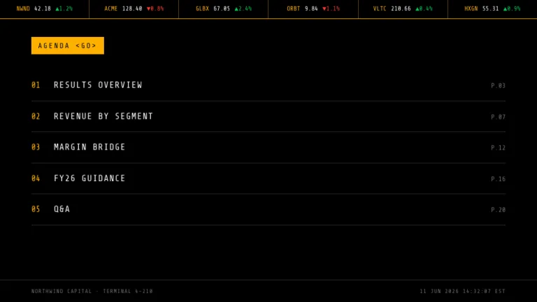
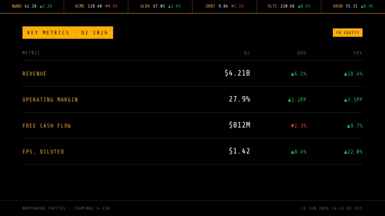
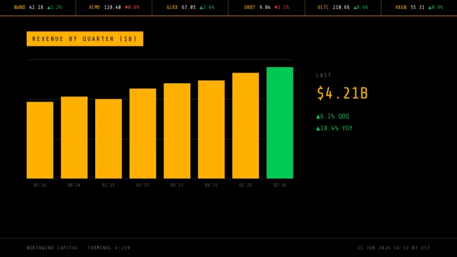
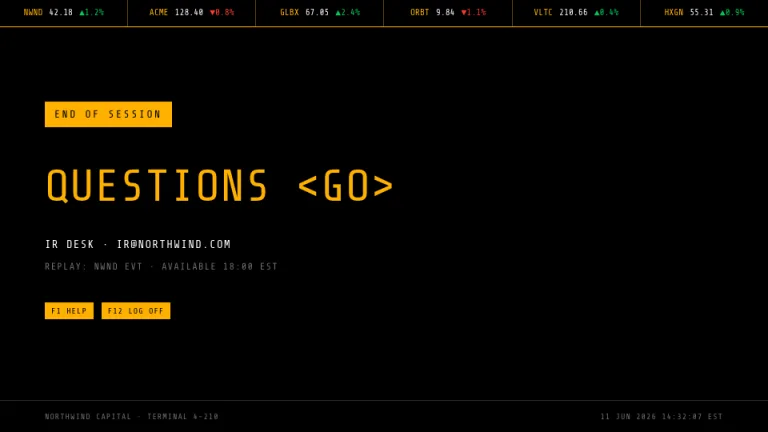

[← All prompts](../README.md) · [Live site](https://slidespeak.co/slide-design-prompts) · [SlideSpeak](https://slidespeak.co)

# Ticker

> Amber on black

Amber mono on pure black, like a market data terminal. A ticker strip runs across the top and the tables stay dense, green up, red down.

**Category:** Finance & consulting &nbsp;·&nbsp; **Style:** Tech, Dark &nbsp;·&nbsp; **Mode:** Dark &nbsp;·&nbsp; **Fonts:** Share Tech Mono

<table>
    <tr>
      <td align="center" width="33%"><br><sub>Title</sub></td>
      <td align="center" width="33%"><br><sub>Agenda</sub></td>
      <td align="center" width="33%"><br><sub>Key metrics</sub></td>
    </tr>
    <tr>
      <td align="center" width="33%"><br><sub>Chart & insight</sub></td>
      <td align="center" width="33%"><br><sub>Closing</sub></td>
    </tr>
</table>

## The prompt

Copy the prompt below into **ChatGPT**, **Claude**, or any AI chat — or grab the raw [`PROMPT.md`](./PROMPT.md). It asks what your presentation is about first, then applies the design to every slide.

```text
Create a presentation in the 'Ticker' theme, a market data terminal. Background: pure black #000000. Typography: 'Share Tech Mono' (a Google Font) everywhere; amber #FFB000 is the primary text color, white for key values, #6E6E6E for secondary text; gains in green #00C853 with a ▲ prefix, losses in red #FF3B30 with a ▼ prefix. Signature motifs: (1) a ticker strip across the top of every slide, one row of entries like 'NWND 42.18 ▲1.2%' separated by thin amber dividers at 40 percent opacity, sitting on a 1px amber rule; (2) section headers as black uppercase text on solid amber blocks; (3) dense right-aligned data tables with 1px row rules in #2A2A2A; (4) function-key chips like 'F8 EQUITY', black 'Share Tech Mono' on small amber rectangles. Charts are flat amber bars over hairline #2A2A2A gridlines with the latest bar in green #00C853. Strictly avoid: gradients, rounded corners, shadows or glow, photographs, blue accents, decorative icons.

Use this theme for my slides. Ask me what the presentation is about first, then apply the theme to every slide.
```

**[Open ChatGPT ↗](https://chatgpt.com/)** &nbsp;·&nbsp; **[Open Claude ↗](https://claude.ai/new)** &nbsp;·&nbsp; **[Generate a finished deck with SlideSpeak ↗](https://app.slidespeak.co/presentation?utm_source=github&utm_medium=referral&utm_campaign=slide-design-prompts)**

## Palette

| Role | Hex |
| --- | --- |
| Background | `#000000` |
| Surface / panel | `#0D0D0D` |
| Border | `#2A2A2A` |
| Primary accent | `#FFB000` |
| Primary (soft tint) | `#332300` |
| Text on primary | `#000000` |
| Heading text | `#FFB000` |
| Body text | `#D6D6D6` |
| Muted text | `#6E6E6E` |

**Chart series:** `#FFB000` `#00C853` `#FF3B30` `#6E6E6E`

## Fonts

- **Share Tech Mono** (heading and body, Google Fonts)

---

<sub>Part of [SlideSpeak Slide Design Prompts](../../README.md) · MIT licensed</sub>
