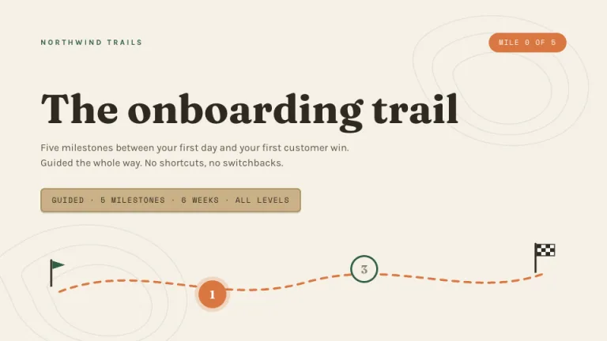
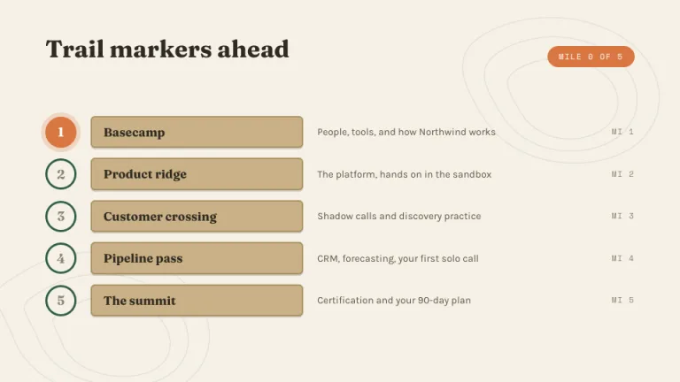
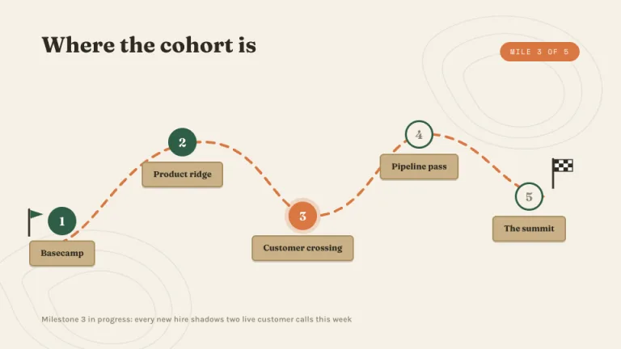
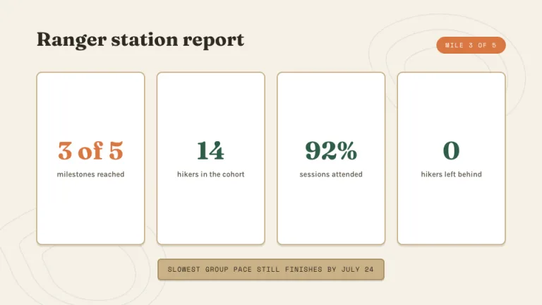
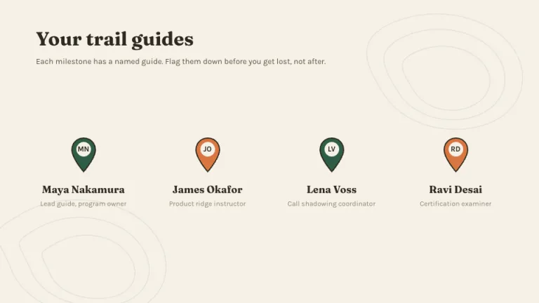
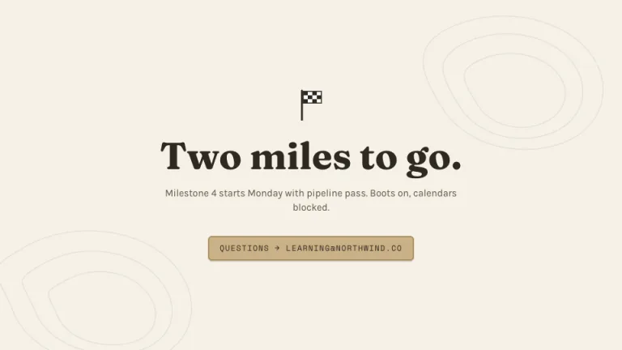

[← All prompts](../README.md) · [Live site](https://slidespeak.co/slide-design-prompts) · [SlideSpeak](https://slidespeak.co)

# Trailhead

> Learning, one mile at a time

A learning journey drawn as a trail map. A dashed path winds past numbered milestones from the start flag to the finish flag.

**Category:** Education & research &nbsp;·&nbsp; **Style:** Warm, Calm &nbsp;·&nbsp; **Mode:** Light &nbsp;·&nbsp; **Fonts:** Fraunces + Karla + Space Mono

<table>
    <tr>
      <td align="center" width="33%"><br><sub>Title</sub></td>
      <td align="center" width="33%"><br><sub>Agenda</sub></td>
      <td align="center" width="33%"><br><sub>Timeline</sub></td>
    </tr>
    <tr>
      <td align="center" width="33%"><br><sub>Key metrics</sub></td>
      <td align="center" width="33%"><br><sub>Team</sub></td>
      <td align="center" width="33%"><br><sub>Closing</sub></td>
    </tr>
</table>

## The prompt

Copy the prompt below into **ChatGPT**, **Claude**, or any AI chat — or grab the raw [`PROMPT.md`](./PROMPT.md). It asks what your presentation is about first, then applies the design to every slide.

```text
Create a presentation styled as a hiking trail map for a learning journey, the 'Trailhead' theme. Background: warm cream (#F5F1E6) with a few concentric wavy topographic contour lines drawn as SVG paths in ink (#2E2A20) at 8 percent opacity, clustered near one corner. Typography: warm 'Fraunces' serif headings in ink (#2E2A20), 'Karla' sans body, 'Space Mono' for distances and badges (all three are Google Fonts). Signature motifs: a winding dashed trail path in trail orange (#D97742, 4px stroke, roughly 12px dashes) connecting 44px circular milestone markers, completed ones filled pine green (#2F5D46) with white numerals, the current one orange with a soft halo, future ones cream with a green border; a triangular green START pennant and a black and white checkered FINISH flag on thin poles; wooden sign labels as tan rounded rectangles (#C9B086 with a 2px #A98F60 border) holding dark 'Fraunces' text; an orange pill badge reading 'MILE 3 OF 5' in 'Space Mono'. Use map pin markers for people. Strictly avoid: photographs, glossy gradients, neon colors, heavy drop shadows, straight rigid timelines, generic corporate icon sets.

Use this theme for my slides. Ask me what the presentation is about first, then apply the theme to every slide.
```

**[Open ChatGPT ↗](https://chatgpt.com/)** &nbsp;·&nbsp; **[Open Claude ↗](https://claude.ai/new)** &nbsp;·&nbsp; **[Generate a finished deck with SlideSpeak ↗](https://app.slidespeak.co/presentation?utm_source=github&utm_medium=referral&utm_campaign=slide-design-prompts)**

## Palette

| Role | Hex |
| --- | --- |
| Background | `#F5F1E6` |
| Surface / panel | `#FFFFFF` |
| Border | `#C9B086` |
| Primary accent | `#2F5D46` |
| Primary (soft tint) | `#E3EAE3` |
| Text on primary | `#FFFFFF` |
| Heading text | `#2E2A20` |
| Body text | `#5A5343` |
| Muted text | `#8C8470` |

**Chart series:** `#2F5D46` `#D97742` `#C9B086` `#8C8470`

## Fonts

- **Fraunces** (heading, Google Fonts)
- **Karla** (supporting, Google Fonts)
- **Space Mono** (supporting, Google Fonts)

---

<sub>Part of [SlideSpeak Slide Design Prompts](../../README.md) · MIT licensed</sub>
