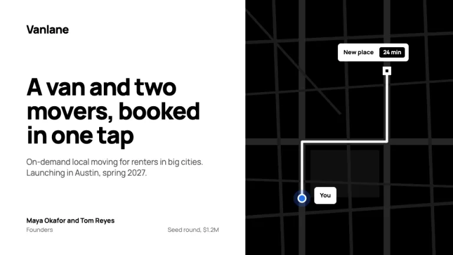
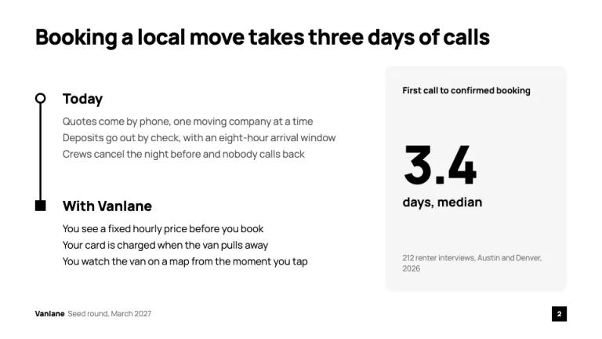
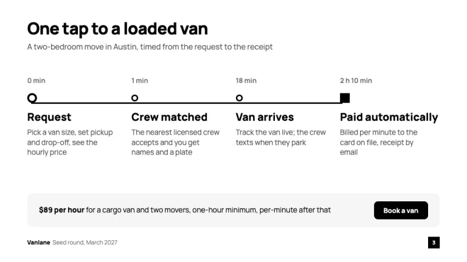
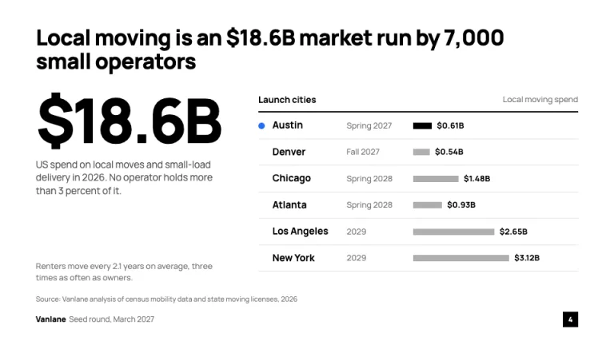
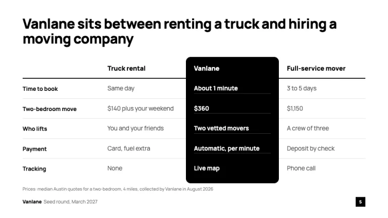
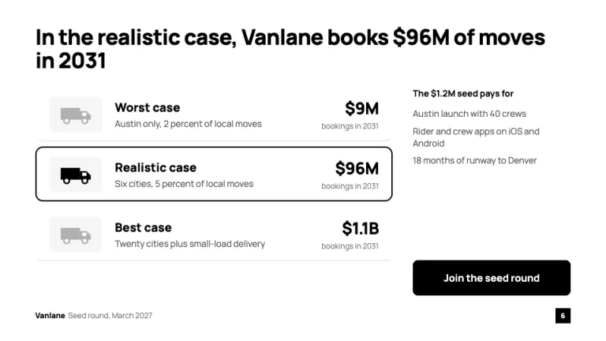

[← All prompts](../README.md) · [Live site](https://slidespeak.co/slide-design-prompts) · [SlideSpeak](https://slidespeak.co)

# Uber Pitch Deck

> Black and white, pickup to drop-off

An Uber pitch deck prompt based on the 2008 UberCab deck: problem, how it works, market, launch cities and outcomes, in black and white. An unofficial homage to the Uber pitch deck. Not affiliated with, endorsed by, or connected to Uber Technologies, Inc.

**Category:** Pitch decks &nbsp;·&nbsp; **Style:** Bold, Minimal &nbsp;·&nbsp; **Mode:** Light &nbsp;·&nbsp; **Fonts:** Manrope

<table>
    <tr>
      <td align="center" width="33%"><br><sub>Cover</sub></td>
      <td align="center" width="33%"><br><sub>Problem to solution</sub></td>
      <td align="center" width="33%"><br><sub>How it works</sub></td>
    </tr>
    <tr>
      <td align="center" width="33%"><br><sub>Market and launch cities</sub></td>
      <td align="center" width="33%"><br><sub>Competition</sub></td>
      <td align="center" width="33%"><br><sub>Potential outcomes</sub></td>
    </tr>
</table>

## The prompt

Copy the prompt below into **ChatGPT**, **Claude**, or any AI chat — or grab the raw [`PROMPT.md`](./PROMPT.md). It asks what your presentation is about first, then applies the design to every slide.

```text
Create a presentation in the 'Uber Pitch Deck' theme, an unofficial homage to the 2008 UberCab seed deck and its order: cover, problem, concept, how it works, market, target cities, competition, potential outcomes, the ask. Background: white (#ffffff) on every slide; the one dark surface is a pure black (#000000) map panel on the cover. Typography: 'Manrope' (Google Fonts) throughout. Titles: one plain sentence stating the point, Manrope 800 at 32 to 36px, #000000, tracking -0.02em, top-left, two lines at most; the cover headline is 800 at 48 to 52px. Body 400 at 14 to 16px in #545454, captions and sources 11 to 13px in #757575. Panels #f6f6f6 with 12px radius, rules #e2e2e2, inactive bars #afafaf. Blue #276ef1 is the you-are-here color, once per slide at most: the pickup dot on the cover map, the first launch city. The signature is the trip line: a 3px black route with a hollow black circle at the start and a filled black square at the end, ride-app pickup and drop-off markers. Run it vertically on the problem slide (circle beside 'Today' and three pain points in #545454, square beside 'With [company]' and three fixes in black) and horizontally on how it works (four stops, each stamped with elapsed time such as '0 min', '18 min', '2 h 10 min', a bold 20px step name and one line of detail). Cover: company name 24px 800 top-left, a one-line pitch, founders and the round at the bottom; the right 45% is a black map panel with #262626 street lines, a 5px white route from a blue pickup dot with a halo to a white drop-off square, and white pills with 6px radius labeling the stops, one holding an ETA in a black tag. Market: one oversized figure at 90 to 96px 800 with -0.05em tracking and a sentence defining it, then launch cities as ordered rows: city, launch date, a 10px bar for local spend, value at the bar end; the first city gets the blue dot and a black bar, the rest #afafaf. Competition: a comparison table between two familiar alternatives, the company's column one black strip with 12px rounded ends and white bold text. Potential outcomes: worst, realistic and best case styled as a ride-option picker, each row with a drawn vehicle glyph on a #f6f6f6 tile, name, assumptions and revenue right-aligned; the realistic row is selected with a 2px black outline. The ask sits in a black button with white 16px 700 text and 8px radius. Footer: company name 12px 800 and the round in #757575 bottom-left, page number in white in a 24px black square bottom-right. Strictly avoid: dark or gray slide backgrounds, gradients, drop shadows, photos, icons in every column, bullet walls, blue text, more than one blue element per slide, multicolor charts, centered titles, emoji, the Uber logo, wordmark or app screenshots, and claiming affiliation with Uber Technologies, Inc.

Use this theme for my slides. Ask me what the presentation is about first, then apply the theme to every slide.
```

**[Open ChatGPT ↗](https://chatgpt.com/)** &nbsp;·&nbsp; **[Open Claude ↗](https://claude.ai/new)** &nbsp;·&nbsp; **[Generate a finished deck with SlideSpeak ↗](https://app.slidespeak.co/presentation?utm_source=github&utm_medium=referral&utm_campaign=slide-design-prompts)**

## Palette

| Role | Hex |
| --- | --- |
| Background | `#ffffff` |
| Surface / panel | `#f6f6f6` |
| Border | `#e2e2e2` |
| Primary accent | `#000000` |
| Primary (soft tint) | `#eeeeee` |
| Text on primary | `#ffffff` |
| Heading text | `#000000` |
| Body text | `#545454` |
| Muted text | `#757575` |

**Chart series:** `#000000` `#276ef1` `#afafaf` `#545454`

## Fonts

- **Manrope** (heading, Google Fonts)

---

<sub>Part of [SlideSpeak Slide Design Prompts](../../README.md) · MIT licensed</sub>
