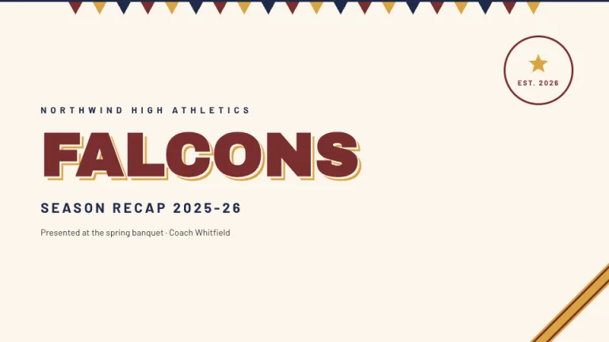
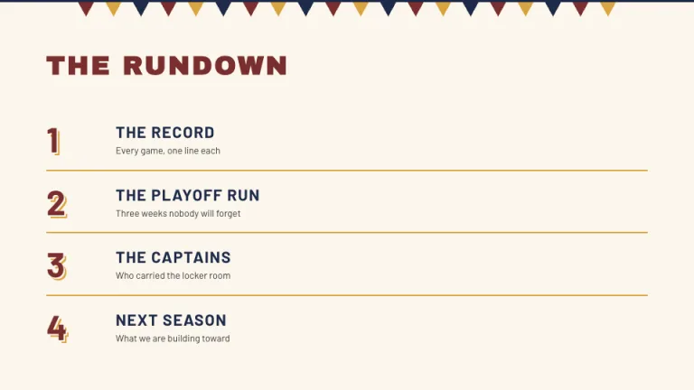
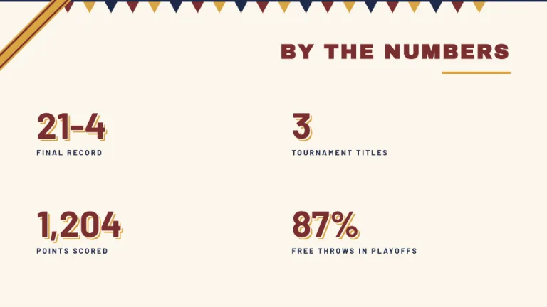
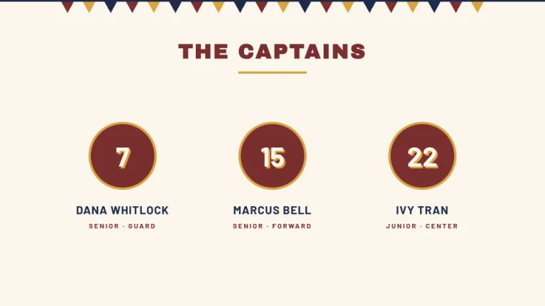
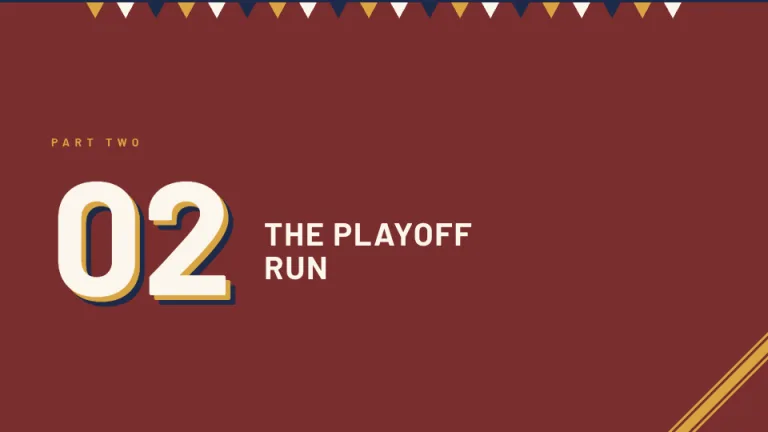
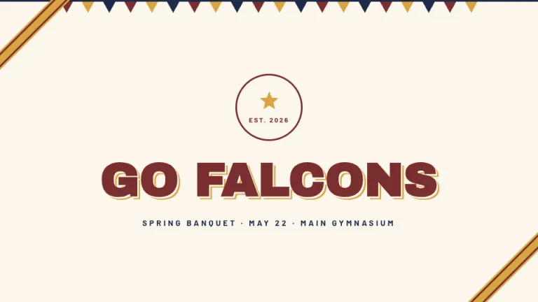

[← All prompts](../README.md) · [Live site](https://slidespeak.co/slide-design-prompts) · [SlideSpeak](https://slidespeak.co)

# Varsity

> Wear the colors

Jersey numbers with layered shadows and a row of pennants on cream. A season recap that belongs in the gym.

**Category:** Education & research &nbsp;·&nbsp; **Style:** Bold, Warm &nbsp;·&nbsp; **Mode:** Light &nbsp;·&nbsp; **Fonts:** Archivo Black + Barlow

<table>
    <tr>
      <td align="center" width="33%"><br><sub>Title</sub></td>
      <td align="center" width="33%"><br><sub>Agenda</sub></td>
      <td align="center" width="33%"><br><sub>Key metrics</sub></td>
    </tr>
    <tr>
      <td align="center" width="33%"><br><sub>Team</sub></td>
      <td align="center" width="33%"><br><sub>Section divider</sub></td>
      <td align="center" width="33%"><br><sub>Closing</sub></td>
    </tr>
</table>

## The prompt

Copy the prompt below into **ChatGPT**, **Claude**, or any AI chat — or grab the raw [`PROMPT.md`](./PROMPT.md). It asks what your presentation is about first, then applies the design to every slide.

```text
Create slides in the 'Varsity' theme, collegiate athletics spirit. Background: cream #FBF6EC. Colors: maroon #7A2E2E, gold #D9A441, navy #1E2A4A. Signature motifs: a row of small pennant triangles, about 22px wide, hanging from a 3px navy line across the top of every slide, alternating maroon, gold, navy; jersey-style display numbers in heavy bold 'Archivo Black' with a layered offset shadow, cream first then gold, behind maroon fill; a diagonal gold stripe ribbon with thin maroon edges cutting across one corner; a circular badge with a 3px maroon ring, a gold star and the words EST. 2026. Typography: thick uppercase 'Archivo Black' headings in maroon with wide tracking and a 4px gold rule beneath; navy body text in 'Barlow' (both Google Fonts). Stats render as jersey numbers with small navy uppercase labels. Section slides flip to solid maroon with cream type and gold accents. Strictly avoid: pastel colors, thin light type, gradients, drop shadows on cards, rounded corners except circles, photography.

Use this theme for my slides. Ask me what the presentation is about first, then apply the theme to every slide.
```

**[Open ChatGPT ↗](https://chatgpt.com/)** &nbsp;·&nbsp; **[Open Claude ↗](https://claude.ai/new)** &nbsp;·&nbsp; **[Generate a finished deck with SlideSpeak ↗](https://app.slidespeak.co/presentation?utm_source=github&utm_medium=referral&utm_campaign=slide-design-prompts)**

## Palette

| Role | Hex |
| --- | --- |
| Background | `#FBF6EC` |
| Surface / panel | `#FFFFFF` |
| Border | `#7A2E2E` |
| Primary accent | `#7A2E2E` |
| Primary (soft tint) | `#F6E7C8` |
| Text on primary | `#FBF6EC` |
| Heading text | `#7A2E2E` |
| Body text | `#3A3A3A` |
| Muted text | `#8C8577` |

**Chart series:** `#7A2E2E` `#D9A441` `#1E2A4A` `#E8D9BF`

## Fonts

- **Archivo Black** (heading, Google Fonts)
- **Barlow** (supporting, Google Fonts)

---

<sub>Part of [SlideSpeak Slide Design Prompts](../../README.md) · MIT licensed</sub>
