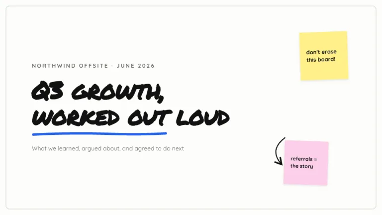
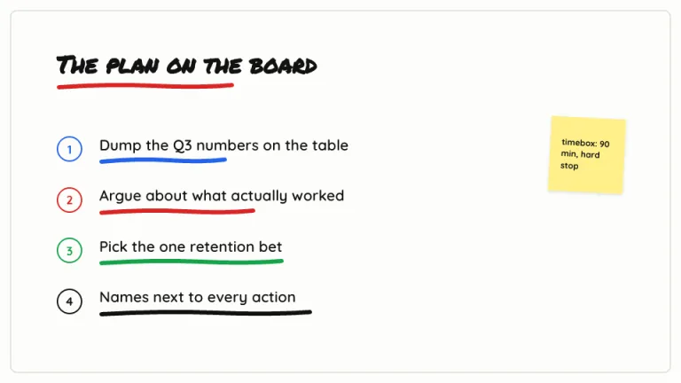
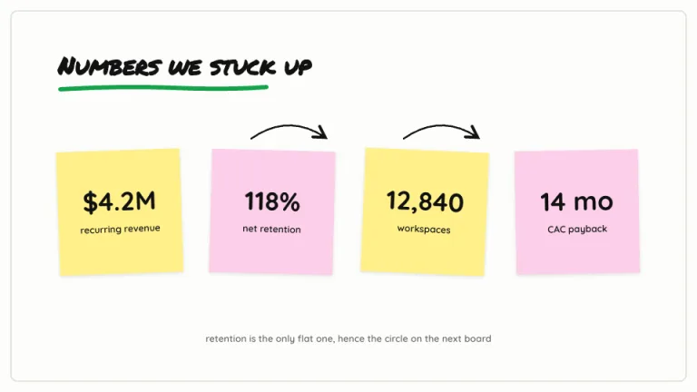
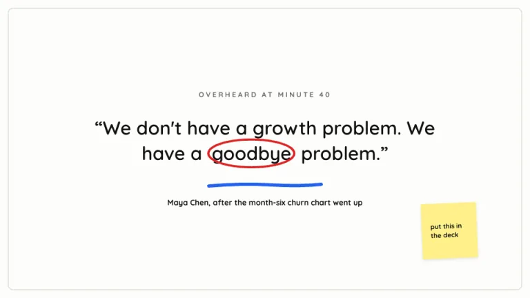
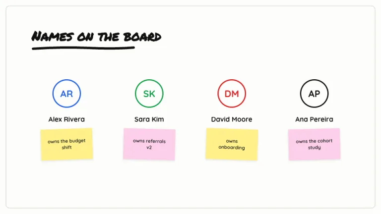
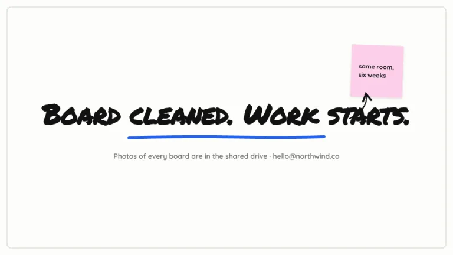

[← All prompts](../README.md) · [Live site](https://slidespeak.co/slide-design-prompts) · [SlideSpeak](https://slidespeak.co)

# Whiteboard

> Fresh from the workshop

The board at the end of a good session. Sticky notes sit slightly crooked and exactly one word gets circled in red.

**Category:** Business & strategy &nbsp;·&nbsp; **Style:** Playful, Warm &nbsp;·&nbsp; **Mode:** Light &nbsp;·&nbsp; **Fonts:** Permanent Marker + Quicksand + Kalam

<table>
    <tr>
      <td align="center" width="33%"><br><sub>Title</sub></td>
      <td align="center" width="33%"><br><sub>Agenda</sub></td>
      <td align="center" width="33%"><br><sub>Key metrics</sub></td>
    </tr>
    <tr>
      <td align="center" width="33%"><br><sub>Quote</sub></td>
      <td align="center" width="33%"><br><sub>Team</sub></td>
      <td align="center" width="33%"><br><sub>Closing</sub></td>
    </tr>
</table>

## The prompt

Copy the prompt below into **ChatGPT**, **Claude**, or any AI chat — or grab the raw [`PROMPT.md`](./PROMPT.md). It asks what your presentation is about first, then applies the design to every slide.

```text
Create a presentation in the 'Whiteboard' theme, a workshop board after a good session. Background: warm white (#FDFDFB) with a thin 2px light-gray frame (#E3E3DB, 10px rounded corners) inset about 14px on every slide, reading as the board edge. Typography: headlines in 'Permanent Marker', marker handwriting; body in friendly bold 'Quicksand', near-black #111111, side notes in #6B6B66 (all fonts here are Google Fonts). Signature motifs: marker underlines, 6px thick rounded strokes drawn slightly uneven as a shallow wave, never ruler-straight, in marker blue #2563EB, red #DC2626, green #16A34A, or black #111111, placed under headlines and key items; sticky notes, 100 to 170px squares in yellow #FEF08A and pink #FBCFE8, rotated 1 to 3 degrees with a very soft small shadow and short lowercase notes handwritten in 'Kalam'; thin hand-drawn curved arrows with open arrowheads connecting related items; exactly one circled word per deck, a red ellipse outline around a single word. Stats go on big sticky notes. Strictly avoid: ruler-straight underlines, gradients, heavy shadows, formal tables, perfectly upright sticky notes, more than one circled word.

Use this theme for my slides. Ask me what the presentation is about first, then apply the theme to every slide.
```

**[Open ChatGPT ↗](https://chatgpt.com/)** &nbsp;·&nbsp; **[Open Claude ↗](https://claude.ai/new)** &nbsp;·&nbsp; **[Generate a finished deck with SlideSpeak ↗](https://app.slidespeak.co/presentation?utm_source=github&utm_medium=referral&utm_campaign=slide-design-prompts)**

## Palette

| Role | Hex |
| --- | --- |
| Background | `#FDFDFB` |
| Surface / panel | `#FEF08A` |
| Border | `#E3E3DB` |
| Primary accent | `#2563EB` |
| Primary (soft tint) | `#DBEAFE` |
| Text on primary | `#FFFFFF` |
| Heading text | `#111111` |
| Body text | `#44443F` |
| Muted text | `#6B6B66` |

**Chart series:** `#2563EB` `#DC2626` `#16A34A` `#111111`

## Fonts

- **Permanent Marker** (heading, Google Fonts)
- **Quicksand** (supporting, Google Fonts)
- **Kalam** (supporting, Google Fonts)

---

<sub>Part of [SlideSpeak Slide Design Prompts](../../README.md) · MIT licensed</sub>
