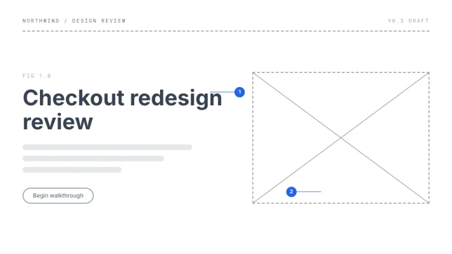
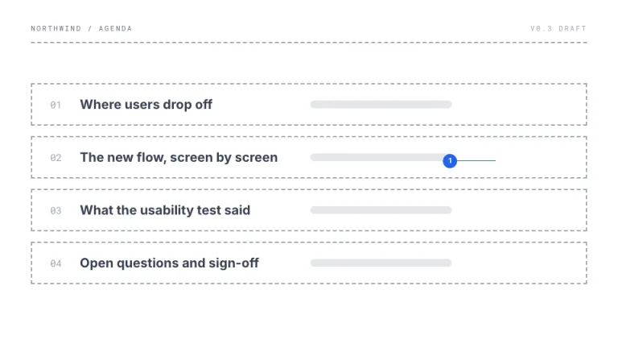
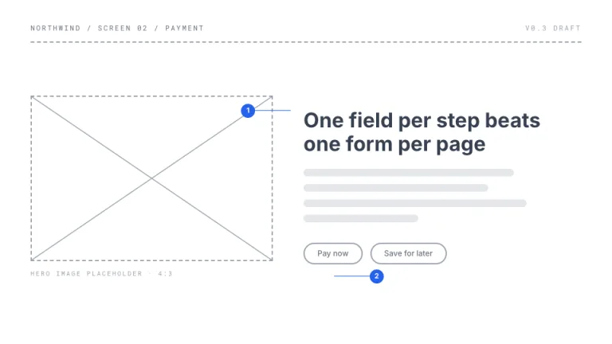
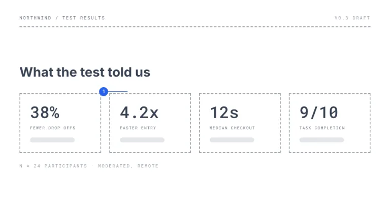
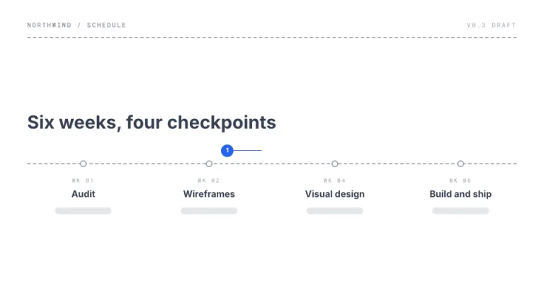
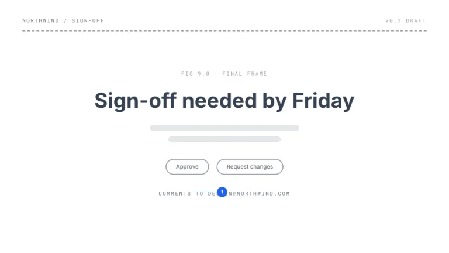

[← All prompts](../README.md) · [Live site](https://slidespeak.co/slide-design-prompts) · [SlideSpeak](https://slidespeak.co)

# Wireframe

> Shipped before the visual design

A deck drawn as a lo-fi wireframe. Dashed boxes, placeholder bars and numbered blue pins, like a design review frozen mid-comment.

**Category:** Tech & product &nbsp;·&nbsp; **Style:** Minimal, Tech &nbsp;·&nbsp; **Mode:** Light &nbsp;·&nbsp; **Fonts:** Inter + Roboto Mono

<table>
    <tr>
      <td align="center" width="33%"><br><sub>Title</sub></td>
      <td align="center" width="33%"><br><sub>Agenda</sub></td>
      <td align="center" width="33%"><br><sub>Image + text</sub></td>
    </tr>
    <tr>
      <td align="center" width="33%"><br><sub>Key metrics</sub></td>
      <td align="center" width="33%"><br><sub>Timeline</sub></td>
      <td align="center" width="33%"><br><sub>Closing</sub></td>
    </tr>
</table>

## The prompt

Copy the prompt below into **ChatGPT**, **Claude**, or any AI chat — or grab the raw [`PROMPT.md`](./PROMPT.md). It asks what your presentation is about first, then applies the design to every slide.

```text
Create a presentation in the 'Wireframe' theme: a lo-fi UX wireframe turned into slides. Background: pure white #FFFFFF. Everything is drawn as a wireframe: containers with 2px dashed #9CA3AF borders and square corners; image placeholders as dashed boxes with corner-to-corner X lines drawn in SVG at 1.5px; fake body text as 12px-tall rounded gray bars in #E5E7EB at varying widths; buttons as outlined pills with 2px #9CA3AF borders and gray #6B7280 labels. Real text appears only in headings ('Inter', #374151, 32 to 46px bold) and key figures ('Roboto Mono'); both are Google Fonts. The only color is annotation blue #2563EB, used for 22px numbered circle pins with white numerals and thin 1px blue leader lines pointing at elements, like design review notes, up to three per slide. 'Roboto Mono' meta labels such as 'v0.3 DRAFT' sit in a dashed header row, 11px uppercase. Strictly avoid: any fill besides #E5E7EB gray and #2563EB blue; solid borders on containers; photos or icons; shadows and gradients; finished visual styling.

Use this theme for my slides. Ask me what the presentation is about first, then apply the theme to every slide.
```

**[Open ChatGPT ↗](https://chatgpt.com/)** &nbsp;·&nbsp; **[Open Claude ↗](https://claude.ai/new)** &nbsp;·&nbsp; **[Generate a finished deck with SlideSpeak ↗](https://app.slidespeak.co/presentation?utm_source=github&utm_medium=referral&utm_campaign=slide-design-prompts)**

## Palette

| Role | Hex |
| --- | --- |
| Background | `#FFFFFF` |
| Surface / panel | `#F9FAFB` |
| Border | `#9CA3AF` |
| Primary accent | `#2563EB` |
| Primary (soft tint) | `#DBEAFE` |
| Text on primary | `#FFFFFF` |
| Heading text | `#374151` |
| Body text | `#6B7280` |
| Muted text | `#9CA3AF` |

**Chart series:** `#2563EB` `#9CA3AF` `#D1D5DB` `#E5E7EB`

## Fonts

- **Inter** (heading, Google Fonts)
- **Roboto Mono** (supporting, Google Fonts)

---

<sub>Part of [SlideSpeak Slide Design Prompts](../../README.md) · MIT licensed</sub>
