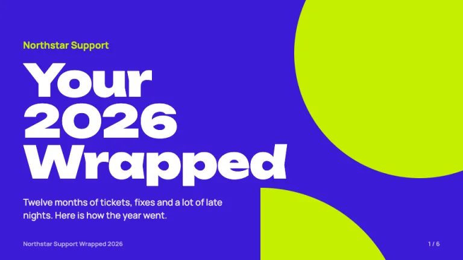
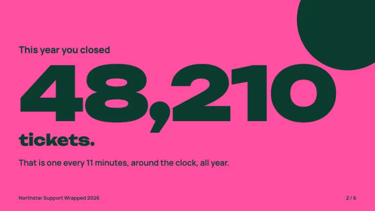
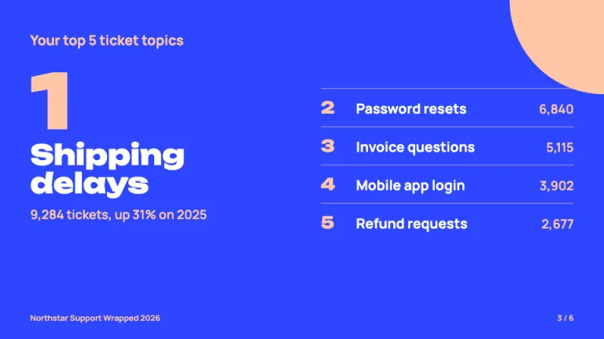
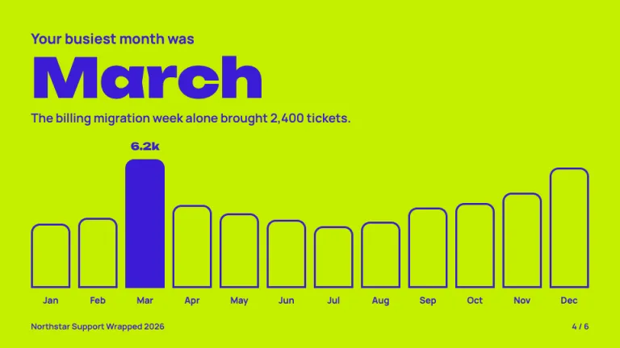
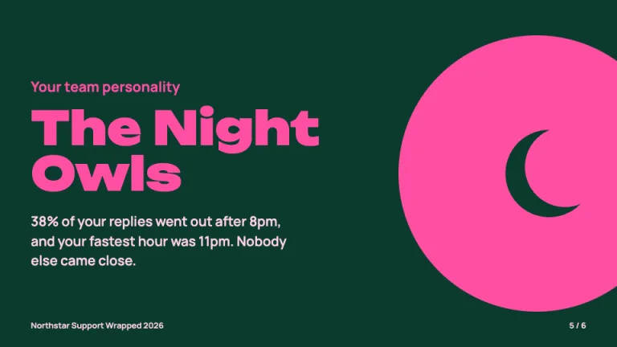
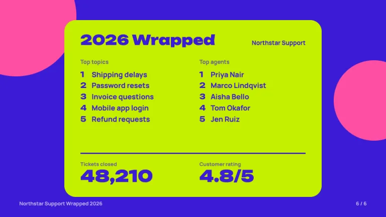

[← All prompts](../README.md) · [Live site](https://slidespeak.co/slide-design-prompts) · [SlideSpeak](https://slidespeak.co)

# Wrapped

> Your year, one stat at a time

A year in review presentation in the style of a Spotify Wrapped template, with one giant stat per slide, clashing duotone color pairs, a ranked top 5 and a summary card to share at the end. An unofficial homage to the Spotify Wrapped format. Not affiliated with, endorsed by, or connected to Spotify AB.

**Category:** Events & seasonal &nbsp;·&nbsp; **Style:** Bold, Playful &nbsp;·&nbsp; **Mode:** Dark &nbsp;·&nbsp; **Fonts:** Unbounded + Manrope

<table>
    <tr>
      <td align="center" width="33%"><br><sub>Opener</sub></td>
      <td align="center" width="33%"><br><sub>Giant stat</sub></td>
      <td align="center" width="33%"><br><sub>Top 5 ranked</sub></td>
    </tr>
    <tr>
      <td align="center" width="33%"><br><sub>Busiest month</sub></td>
      <td align="center" width="33%"><br><sub>Team personality</sub></td>
      <td align="center" width="33%"><br><sub>Summary card</sub></td>
    </tr>
</table>

## The prompt

Copy the prompt below into **ChatGPT**, **Claude**, or any AI chat — or grab the raw [`PROMPT.md`](./PROMPT.md). It asks what your presentation is about first, then applies the design to every slide.

```text
Create a presentation in the 'Wrapped' theme, a year-in-review deck in the one-stat-per-slide register of annual music recaps. Every slide is a full-bleed duotone pair, and each slide uses exactly one pair from this fixed set: violet #3b1bd6 background with lime #c4f000 shapes and white #ffffff text; hot pink #ff4fa3 background with deep green #0c3b2e text and shapes; electric blue #2d46ff background with peach #ffc7a8 shapes and white text; lime #c4f000 background with violet #3b1bd6 text. Alternate pairs from slide to slide so no two neighbors match. Typography: 'Unbounded' (Google Fonts) weight 800 to 900 for stats and headlines, tight leading around 0.95, sentence case; 'Manrope' 600 to 700 for every supporting line at 19 to 24px. The signature is one giant number per slide in Unbounded 900 at 140 to 220px with a short lead-in above ('This year you closed') and one second-person line below that turns the number into a story ('That is one every 11 minutes'). Big flat CSS shapes in the pair's second color (full circles, quarter circles, pills) bleed off one or two edges, one or two per slide, never behind body text. Opener: the team or company name small, then 'Your 2026 Wrapped' stacked on three lines at about 90px. Top 5 slide: a real ranking, so numbered: the number one item huge on the left with its count and change versus last year, items two to five as quiet rows on the right split by 2px lines at 35% opacity. Month slide: twelve rounded-top bars drawn as 3px outlines in the ink color with transparent fill, only the peak month filled solid with its value above it, the month name as the headline. Personality slide: 'Your team personality' then a named archetype such as 'The Night Owls' at 72px and one sentence of evidence, beside a large circle holding a simple flat SVG glyph. Summary card finale: a lime #c4f000 panel with 28px radius centered on violet, holding two ranked top 5 lists side by side, a 3px violet rule, and two headline numbers in Unbounded; sized so people can screenshot and share it. Copy is second person, cheeky and short: no slide carries more than 30 words. Footer: the deck name bottom-left and '3 / 6' style progress bottom-right in Manrope 13px in the pair's muted tone, the only small text allowed. Strictly avoid: the Spotify logo, Spotify green #1db954 and claiming affiliation with Spotify, more than one duotone pair on a slide, paragraphs and bullet lists, stats set smaller than the headline, drop shadows, gradients or gradient text, stock photos, emoji, icons in every corner, thin or light font weights, gray backgrounds and white slides.

Use this theme for my slides. Ask me what the presentation is about first, then apply the theme to every slide.
```

**[Open ChatGPT ↗](https://chatgpt.com/)** &nbsp;·&nbsp; **[Open Claude ↗](https://claude.ai/new)** &nbsp;·&nbsp; **[Generate a finished deck with SlideSpeak ↗](https://app.slidespeak.co/presentation?utm_source=github&utm_medium=referral&utm_campaign=slide-design-prompts)**

## Palette

| Role | Hex |
| --- | --- |
| Background | `#3b1bd6` |
| Surface / panel | `#c4f000` |
| Border | `#2a14a0` |
| Primary accent | `#ff4fa3` |
| Primary (soft tint) | `#ffd1e8` |
| Text on primary | `#0c3b2e` |
| Heading text | `#ffffff` |
| Body text | `#efeaff` |
| Muted text | `#b9b0f0` |

**Chart series:** `#c4f000` `#ff4fa3` `#2d46ff` `#ffc7a8`

## Fonts

- **Unbounded** (heading, Google Fonts)
- **Manrope** (supporting, Google Fonts)

---

<sub>Part of [SlideSpeak Slide Design Prompts](../../README.md) · MIT licensed</sub>
